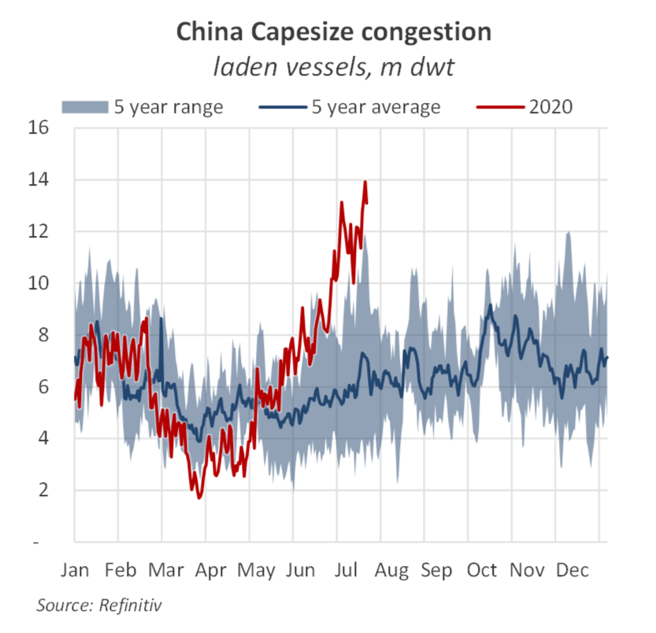
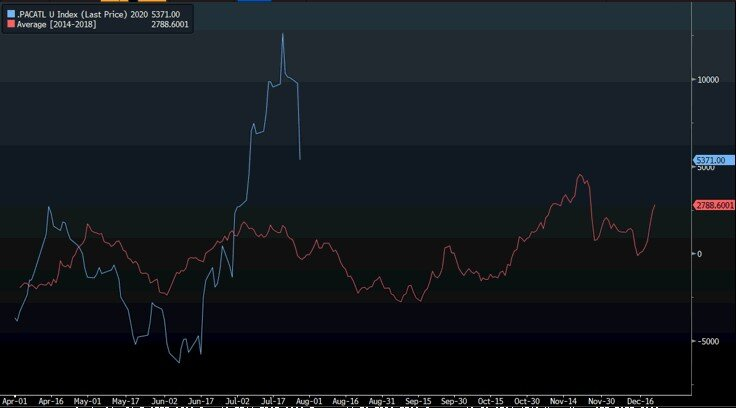

# Shifting currents beneath the calm in dry bulk

**Date:** July 28, 2020  
**Publisher:** Breakwave Advisors | **Category:** Market Insights  
**Original URL:** [https://www.breakwaveadvisors.com/insights/2020/7/28/shifting-currents-beneath-the-calm-in-dry-bulk](https://www.breakwaveadvisors.com/insights/2020/7/28/shifting-currents-beneath-the-calm-in-dry-bulk)  

---

> **Figure 1: “…Another Positive Signal Is the Surge in the Prices of Chinese**  
> *“…Another positive signal is the surge in the prices of Chinese building equities, as local-government stimulus measures kick in and the nation starts rebuilding after devastating floods. China’s CSI 300 Materials Index gained 20% over the past month, compared with a 10% advance for the CSI 300.”*  
> [Local Asset](file:///C:/Users/Dell/Github/Shipping/corpus/03-breakwave/insights/2020/assets/2020-07-28_shifting-currents-beneath-the-calm-in-dry-bulk_img_bull3_d89e486941bf.jpg)

As the rate of descent in dry bulk freight rates decreases, some much needed stability has penetrated the spot market, and in some cases even reverted the declines experienced in the last few days. We remain of the view that soon spot rates will turn higher, and the combination of a number of bullish factors will tighten the market again as we head into the final four months of the year.

Still, at the moment, the spot market is not ready for a significant rally. The recent drop in Capesize rates from the mid-30,000 down to the mid-teens in a matter of a few weeks, was a mini shock to market participants and a period of consolidation is needed to reestablish confidence.

Yet, the factors that pushed the market to recent highs are still there, and all that is needed is some increase on the demand side, i.e. higher shipments. Bloomberg today provides some additional color on the demand side, taking a broader view on the Chinese economy and what that might mean for dry bulk rates:

Yet, in an idiosyncratic market like dry bulk, one should look a bit deeper than just the macro picture.

Take for instance congestion. As Braemar mentioned last week, congestion is at record levels, reflecting surging iron ore arrivals, COVID-19 related crewing delays, as well as vessels queuing for quotas in the instances of coal cargoes. The chart below shows such a development, which is still aiding the supply side of the dry bulk market.

> **Figure 2: Atlantic Spot Rates Minus Pacific Spot Rates**  
> *Atlantic Spot Rates minus Pacific Spot Rates*  
> [Local Asset](file:///C:/Users/Dell/Github/Shipping/corpus/03-breakwave/insights/2020/assets/2020-07-28_shifting-currents-beneath-the-calm-in-dry-bulk_img_chinaportcongestion_1ad09e57be8b.png)

Another factor that affected spot rates early in July, there was the significant disconnect between the Atlantic spot rates and the Pacific spot rates (the chart below show the 5-year average net difference between the two vs 2020), that has now more or less corrected. Over short periods of time, the two markets can divert as positional tightness is causing such dislocations. However, as owners reposition their vessels to take advantage of the higher freight rates, such dislocations tend to correct. Usually, at relatively high rates, the correction tends to penalize the tighter market and, as we have seen, the Pacific market that led the recent rally also experienced the most dramatic drop late last week.

> **Figure 3: Pac vs Atl**  
> [Local Asset](file:///C:/Users/Dell/Github/Shipping/corpus/03-breakwave/insights/2020/assets/2020-07-28_shifting-currents-beneath-the-calm-in-dry-bulk_img_pacvsatl_f4e561600c7b.jpg)

Finally, summer is usually a slow period for the financial markets and dry bulk is no exception. However as we enter August, time and again the instincts of freight traders come back into action, and with September stems on the horizon, more activity has historically translated to higher rates. Will this time be any different?

---

**Tags:** Shipping, Dry Bulk, Capesize, Panamax  
