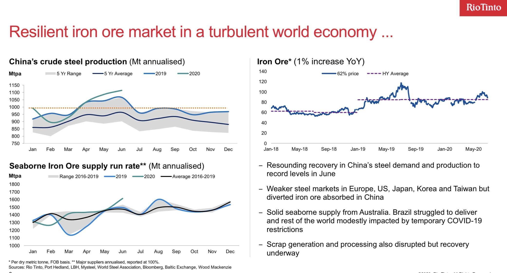

# Rio Tinto repeats the obvious: the iron ore market is booming

**Date:** July 29, 2020  
**Publisher:** Breakwave Advisors | **Category:** Market Insights  
**Original URL:** [https://www.breakwaveadvisors.com/insights/2020/7/29/rio-tinto-repeats-the-obvious-that-the-iron-ore-market-thrives](https://www.breakwaveadvisors.com/insights/2020/7/29/rio-tinto-repeats-the-obvious-that-the-iron-ore-market-thrives)  

---

Missing image: https://images.squarespace-cdn.com/content/v1/5a4d1d26e5dd5b537a6647c5/1596030677911-WNNBFZTBWFSGUZOGXSH5/rio+tinot+2.png

Readers of our columns know by now that we continue to view the current circumstances in the iron ore market as particularly bullish for freight. The progression of events in the last two years in the $120 billion per year iron ore trade combined with shifting macro fundamentals due to major global events, have basically set up the stage for a surge in exports that has pushed freight rates and will continue to support them for the reminder of this year and possibly beyond.

A confirmation of such development also comes from Rio Tinto that today reported almost $10 billion in 1H EBITDA, calling the Chinese recovery “amazing”. And amazing it is: As presented in their results, seaborne iron ore supply is at new all time highs, as Chinese demand is also at an all time high run rate.

> **Figure 1: Img 2437**  
> [Local Asset](file:///C:/Users/Dell/Github/Shipping/corpus/03-breakwave/insights/2020/assets/2020-07-29_rio-tinto-repeats-the-obvious-that-the-iron-ore-market-thrives_img_img-2437_25b88b6df7fa.jpg)

Vale is due to report second quarter results later today, and expectations are that once again they will point to their recently reiterated guidance of 310-300 million tons of iron ore production for the year.

The stage is set for a a strong second half for the iron ore markets and consequently for dry bulk freight. The future developments are always unknown, but with China buying every available ton of seaborne iron ore, the environment is as favorable as it can be for the dry bulk market.

---

**Tags:** Shipping, Rio Tinto, Capesize  
