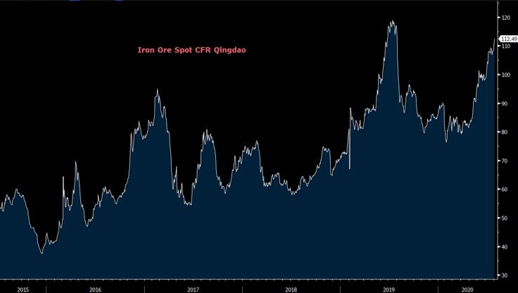
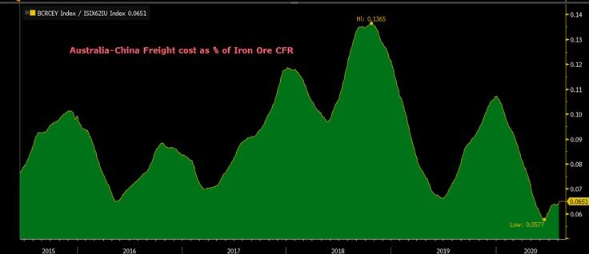
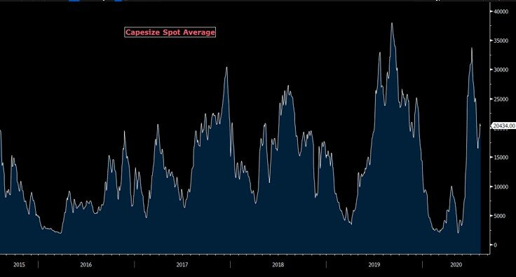

# With Iron ore Rallying to one-year highs, are freight rates about to Follow?

**Date:** August 06, 2020  
**Publisher:** Breakwave Advisors | **Category:** Market Insights  
**Original URL:** [https://www.breakwaveadvisors.com/insights/2020/8/6/with-iron-ore-at-one-year-highs-are-freight-rates-about-to-rally](https://www.breakwaveadvisors.com/insights/2020/8/6/with-iron-ore-at-one-year-highs-are-freight-rates-about-to-rally)  

---

> **Figure 1: Ship7**  
> **Interactive Data & Source:** [Spglobal](https://www.spglobal.com/platts/en/market-insights/latest-news/metals/080620-capesize-rates-stage-v-shaped-recovery-on-china-iron-ore-demand-vessel-delays) | [Local Asset](file:///C:/Users/Dell/Github/Shipping/corpus/03-breakwave/insights/2020/assets/2020-08-06_with-iron-ore-at-one-year-highs-are-freight-rates-about-to-rally_img_ship7_091cd72fc1e5.jpg)

The global inflationary environment that has pushed gold prices past $2,000/oz and has sent silver prices soaring, is also affecting one of the most important commodities in the world, namely iron ore. Although iron ore has always been driven by its own idiosyncratic fundamentals, in an environment where governments are pumping trillions in stimulus dollars, the inflationary pressures are also having a major impact on iron ore prices.

So far this year, China has been the driving force behind the relentless demand for steel, and thus for iron ore, but the upcoming recovery on steel demand ex-China is about to take over, possibly continuing to support iron ore prices well above the psychologically important $100 per ton mark for the foreseeable future. After all, last time iron ore prices were that high, some 100 million metric tons per year of capacity in Brazil were offline.

> **Figure 2: “Strengthening Demand for Iron Ore Should Trump Concerns Around**  
> *“Strengthening demand for iron ore should trump concerns around rising supply as the global economy recovers from the shock of the coronavirus pandemic. Data points suggest steel consumption in China is expanding, on an improvement in housing starts and swollen order books for infrastructure contractors. Also, Chinese steel mills operating Basic Oxygen Furnaces are making US$100/ton profit margins despite high iron-ore prices while scrap is relatively unattractive. On the supply side, Vale's iron-ore exports are likely to rise over the next two years, but are likely to be taken up by the recovery in steel production outside of China.”*  
> **Interactive Data & Source:** [Spglobal](https://www.spglobal.com/platts/en/market-insights/latest-news/metals/080620-capesize-rates-stage-v-shaped-recovery-on-china-iron-ore-demand-vessel-delays) | [Local Asset](file:///C:/Users/Dell/Github/Shipping/corpus/03-breakwave/insights/2020/assets/2020-08-06_with-iron-ore-at-one-year-highs-are-freight-rates-about-to-rally_img_ironorespotcfr_105db8babc64.jpg)

Dow Jones quoting Citi Research also agrees, and is out with similar comments earlier today describing such a development in more detail:

Citi is not alone. Iron ore is supported by real buying activity, and as[Platts discusses further](https://www.spglobal.com/platts/en/market-insights/latest-news/metals/080620-capesize-rates-stage-v-shaped-recovery-on-china-iron-ore-demand-vessel-delays), demand for the material remains robust:

*“China is buying all the iron ore that they can find, and supply of iron ore is tight," a ship chartering source with a miner said. "Also, the fact that they have turned a net importer of steel shows there is demand for steel within China," the source added.”*

Obviously the above is not new, but more and more the bearish supply-driven analyst thesis against iron ore is been replaced by a tightening supply and increasing demand narrative. If one throws on top of that the above discussed inflationary wave affecting real asset prices that is taking place, iron ore could continue surging, in the process supporting high profitability for major iron ore miners and thus making freight an even smaller component of the delivered price.

Indeed, high iron ore prices are good for freight, as most freight costs that are already quoted on a USD/ton basis are becoming a smaller percentage of CFR (Cost and Freight), increasing the negotiating power of shipowners in the spot market.

> **Figure 3: C5 As % of Cfr**  
> [Local Asset](file:///C:/Users/Dell/Github/Shipping/corpus/03-breakwave/insights/2020/assets/2020-08-06_with-iron-ore-at-one-year-highs-are-freight-rates-about-to-rally_img_c5as25ofcfr_a5cfeaf209c7.jpg)

As a result, Capesize rates should continue to find major support in such an environment with the inflationary pressures acting an an indirect tailwind. As we head into the final stretch of the year, it will not be surprising to see new multi-year highs for Capesize rates been achieved in contrast to the current futures curve (let alone analysts estimates that usually follow the futures curve up and down anyway) that is actually calling for a much more muted development trajectory.

> **Figure 4: Capesize Spot**  
> [Local Asset](file:///C:/Users/Dell/Github/Shipping/corpus/03-breakwave/insights/2020/assets/2020-08-06_with-iron-ore-at-one-year-highs-are-freight-rates-about-to-rally_img_capesizespot_a76f337736f9.jpg)

After all, as we have said again and again, the futures market has been pricing the future based on recent past (i.e. last year) and that bizarre year-after-year phenomenon once again presents a unique opportunity for investors and traders to capitalize on a global price trend that eventually will find its way to this far-reaching corner of the global economy.

---

**Tags:** Shipping, Capesize, China, Dry Bulk, Panamax  
