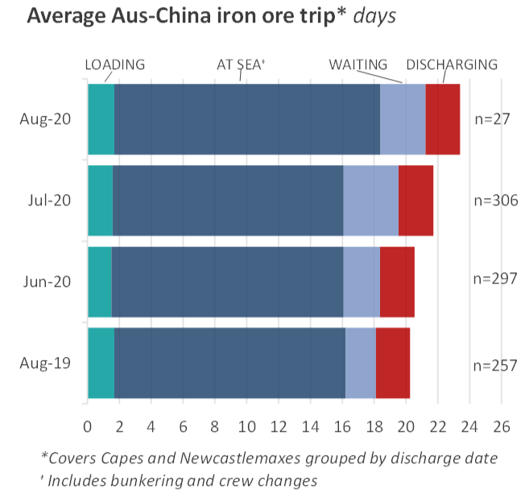

# COVID-19 related delays boost rates in Asia

**Date:** August 11, 2020  
**Publisher:** Breakwave Advisors | **Category:** Market Insights  
**Original URL:** [https://www.breakwaveadvisors.com/insights/2020/8/11/covid-19-related-delays-boost-rates-in-asia](https://www.breakwaveadvisors.com/insights/2020/8/11/covid-19-related-delays-boost-rates-in-asia)  

---

> **Figure 1: Market Chart 1**  
> **Interactive Data & Source:** [Shippingwatch](https://shippingwatch.com/Services/article12331365.ece) | [Local Asset](file:///C:/Users/Dell/Github/Shipping/corpus/03-breakwave/insights/2020/assets/2020-08-11_covid-19-related-delays-boost-rates-in-asia_img_image-asset_58b94d781a29.jpeg)

With more than six months into the pandemic, the impact on shipping is only now begging to become visible in pricing, as COVID-19 related delays continue to add to port congestion and tie up more and more ships in the process. With[more than 80% of Asian ports closed to crew changes](https://shippingwatch.com/Services/article12331365.ece), crew change regulations are becoming stricter and the length of round-trip voyages have been extended by a significant amount, especially in Asia where one-way laden voyages are below the 14-day quarantine threshold for most countries.

As a result, charterers and miners are increasingly looking at ships outside their usual pool of vessels, with today’s rumored fixture priced well above index for a 20-year old vessel in Australia as an example. (Most major miners strongly prefer vessels younger than 15 years of age).

The Atlantic market is better suited to handle such delays as most crew changes take place in Asia and given the long ballast times to the Atlantic, the 14-day quarantine is less relevant and thus does not lead to any considerable associated delays at loading ports.

[Braemar Research](https://braemaracm.com/service/research/)had some very interesting calculations on that front, showing the effect of such crew change delays in the key Australia to China route. As the chart below shows, the length of the trip as increased considerably, not only versus last year (about 15% longer) but also versus the last few months.

> **Figure 2: Source: Braemar Research**  
> [Local Asset](file:///C:/Users/Dell/Github/Shipping/corpus/03-breakwave/insights/2020/assets/2020-08-11_covid-19-related-delays-boost-rates-in-asia_img_c5length_a434f0198b21.png)

Source: Braemar Research

With seasonality increasingly having a positive impact on demand (in fact last week was the best week in terms of exports out of Brazil in 2020), such a supply tightening should continue to support freight rates while market participants and freight traders are focusing on more traditional market balance calculations and ignore such externalities creating considerable opportunities in the futures market as the curve continues to be priced almost flat to current spot rates.

Finally, with iron ore prices now already reflecting the increased Brazilian production as exports have more or less recovered from the low levels of earlier in the year, the strong profit margins that global iron ore miners are realizing should push even more ore product in the water, which should boost ton-miles and thus freight rates higher for the months to come. The current setup is quite favorable for dry bulk shipping and although the unusual times we are living can always change circumstances at an instant, the next several months seem quite favorable for dry bulk rates.
