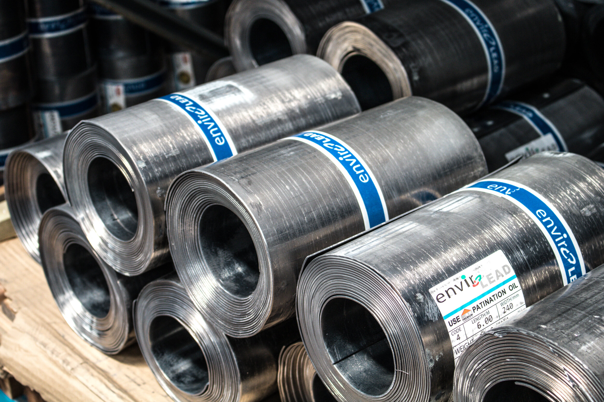
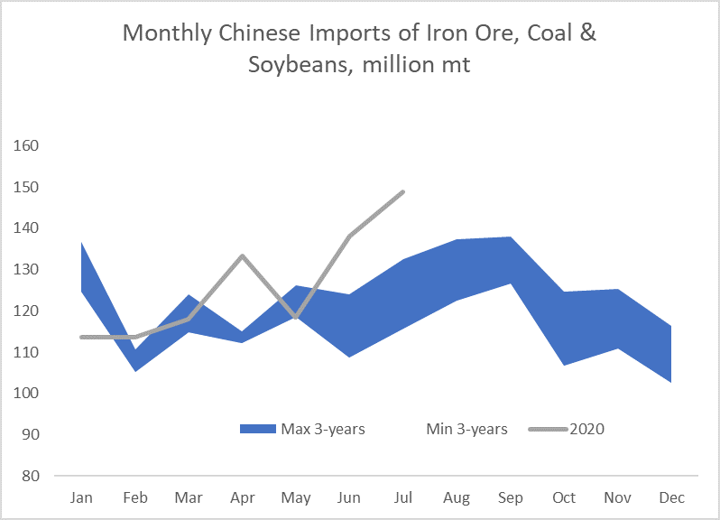
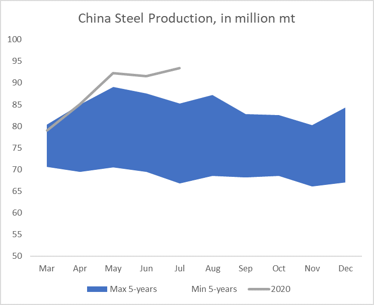
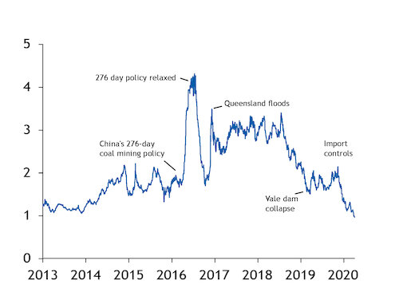

# China’s Steel Complex remains the driving force For dry bulk demand

**Date:** August 14, 2020  
**Publisher:** Breakwave Advisors | **Category:** Market Insights  
**Original URL:** [https://www.breakwaveadvisors.com/insights/2020/8/14/china-remains-the-driving-force-of-dry-bulk-demand](https://www.breakwaveadvisors.com/insights/2020/8/14/china-remains-the-driving-force-of-dry-bulk-demand)  

---

> **Figure 1: “The Consumption of Steel in July Was Underpinned by Demand For**  
> *“The consumption of steel in July was underpinned by demand for flat steel products used in products from cars and appliances, even as heavy rain hurt demand for steel products used in construction activities.*  
> **Interactive Data & Source:** [Reuters](https://www.reuters.com/article/us-china-economy-output-steel/china-produces-record-crude-steel-in-july-on-strong-demand-idUSKCN25A0EP) | [Local Asset](file:///C:/Users/Dell/Github/Shipping/corpus/03-breakwave/insights/2020/assets/2020-08-14_china-remains-the-driving-force-of-dry-bulk-demand_img_image-asset_f8b35fe6ac15.jpeg)

Yesterday, China released some quite impressive infrastructure-related economic numbers that once again signify the importance of Chinese demand in the recent resurgence in dry bulk rates. China’s steel complex remains stronger that ever, and with that, demand for iron ore also remains the highest ever. Adding the relatively low inventory levels of iron ore and the potential for resurfacing bulk demand elsewhere, and dry bulk has a lot going on for the rest of the year.

As[Reuters describes](https://www.reuters.com/article/us-china-economy-output-steel/china-produces-record-crude-steel-in-july-on-strong-demand-idUSKCN25A0EP), a number of factors are contributing to such a demand increase out of China, that has led most analysts to sharply revise up their expectations for the rest of the year:

*Production of hot-rolled coils and cold-rolled coils at major mills jumped nearly 28% in July from a month earlier, according to data compiled by Mysteel consultancy, while output for steel reinforcing bars used in buildings rose 18%.*

*“As the monsoon season has come to an end, demand for construction rebar has stabilized since late-July and (is) expected to further recover in coming months,” Zhuo Guiqiu, analyst with Jinrui Capital said before the data was released.”*

And it is easy to see how China is driving dry bulk demand this year. Looking at the three most shipping-intensive dry commodities, iron ore, coal and soybeans, the last few months have seen**record high import volumes into China**, far surpassing the previous highs.

> **Figure 2: China Imports**  
> **Interactive Data & Source:** [Argusmedia](https://www.argusmedia.com/en/news/2132400-iron-ores-share-of-china-steel-costs-hits-new-high?backToResults=true) | [Local Asset](file:///C:/Users/Dell/Github/Shipping/corpus/03-breakwave/insights/2020/assets/2020-08-14_china-remains-the-driving-force-of-dry-bulk-demand_img_chinaimports_b0af037c9ed8.png)

Although other areas ex-China have recorded sharp declines in imports due to COVID-19, the mere size of the Chinese increases combined with the ton-mile impact of such trade, has had a considerable positive effect on freight rates that few would have predicted a few months back (as a reminder, three months ago the third quarter Capesize futures contract was trading below 10,000 and now half way into the quarter it stands at roughly 23,000).

**Steel demand in China remains also at record high levels**, boosted by construction and appliance demand as well as a resurgence in automobile manufacturing (although one has to remember this comes from a low base as the car manufacturing segment has been in a technical recession in China for the last 18 months or so).

> **Figure 3: “Chinese Domestic Steel Demand Appears to Have Been Bolstered By**  
> *“Chinese domestic steel demand appears to have been bolstered by the government expediting approvals for infrastructure projects, such as airports and rail links which were scheduled pre-pandemic, and more recently, we have seen an uptick in steel procurement for infrastructure projects facilitated by the special bonds issued in May. The Chinese steel market has become such an outlier in the global economy that it has become a target for other steel producing countries to sell to, withChina becoming a net importerof steel for the first time in 11 years in June.”*  
> **Interactive Data & Source:** [Argusmedia](https://www.argusmedia.com/en/news/2132400-iron-ores-share-of-china-steel-costs-hits-new-high?backToResults=true) | [Local Asset](file:///C:/Users/Dell/Github/Shipping/corpus/03-breakwave/insights/2020/assets/2020-08-14_china-remains-the-driving-force-of-dry-bulk-demand_img_chinasteeldemand_c7c04a70c749.png)

Braemar has some more color to add on China’s steel demand:

The relentless demand for iron ore this year has also pushed iron ore prices to very high levels, leading to some unintended consequences. As[Argus reports](https://www.argusmedia.com/en/news/2132400-iron-ores-share-of-china-steel-costs-hits-new-high?backToResults=true),*“Iron ore's share of the cost of making a tonne of steel has risen to the highest level since Argus began iron ore assessments in 2013”*. Steel margins remain healthy, however, as steel prices have also reached multi-year highs. Yet,**iron ore is now the costliest material in the steel making process**, taking the rein from coking coal.

### Chart: Ratio of Iron Ore Price to Coking Coal Price

> **Figure 4: Source: Argus**  
> [Local Asset](file:///C:/Users/Dell/Github/Shipping/corpus/03-breakwave/insights/2020/assets/2020-08-14_china-remains-the-driving-force-of-dry-bulk-demand_img_ironoretocokingcoal_a218d0fccda7.jpg)

source: Argus

And yet,**peak shipping season for iron ore is still ahead of us**. Although the last two years have seen an earlier pattern in terms of peak shipments, unanticipated factors have been the main reason behind that (both relating to Brazil’s dam accidents for Vale and Anglo-American). Absent such events, we expect iron ore shipments to peak in the fourth quarter of the year, further boosting demand for dry bulk.

With Capesize rates having found a floor at around 20,000/day following the recent correction, the next leg higher, if and when it comes, should push rates to new decade highs for the period, with the highest average for the fourth quarter in the last ten years being around 28,000/day in 2011.
