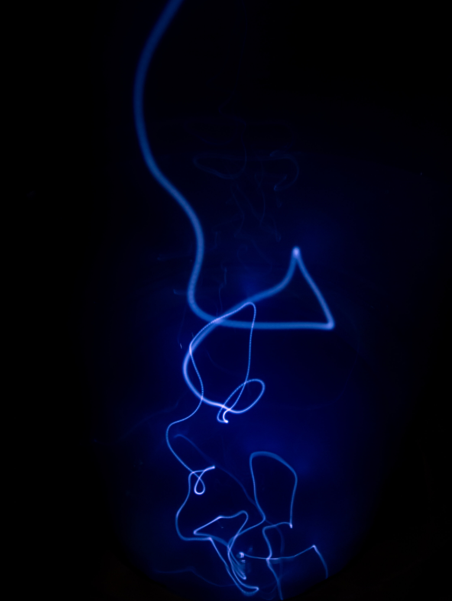

# China's Electricity Production Sets New Record

**Date:** August 14, 2020  
**Publisher:** Breakwave Advisors | **Category:** Market Insights  
**Original URL:** [https://www.breakwaveadvisors.com/insights/2020/8/14/chinas-electricity-production-sets-new-record](https://www.breakwaveadvisors.com/insights/2020/8/14/chinas-electricity-production-sets-new-record)  

---

> **Figure 1: Market Chart 1**  
> [Local Asset](file:///C:/Users/Dell/Github/Shipping/corpus/03-breakwave/insights/2020/assets/2020-08-14_chinas-electricity-production-sets-new-record_img_image-asset_7040744b79a7.jpeg)

Data released today shows China's coal production totaled 317.9 million tons last month. This mark's a year-on-year decline of 1%. Coal-derived electricity generation totaled 460 billion kilowatt hours last month, which marks year-on-year growth of 1%. Last month marks the third consecutive month where China's coal-derived electricity generation growth has exceeded coal production growth. It remains very helpful for coal import prospects that coal-derived electricity generation growth continues to exceed domestic coal production growth.

China's overall electricity generation totaled 680.1 billion kilowatt hours last month, which marks the largest amount of electricity ever produced in China and marks year-on-year growth of 3%. Also of note is that hydropower production totaled 146.3 billion kilowatt hours last month, which marks the largest amount of hydropower ever produced and is up year-on-year by 6%. Despite the record hydropower production, coal-derived electricity generation has still been able to continue to grow.

---

**Tags:** China  
