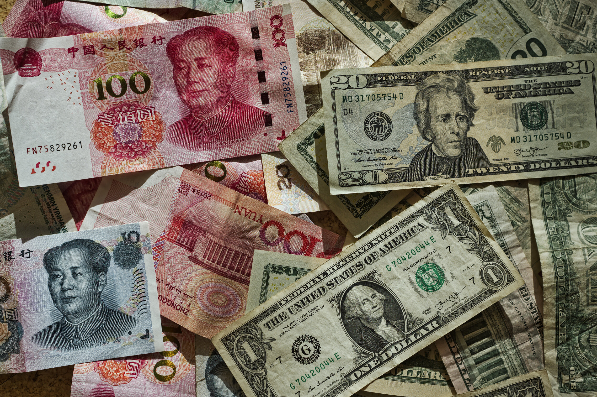

# Chinese Lending Remains Well Above Last Year’s Level

**Date:** August 17, 2020  
**Publisher:** Breakwave Advisors | **Category:** Market Insights  
**Original URL:** [https://www.breakwaveadvisors.com/insights/2020/8/17/chinese-lending-remains-well-above-last-years-level](https://www.breakwaveadvisors.com/insights/2020/8/17/chinese-lending-remains-well-above-last-years-level)  

---

> **Figure 1: Market Chart 1**  
> [Local Asset](file:///C:/Users/Dell/Github/Shipping/corpus/03-breakwave/insights/2020/assets/2020-08-17_chinese-lending-remains-well-above-last-years-level_img_image-asset_b5f8b7c2b99e.jpeg)

Chinese banks issued 993 billion yuan in new loans in July, which marks a month-on-month decline of 817 billion yuan (-45%) and a year-on-year decline of 67 billion yuan (-6%). Despite the decline, the first seven months of this year have still seen lending grow year-on-year by 22%.

In comparison, lending during all of last year grew year-on-year by only 4%. Overall, this year’s robust new lending growth remains a very positive development for China’s overall economic growth prospects and the dry bulk market, as does the fact that China’s outstanding loan growth also remains higher than last year’s level. Outstanding loan growth in July came in at 13%, which is down only slightly from the 13.2% growth seen in June. Each of the last four months have seen China’s outstanding loan growth come in at at least 13%. Prior to this period, the previous nine months saw outstanding loan growth average 12.4%.

---

**Tags:** China  
