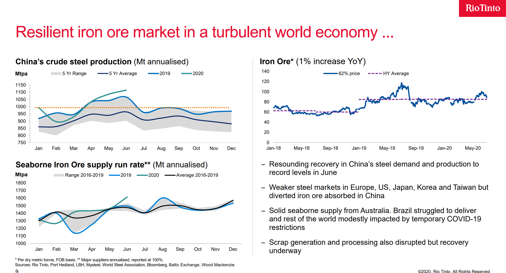
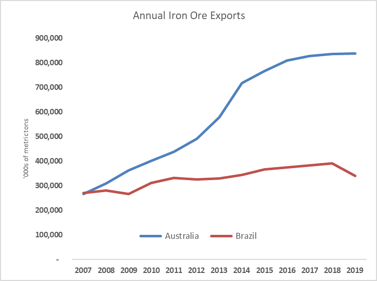
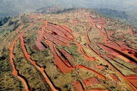

# “The Boy Who Cried Wolf”: the story of the year for Iron ore

**Date:** August 19, 2020  
**Publisher:** Breakwave Advisors | **Category:** Market Insights  
**Original URL:** [https://www.breakwaveadvisors.com/insights/2020/8/19/how-likely-is-the-supply-respond-when-it-comes-to-iron-ore](https://www.breakwaveadvisors.com/insights/2020/8/19/how-likely-is-the-supply-respond-when-it-comes-to-iron-ore)  

---

> **Figure 1: “We Consider That There Are Two Major Forces That Could Generate**  
> *“We consider that there are two major forces that could generate major iron ore price volatility in the coming year. The first is uncertainty regarding the re–emergence and containment of COVID–19 outbreaks. The second is seaborne supply uncertainty.”*  
> **Interactive Data & Source:** [Bhp](https://www.bhp.com/media-and-insights/prospects/2020/08/bhps-economic-and-commodity-outlook/#ironore) | [Local Asset](file:///C:/Users/Dell/Github/Shipping/corpus/03-breakwave/insights/2020/assets/2020-08-19_how-likely-is-the-supply-respond-when-it-comes-to-iron-ore_img_boywolf_d3a90130e6e7.jpg)

In the classic story “The boy who cried wolf”, the tale concerns a shepherd boy who repeatedly tricks nearby villagers into thinking a wolf is attacking his town's flock. When a wolf actually does appear and the boy again calls for help, the villagers believe that it is another false alarm and the sheep are eaten by the wolf.

With iron ore prices now approaching $130 per ton, a level not seen since 2014, most major miners have been cautious on the price outlook, citing increasing supply as the catalyst for a correction. In fact, over the last month or so, Vale, Rio Tinto, BHP and FMG have all one way or another said that they expect iron ore prices to come down as supply of the material increases. And yet, iron ore prices and the underlying futures keep climbing even higher, disregarding such concerns in a market that seems to soon aim for new all time highs. Vale, the only miner with perceived significant spare capacity, again and again has been promising supply gains only to fail to deliver at the end of each period.

BHP is the latest miner to state that iron ore prices will decline due to additional supply. In its[economic and commodity outlook](https://www.bhp.com/media-and-insights/prospects/2020/08/bhps-economic-and-commodity-outlook/#ironore)published yesterday, BHP begins by stating what seems the obvious, at least for those who have followed the iron ore market:

> **Figure 2: “The Observation That Seaborne Supply Conditions for This**  
> *“The observation that seaborne supply conditions for this calendar year and next are highly uncertain, both in aggregate and in terms of quality profile, is self–evident, as it has been since the Brumadinho tailings dam tragedy in January 2019. With Brazil now also struggling with one of the world’s most severe outbreaks of COVID–19, the recovery trajectory for exports is even more uncertain. While we do not think that the current constraints on Brazilian exports are informative for long run equilibrium pricing, we reiterate that the normalization process could be a multi–year event. The inevitable ups and downs of the path back to a more stable and predictable Brazilian export performance can be reasonably expected to generate volatility in both index and product pricing.”*  
> **Interactive Data & Source:** [Vale](http://www.vale.com/EN/investors/information-market/presentations-webcast/PresentationsWebcastsDocs/Vale%20Day%202017_i%20vSite.pdf) | [Local Asset](file:///C:/Users/Dell/Github/Shipping/corpus/03-breakwave/insights/2020/assets/2020-08-19_how-likely-is-the-supply-respond-when-it-comes-to-iron-ore_img_ironroe2_9e95a4cdceb6.jpg)

Although COVID-19 outbreaks could be directly associated with seaborne supply disruptions, the addition of seaborne supply**again**as an additional factor does not provide a lot of helpful hints on what that might translate into:**If it is not COVID-19 related, what else might affect seaborne supply?**

BHP continues, offering their longer term views on the supply side:

It is evident that Brazil has become the “**black box**” when it comes to iron ore supply, something that we have been stressing for a while now, as historically Vale has shown to be unreliable when it comes to achieving their production targets, even prior to the Brumadinho dam accident.

Rio Tinto also offered similar comments on supply when they reported their second quarter results as evident by the comments below:

> **Figure 3: Rio Tinto Iron Ore Q2**  
> **Interactive Data & Source:** [Vale](http://www.vale.com/EN/investors/information-market/presentations-webcast/PresentationsWebcastsDocs/Vale%20Day%202017_i%20vSite.pdf) | [Local Asset](file:///C:/Users/Dell/Github/Shipping/corpus/03-breakwave/insights/2020/assets/2020-08-19_how-likely-is-the-supply-respond-when-it-comes-to-iron-ore_img_riotintoironoreq2_f14498997d1c.png)

History is a guide and shows the evolution of iron ore production on the two different continents: In 2007, both Brazil and Australia were producing and exporting an equal amount of iron ore. As the Chinese steel industry went into overdrive in the process absorbing every incremental ton of iron ore in the planet, Australia also went into a mining renaissance, increasing iron ore exports almost threefold over the next decade and now standing just a breath away from exporting 900 million tons of material per year. On the other hand, Brazil is merely up 20% or so during the same period, despite promises of significant new projects and billions of dollars spent on development.

> **Figure 4: Aus Br Iron Ore**  
> **Interactive Data & Source:** [Vale](http://www.vale.com/EN/investors/information-market/presentations-webcast/PresentationsWebcastsDocs/Vale%20Day%202017_i%20vSite.pdf) | [Local Asset](file:///C:/Users/Dell/Github/Shipping/corpus/03-breakwave/insights/2020/assets/2020-08-19_how-likely-is-the-supply-respond-when-it-comes-to-iron-ore_img_ausbrironore_33474531713f.png)

So, the sceptisizm towards Brazilian iron ore supply is well deserved. The magical 450 million tons of annual production for Vale, regularly discussed in their presentations pre-Brumadinho, never materialized, while Vale’s production is now almost 35% below its[nominal capacity target](http://www.vale.com/EN/investors/information-market/presentations-webcast/PresentationsWebcastsDocs/Vale%20Day%202017_i%20vSite.pdf)as set only 3 years ago. (Although one should always given the company the benefit of the doubt given their two major dam accidents, Samarco and Brumandinho, in the last three years).

As the market is struggling with figuring out what will bring iron ore prices down, supply seems an easy answer, but unlike other commodities that inventories (either commercial or strategic such as crude oil) are readily available, iron ore inventories are minimal versus global consumption and currently only available in China on a commercial basis ( bonded inventories represent a large part of such quantities onshore under “curry trade” structures and bank financing schemes). In addition, iron ore projects take years to develop and bring into the market. The bearishness on the Chinese economy over the last few years has basically put a lot of potential projects on ice. Now, tightness is real, driven by unexpectedly strong Chinese steel demand and lack of readily available iron ore supply.

> **Figure 5: Photo: Simandou Deposits**  
> *Photo: Simandou deposits*  
> **Interactive Data & Source:** [En Wikipedia](https://en.wikipedia.org/wiki/Simandou_mine) | [Local Asset](file:///C:/Users/Dell/Github/Shipping/corpus/03-breakwave/insights/2020/assets/2020-08-19_how-likely-is-the-supply-respond-when-it-comes-to-iron-ore_img_simandou_92431aef2043.jpg)

In addition, a persistently backwardated iron ore futures curve and a crowded bearish call on iron ore prices from the broader analyst community make sizable greenfield projects unlikely in the medium term. The exception is the West Africa[Simandou project](https://en.wikipedia.org/wiki/Simandou_mine), that once again surfaces as the white knight for the iron ore market (similar to the early 2010’s when again iron ore was in the $100s and the Simandou scandal was dominating headlines with intriguing dealings in the corrupt world of Africa’s politics looking like they came out of a spy novel).

Finally, look for iron ore to continue to make new highs as the above factors are mainly long term drivers in a market that currently starves for high quality iron ore**now**. The hope of magical new supply appearing in the seaborne market and bringing iron ore prices down is exactly that:**a hope**. Inevitably the market turns to Vale to save the day, and if that happens,**dry bulk rates will move sharply higher**over the next few months. More importantly, “The boy who cried wolf” parallel is what we would see as the upside scenario for dry bulk, as Vale once again is pointing to significant production gains for the rest of the year that most of the industry (let alone the iron ore market) does not believe anymore.

### Do You Remember How the Tale Ends?

---

**Tags:** Shipping, Rio Tinto, Vale, Dry Bulk, Bhp  
