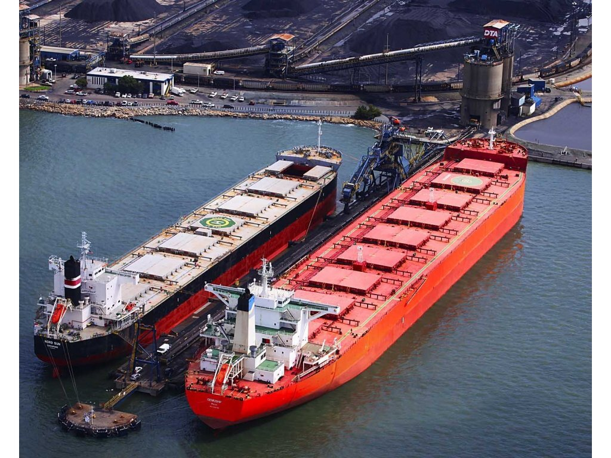
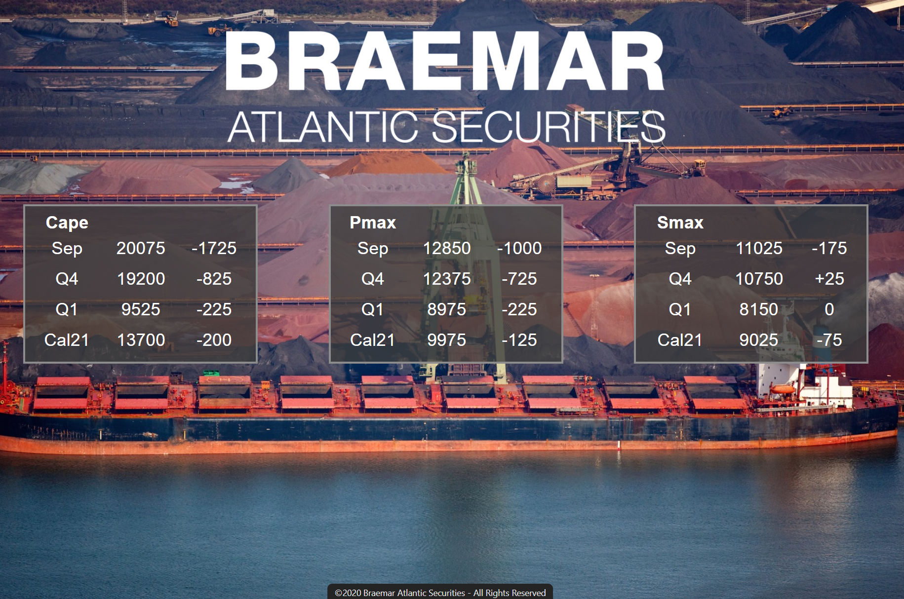
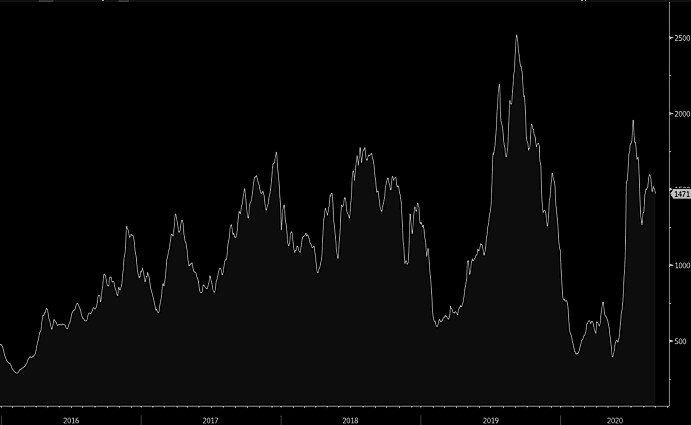

# Weather normalization in N. China brings sellers

**Date:** September 01, 2020  
**Publisher:** Breakwave Advisors | **Category:** Market Insights  
**Original URL:** [https://www.breakwaveadvisors.com/insights/2020/9/1/weather-normalization-negatively-affecting-rates](https://www.breakwaveadvisors.com/insights/2020/9/1/weather-normalization-negatively-affecting-rates)  

---

> **Figure 1: Ship16**  
> [Local Asset](file:///C:/Users/Dell/Github/Shipping/corpus/03-breakwave/insights/2020/assets/2020-09-01_weather-normalization-negatively-affecting-rates_img_ship16_80cce75b5324.jpg)

Freight futures across the board took a dive today, as the tightness and caution of last week due to a couple of weather systems in North China that were causing delays, faded. With the market now normalizing, a number of market participants felt more comfortable to hedge forward positions with futures that have been relatively stable for the past few weeks and, as a result, selling pressure across all asset classes pushed futures at the low end of their recent trading range.

Yet, we don’t foresee further aggressive moves on freight futures for now, despite the fact that the physical market remains relatively inactive with a downwards bias which is limiting the optimism in the futures market. Time and again however, any upward move in physical is abrupt, and most of the times not predicted by futures, and as a result, aggressively selling freight futures so early into the winter based on solely that, might not prove to be a wise strategy.

> **Figure 2: Baltic Dry Index**  
> *Chart: Baltic Dry Index*  
> [Local Asset](file:///C:/Users/Dell/Github/Shipping/corpus/03-breakwave/insights/2020/assets/2020-09-01_weather-normalization-negatively-affecting-rates_img_braemarsep1_94dfa7607b2d.png)

The next four months will be exciting for dry bulk shipping, since this time around, there is no clear direction similar to other years as we enter the seasonally strong period of the year. Iron ore export volumes remain strong, coal inventories in China low, while grain exports out of the US are once again at record high levels. On the other hand, ex-China, demand for bulk commodities remain weak and thus is not absorbing the marginal vessel supply to significantly tighten the market.

The macro environment remains favorable for commodities and thus shipping, with the weak US Dollar (lowest level in two years today) aiding restocking trends across most commodities. Iron ore prices remain in the $120 USD/ton range, a very welcoming development for miners, while iron ore inventories are still low and stable.

All the above makes it a compelling trading environment for market participants, as the odds are evenly spread without considerable premiums/discounts on freight futures versus spot, thus potentially leading to healthy gains for the traders that accurately read the market’s short term direction.

> **Figure 3: BDI**  
> [Local Asset](file:///C:/Users/Dell/Github/Shipping/corpus/03-breakwave/insights/2020/assets/2020-09-01_weather-normalization-negatively-affecting-rates_img_bdi_23a641bdc767.jpg)

---

**Tags:** Shipping, Dry Bulk, Capesize, Panamax  
