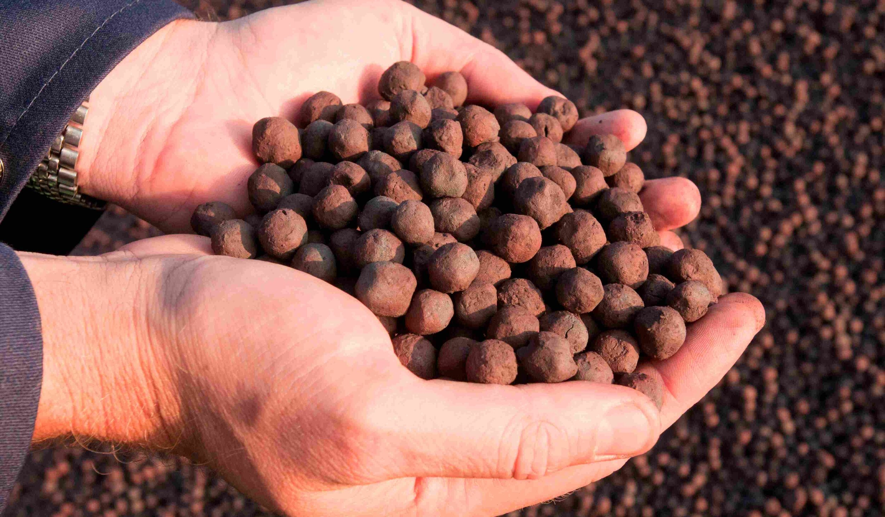
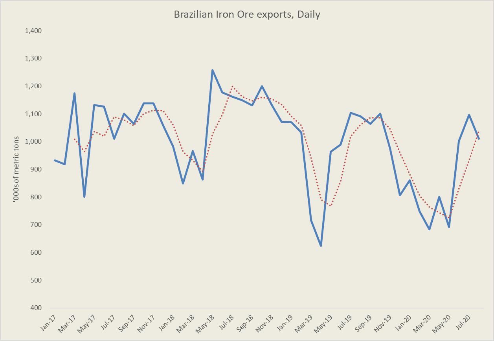
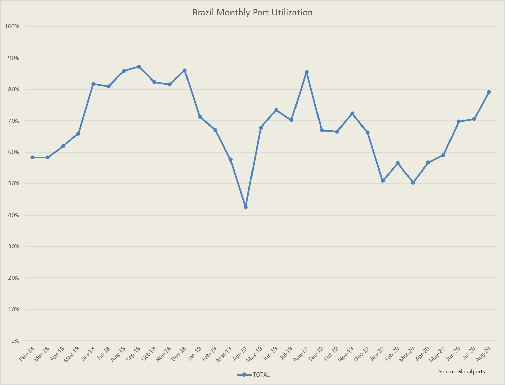

# Brazil Iron Ore Exports Recover, Expect Further Improvements

**Date:** September 02, 2020  
**Publisher:** Breakwave Advisors | **Category:** Market Insights  
**Original URL:** [https://www.breakwaveadvisors.com/insights/2020/9/2/brazil-iron-ore-exports-recover-expect-further-improvement](https://www.breakwaveadvisors.com/insights/2020/9/2/brazil-iron-ore-exports-recover-expect-further-improvement)  

---

> **Figure 1: Iron Ore Pellets**  
> [Local Asset](file:///C:/Users/Dell/Github/Shipping/corpus/03-breakwave/insights/2020/assets/2020-09-02_brazil-iron-ore-exports-recover-expect-further-improvement_img_ironorepellets_4425ade9df22.jpg)

For the month of August and based on official data by the Brazilian Ministry of Economy, Brazil saw a month-over-month decline in iron ore exports, with an estimated 1.0 million tons of daily exports, an 8% drop over July. Additionally, at 31.3 million tons for the whole month, the total was below last year’s 33.8 million tons. Port tracking data, however, indicates a jump in iron ore loadings for August, up some 16% from July, but still down from last year’s level. The difference is usually attributed to the timing of customs declarations. For shipping, actual loadings are more important, and given the rally in freight rates in July (corresponding to August loadings) it seems some of the iron ore in the official data was “booked for exporting” in July, but actually loaded in August. In any case, the fact of the matter is that Brazilian iron ore exports have gradually recovered, and the run rate has now caught up with last year as the chart below shows.

> **Figure 2: Br Iron Ore Run Rate**  
> [Local Asset](file:///C:/Users/Dell/Github/Shipping/corpus/03-breakwave/insights/2020/assets/2020-09-02_brazil-iron-ore-exports-recover-expect-further-improvement_img_brironorerunrate_56dfdad3f0db.png)

Brazilian port utilization is back to almost 80%, which is a relatively high number versus history, despite last year’s spike during the month of August (could be data driven rather than actual improvement at that time). All ports saw incremental volume improvements with the exception of Acu (mainly used by Anglo-American) that was marginally down.

> **Figure 3: Market Chart 3**  
> [Local Asset](file:///C:/Users/Dell/Github/Shipping/corpus/03-breakwave/insights/2020/assets/2020-09-02_brazil-iron-ore-exports-recover-expect-further-improvement_img_image-asset_47e955bfe1e2.png)

Brazilian iron ore exports remain some 9% lower versus last year, despite the favorable comps due to last year’s dam accident. Year-to-date, Brazil has exported some 209 million tons of iron ore, the lowest level since 2013.

We expect further improvements on a year-over-year basis, as the comps become more favorable given the production disruptions that Vale experienced late last year, with the export run rate declining quite a bit towards the fourth quarter of 2019.

---

**Tags:** Brazil, Capesize  
