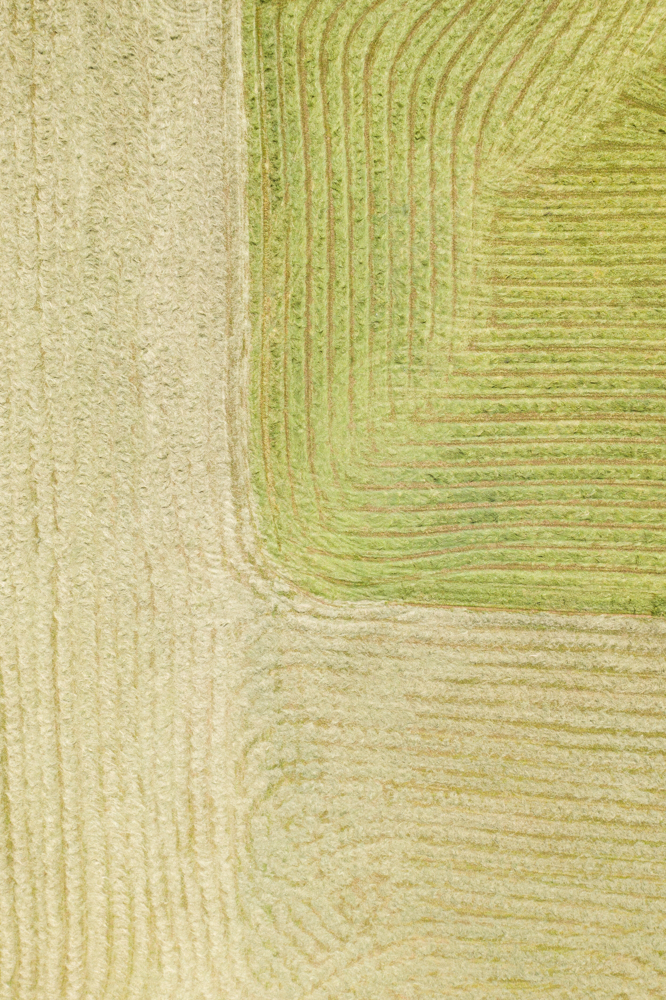
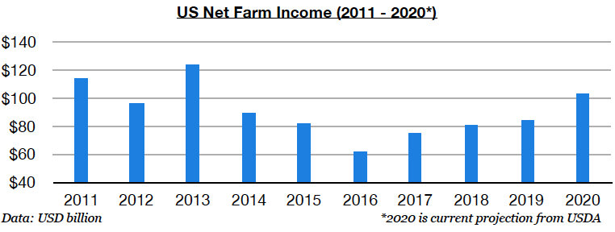
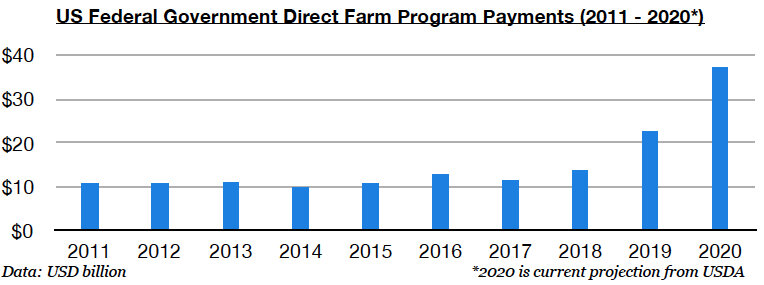

# US Farm Income Faring Very Well

**Date:** September 03, 2020  
**Publisher:** Breakwave Advisors | **Category:** Market Insights  
**Original URL:** [https://www.breakwaveadvisors.com/insights/2020/9/3/60abmyg0nxppybxq9hm39oysfy5zcb](https://www.breakwaveadvisors.com/insights/2020/9/3/60abmyg0nxppybxq9hm39oysfy5zcb)  

---

> **Figure 1: Market Chart 1**  
> [Local Asset](file:///C:/Users/Dell/Github/Shipping/corpus/03-breakwave/insights/2020/assets/2020-09-03_60abmyg0nxppybxq9hm39oysfy5zcb_img_image-asset_adfbbff50e31.jpeg)

The United States Department of Agriculture announced today that US net farm income has continued to climb this year and is expected to again reach its highest level since 2013. This remains significant as US farmers have not been faring nearly as poorly as many pundits and media outlets have been reporting in recent years. As we have examined in prior work, net income has been rising on a steady basis since 2017 and continued to rise in recent years even despite the trade war with China.

US net farm income this year is on pace to total $102.7 billion. This would mark a year-on-year increase of $19 billion (23%) and would mark the highest income since 2013’s record $123.7 billion.

> **Figure 2: Farm Chart 1**  
> [Local Asset](file:///C:/Users/Dell/Github/Shipping/corpus/03-breakwave/insights/2020/assets/2020-09-03_60abmyg0nxppybxq9hm39oysfy5zcb_img_farmchart1_b48d8627f8ec.jpg)

Federal government direct farm program payments are contributing to a large amount of the income. Federal government direct farm program payments are expected to end this year at a record $37.2 billion. This would equate to 36% of net farm income this year, which would mark its highest share since 2001.

> **Figure 3: Farm Chart 2**  
> [Local Asset](file:///C:/Users/Dell/Github/Shipping/corpus/03-breakwave/insights/2020/assets/2020-09-03_60abmyg0nxppybxq9hm39oysfy5zcb_img_farmchart2_5e5684b2b1c6.jpg)

---

**Tags:** Grains, China  
