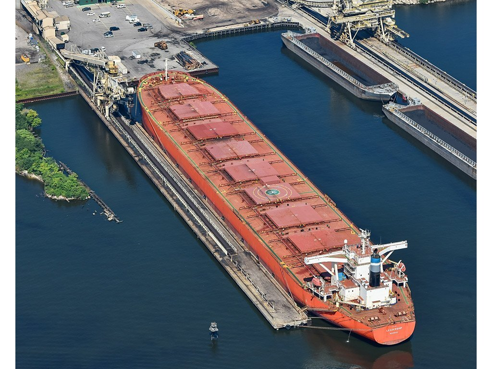
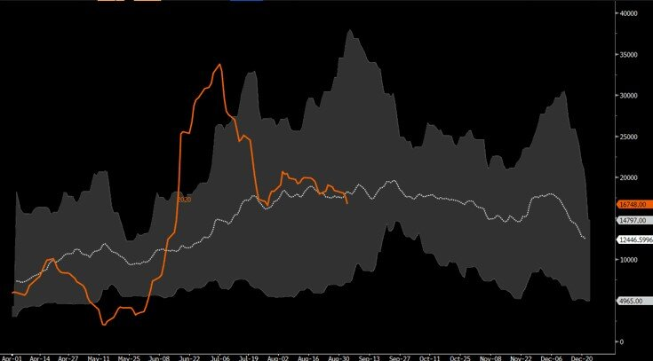
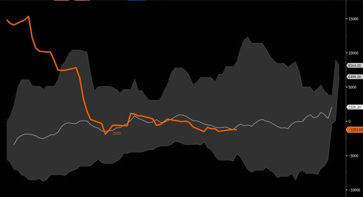
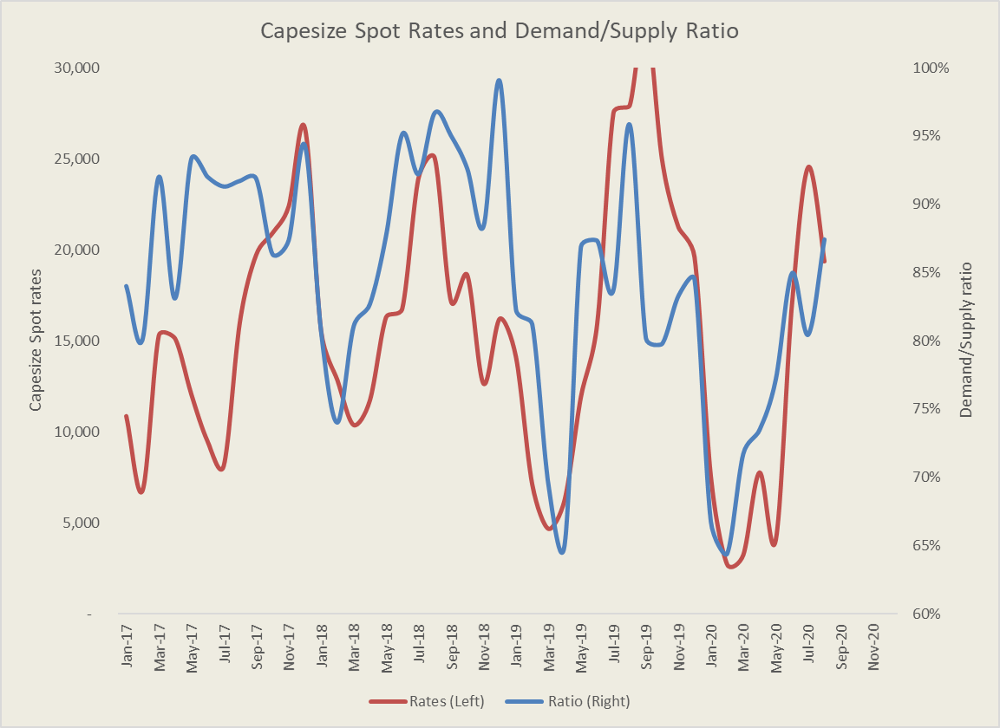

# Capesize rates: Where Do we Go from Here

**Date:** September 03, 2020  
**Publisher:** Breakwave Advisors | **Category:** Market Insights  
**Original URL:** [https://www.breakwaveadvisors.com/insights/2020/9/3/capesize-rates-where-do-we-stand-vs-the-past](https://www.breakwaveadvisors.com/insights/2020/9/3/capesize-rates-where-do-we-stand-vs-the-past)  

---

> **Figure 1: Capesize Spot Rates**  
> *Capesize spot rates, 5-year range*  
> [Local Asset](file:///C:/Users/Dell/Github/Shipping/corpus/03-breakwave/insights/2020/assets/2020-09-03_capesize-rates-where-do-we-stand-vs-the-past_img_ship6_6afb0b54176f.jpg)

The last few weeks have been quite uneventful for Capesizes, while in the last few days, spot Capesize rates have been drifting lower amid a dull and uneventful market. Futures are closely following the spot market, as there is little confidence among market participants about the near term direction of spot rates. Yet, if one were to look back at recent history, Capesize rates are not that different for this time of the year.

The first chart shows where Capesize rates currently are versus their recent historical range as well as the 5-year average. Following an unexpected rally in mid summer that exceeded market expectations, rates have now returned to the middle of their historical range and are closely tracking the five-year average for this time of the year.

> **Figure 2: Spot Capesize Rates Minus Q4 Freight Futures**  
> *Spot Capesize rates minus Q4 freight futures*  
> [Local Asset](file:///C:/Users/Dell/Github/Shipping/corpus/03-breakwave/insights/2020/assets/2020-09-03_capesize-rates-where-do-we-stand-vs-the-past_img_capesize5yearrange_6e1b5609f69c.jpg)

Additionally, futures are also showing a strong correlation to recent history. Looking at how the spread between fourth quarter Capesize futures and the spot index has performed so far in the third quarter, one can see that market participants are currently not placing any significant premium or discount versus the historical norm, as the chart below slows. That follows a steep discount to spot earlier in the third quarter, as the market was doubtful that the strong spot rates that were trading above 30,000 at the time will be sustained for the rest of the year.

> **Figure 3: Capesize Rates (3-Month Average) Vs**  
> *Capesize rates (3-month average) vs. Ratio of Demand to Supply (iron ore only)*  
> [Local Asset](file:///C:/Users/Dell/Github/Shipping/corpus/03-breakwave/insights/2020/assets/2020-09-03_capesize-rates-where-do-we-stand-vs-the-past_img_q4range_c653e3c63437.jpg)

Historical price patterns might not be useful once we look at what the future brings, as the supply/demand balance is quite different from year to year. After all, as in all commodities, rarely historical averages are realized (thus and the broad historical range). To that front, iron ore export volumes from Australia and (more importantly) from Brazil will play a much more important role on the future development of spot rates.

As the last chart shows, there is a decent correlation between Capesize spot rates and the ratio of demand to supply based solely on iron ore exports (such ratio takes into account the fleet size, sailing speeds and distances). So far this year, the improvement on such ratio has accurately predicted the summer rally in spot rates (although admittedly spot rates overshot the model in July).

> **Figure 4: Sd Balance Capesizes**  
> [Local Asset](file:///C:/Users/Dell/Github/Shipping/corpus/03-breakwave/insights/2020/assets/2020-09-03_capesize-rates-where-do-we-stand-vs-the-past_img_sdbalancecapesizes_2be1ed190edf.png)

As we look towards the rest of the year, the ratio of demand to supply should push towards 90%+, as iron ore exports ramp up. Such a prediction is further supported by iron ore prices that hover at 6+ year highs and just shy of $130/ton, providing a strong incentive for major miners to produce and export as much as possible to take advantage of such a robust market.

Finally, if such a scenario indeed plays out, then Capesize rates should follow, and with the fourth quarter futures currently in the 18,000 range, the risk/reward seems tilted towards higher realized rates for the rest of the year versus what is priced-in.

---

**Tags:** Shipping, Capesize, Brazil, Australia  
