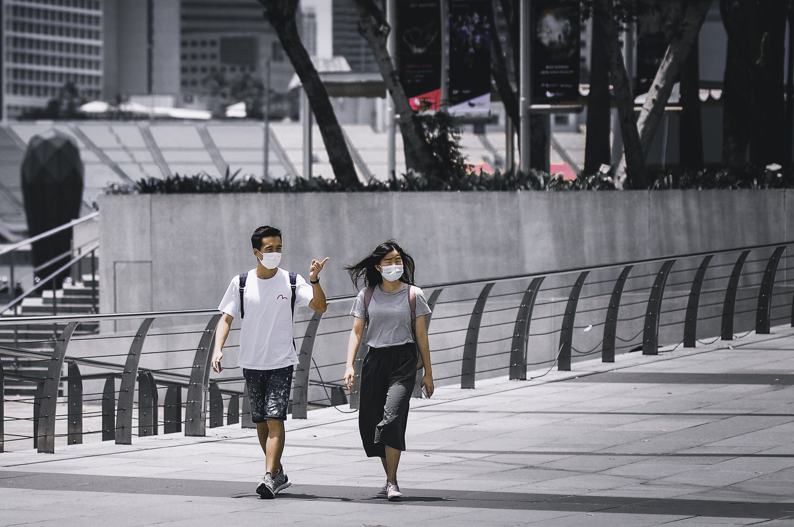

# India’s Daily Coronavirus Cases Set Another Record

**Date:** September 07, 2020  
**Publisher:** Breakwave Advisors | **Category:** Market Insights  
**Original URL:** [https://www.breakwaveadvisors.com/insights/2020/9/4/indias-daily-coronavirus-cases-set-another-record](https://www.breakwaveadvisors.com/insights/2020/9/4/indias-daily-coronavirus-cases-set-another-record)  

---

> **Figure 1: Coronavirus Pandemic Continues to Intensify in India (Where It**  
> *The coronavirus pandemic continues to intensify in India (where it is a dry bulk commoditydemandissue), but fortunately the pandemic continues to improve in Brazil (where it is no longer threatening dry bulk commoditysupply). Daily new coronavirus cases declined further in Brazil last week, but yet another record was seen in India. 84,156 new cases were reported in India on Thursday. Earlier last month new cases in India finally stopped rising, but daily records are being set again.*  
> [Local Asset](file:///C:/Users/Dell/Github/Shipping/corpus/03-breakwave/insights/2020/assets/2020-09-07_indias-daily-coronavirus-cases-set-another-record_img_image-asset_7a7f717a5006.jpeg)

Coronavirus-related deaths, however, peaked in India back in mid-August. Brazil’s new daily coronavirus cases still remain well below their July 29th peak and also have continued to decline. Coronavirus-related deaths in Brazil have continued to decline as well.

---

**Tags:** Coronavirus, India  
