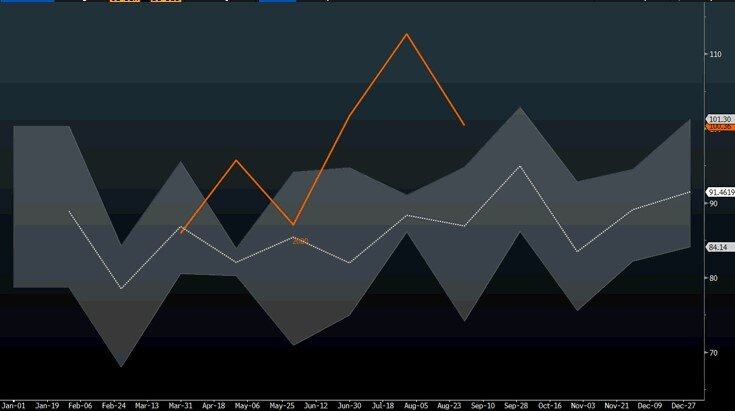
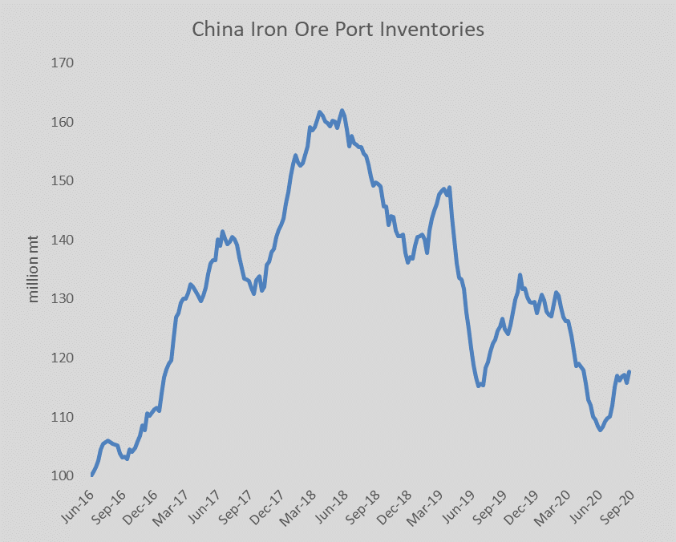
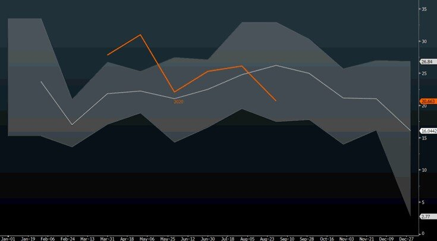

# Iron Ore Imports to China Remain Strong

**Date:** September 08, 2020  
**Publisher:** Breakwave Advisors | **Category:** Market Insights  
**Original URL:** [https://www.breakwaveadvisors.com/insights/2020/9/8/iron-ore-imports-to-china-remain-strong](https://www.breakwaveadvisors.com/insights/2020/9/8/iron-ore-imports-to-china-remain-strong)  

---

> **Figure 1: China’s Iron Ore Imports versus 5-Year Range**  
> *China’s iron ore imports versus 5-year range*  
> **Interactive Data & Source:** [Reuters](https://www.reuters.com/article/china-economy-trade-ironore/update-1-china-august-iron-ore-imports-down-109-from-july-on-falling-shipments-idUSL4N2G412J) | [Local Asset](file:///C:/Users/Dell/Github/Shipping/corpus/03-breakwave/insights/2020/assets/2020-09-08_iron-ore-imports-to-china-remain-strong_img_ironorepellets_4425ade9df22.jpg)

Iron ore imports into China continue to increase versus last year, with August reported number up 6% compared to the same period last year. That was lower, however, from the record high imports for the month of July, but July imports were unusually strong for a single month. After all, Australia, which is the closest major iron ore exporter to China, had a record high month in June. In addition,[COVID-related delays also played a role as customs clearance slowed down](https://www.reuters.com/article/china-economy-trade-ironore/update-1-china-august-iron-ore-imports-down-109-from-july-on-falling-shipments-idUSL4N2G412J)during the month of August, contributing to the sequential decline.

The run rate remains on track for another record year when it comes to China’s iron ore imports.

> **Figure 2: China Iron Ore Imports**  
> [Local Asset](file:///C:/Users/Dell/Github/Shipping/corpus/03-breakwave/insights/2020/assets/2020-09-08_iron-ore-imports-to-china-remain-strong_img_chinaironoreimports_d207cc5071ff.jpg)

Iron ore inventories remain low, albeit off their recent 4-year lows, but there has been no significant inventory rebuilding despite the very strong imports over the last few months. Although inventories are now in the middle of their historical range on an absolute basis, adjusted for consumption, they now stand at the lowest point since 2015.

> **Figure 3: China’s Coal Imports versus 5-Year Range**  
> *China’s coal imports versus 5-year range*  
> [Local Asset](file:///C:/Users/Dell/Github/Shipping/corpus/03-breakwave/insights/2020/assets/2020-09-08_iron-ore-imports-to-china-remain-strong_img_ironoreinventorries2csep4_f7e3e6748565.png)

Overall, the data for August was supportive of a strong freight market. Excluding iron ore, coal imports were weaker compared to July, but remain on a run rate of about 300 million tons for the whole year, which is in line to the last few year’s level given the import quota that China imposes on coal imports (there is usually a big seasonal drop every year towards December as imports quotas are met).

> **Figure 4: China Coal Imports**  
> [Local Asset](file:///C:/Users/Dell/Github/Shipping/corpus/03-breakwave/insights/2020/assets/2020-09-08_iron-ore-imports-to-china-remain-strong_img_chinacoalimports_b7a5a07f37cf.jpg)

Finally, China’s soybean imports had another strong month, now tracking at the high end of their recent historical range, as China continues to build up strategic inventories in grains but also the year-over-year comparisons are now quite favorable given the trade tensions last year.

**Total imports for the three major dry bulk commodities into China, namely iron ore, coal and soybeans, are up 8.7% year to date**, a very strong performance driven mainly by strong demand for steel that is absorbing increasingly higher iron ore volumes into the country.

---

**Tags:** Shipping, Dry Bulk, Capesize, China  
