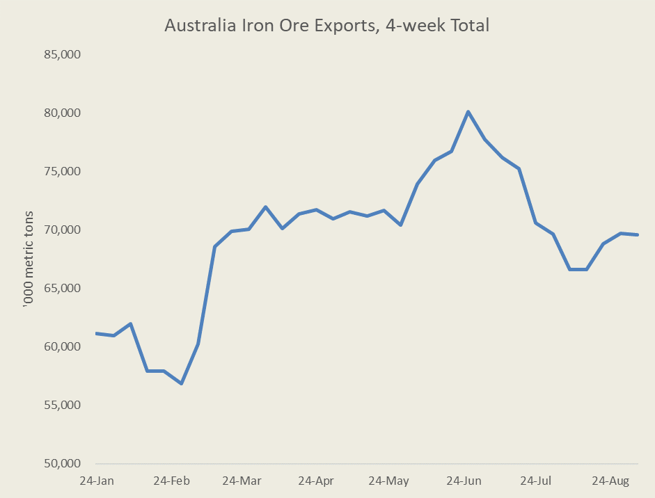
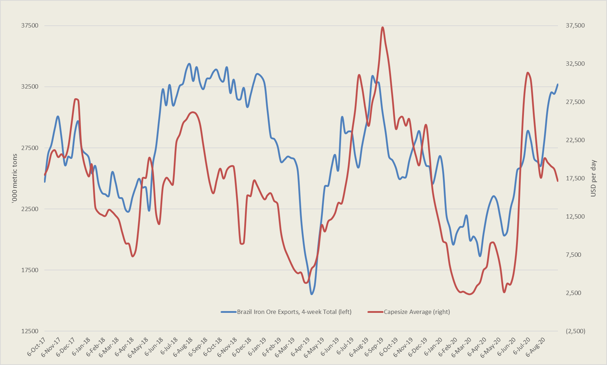
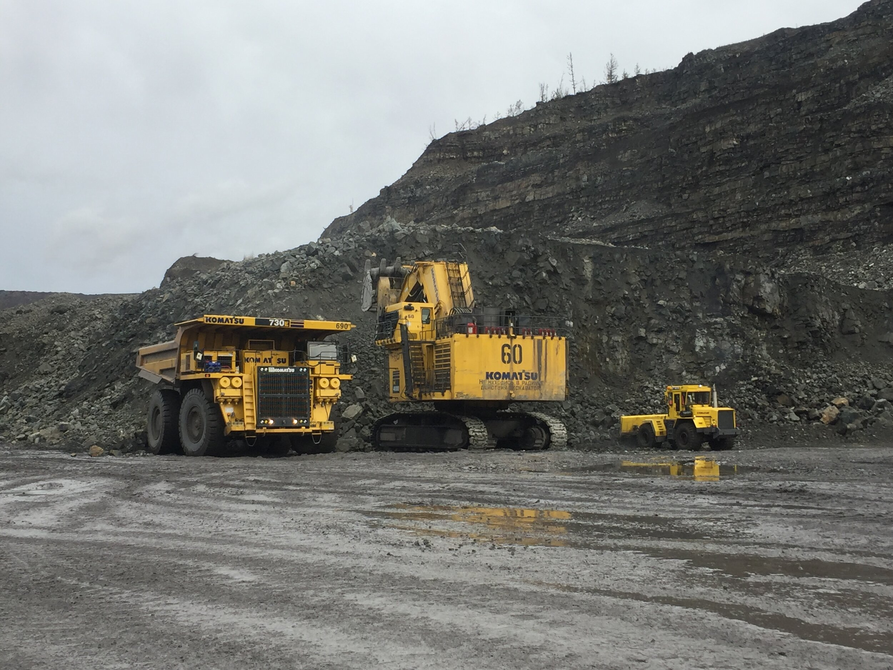

# Capesize rates Continue to weaken despite solid export volumes

**Date:** September 09, 2020  
**Publisher:** Breakwave Advisors | **Category:** Market Insights  
**Original URL:** [https://www.breakwaveadvisors.com/insights/2020/9/9/capesize-rates-weaken-despite-solid-export-volumes](https://www.breakwaveadvisors.com/insights/2020/9/9/capesize-rates-weaken-despite-solid-export-volumes)  

---

> **Figure 1: Ship26**  
> [Local Asset](file:///C:/Users/Dell/Github/Shipping/corpus/03-breakwave/insights/2020/assets/2020-09-09_capesize-rates-weaken-despite-solid-export-volumes_img_ship26_5f0b2d91676d.jpg)

The Capesize market continued its descent today, with average spot rates dropping to the mid-15,000 range and with all shipping routes posting losses. The downward trend that begun in early August remains in place for the large dry bulk ships, although volatility has been subdued during that period, something of an anomaly for the highly volatile Capesize market.

Despite the weakening trend in spot rates, iron ore exports remain strong from both Brazil and Australia, the two main exporting regions. Although the pace of exports from Australia has eased from the record high levels of early summer, it is still healthy, while Brazil continues to post new highs for the year. Yet, Capesize spot rates have fail to react so far to the strong cargo flows.

Looking first at Australia, the 4-week run rate has gradually declined from the record high 80 million plus range hit in late June, but has started to slowly recover. As the calendar year comes to an end, an acceleration is exports should be expected, in line with historical trends, which should be supportive for Capesize rates in the Pacific region.

> **Figure 2: Aussie Iron Ore**  
> [Local Asset](file:///C:/Users/Dell/Github/Shipping/corpus/03-breakwave/insights/2020/assets/2020-09-09_capesize-rates-weaken-despite-solid-export-volumes_img_aussieironore_4823847b9ee0.png)

More interestingly, Brazilian iron ore exports remain firm, and actually the 4-week run rate hit a new high for the year last week of more than 32 million tons (blue line in the chart below). Such level matches more or less the highs of last year’s run rate, which subsequently experienced a significant decline during the fourth quarter of 2019, as Vale’s woes from the Brumadinho dam incident remained an issue for both production and exports.

Yet, there has recently been a divergence between the relatively healthy export levels and Capesize rates (red line reflects rates vs blue line corresponding to exports). This is a bit puzzling but not unheard of, especially given the volatile nature of Capesize rates. With exports still remaining solid this week (pointing to a 2020-record month for September, although it is still too early), the probability of rates turning back up seems higher versus a decline in exports, based on historical trends.

> **Figure 3: “We Are More Bullish on Chinese Steel Demand for the Next Three**  
> *“We are more bullish on Chinese steel demand for the next three years based on projected continuation of government support, with the property, infrastructure and automotive sectors expected to remain key pillars of China’s economic growth over the period.”*  
> [Local Asset](file:///C:/Users/Dell/Github/Shipping/corpus/03-breakwave/insights/2020/assets/2020-09-09_capesize-rates-weaken-despite-solid-export-volumes_img_brazilepxortsvsrates_e961a01edcf4.png)

Looking forward, there should be a steadier trajectory when it comes to Brazilian iron ore exports versus last year, and the run rate might even accelerate further as the year progresses. Vale remains confident of reaching their production target, which means exports need to at least be maintained at the current pace for the rest of the year. Such a high run rate of exports will most likely put upward pressure in rates in the Atlantic region, thus pushing the Capesize average higher.

In addition, the Chinese economy looks solid when it comes to infrastructure spending, and in fact demand for steel and steel products is posting new records month after month. Citigroup is also focusing on such a strength in their most recent report, where they raised their iron ore forecasts:

> **Figure 4: Market Chart 4**  
> [Local Asset](file:///C:/Users/Dell/Github/Shipping/corpus/03-breakwave/insights/2020/assets/2020-09-09_capesize-rates-weaken-despite-solid-export-volumes_img_image-asset_d50872c46f4b.jpeg)

For Capesize rates, the recent divergence from trend should soon revert, and as is always the case in shipping, such a reversion will not be gradual but rather abrupt. Freight futures have declined in tandem with spot, and the curve remains almost flat, which should benefit long positions were spot rates to turn higher (compare than to history when Q4 futures were usually at steep premiums to spot).

Turning points in freight rates are very difficult to call, but fundamentally the demand side of the equation points to an improvement in the spot market soon as iron ore exports accelerate.

---

**Tags:** Capesize, Dry Bulk, Brazil, Australia  
