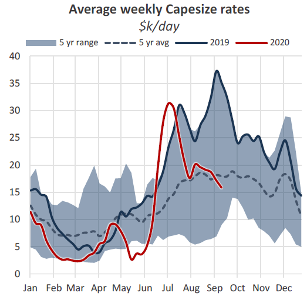
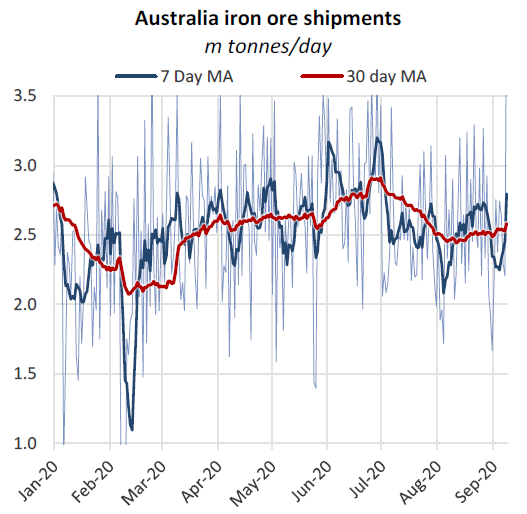
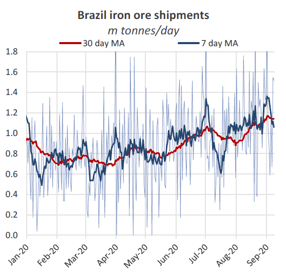
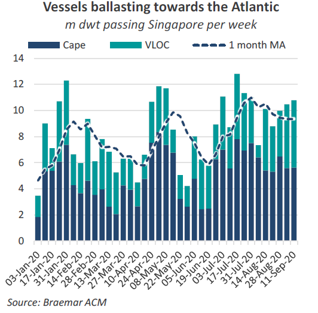
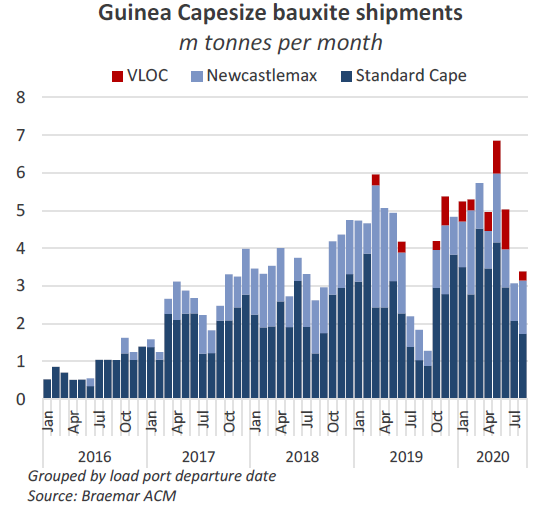
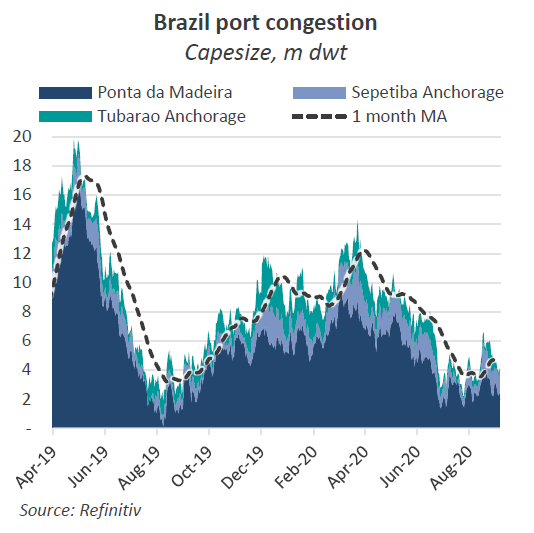
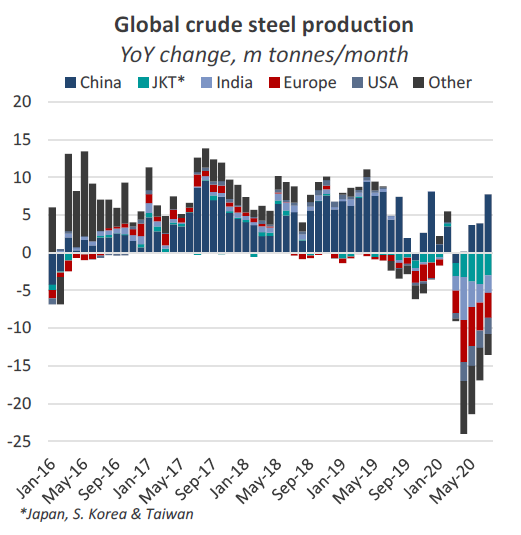

# Capesize market: Back to school

**Date:** September 11, 2020  
**Publisher:** Breakwave Advisors | **Category:** Market Insights  
**Original URL:** [https://www.breakwaveadvisors.com/insights/2020/9/11/capesize-market-back-to-school](https://www.breakwaveadvisors.com/insights/2020/9/11/capesize-market-back-to-school)  

---

*by Nick Ristic*

### Slide Away

After a mighty rally in June, and a subsequent correction in July, the Cape market seemingly took the rest of the summer off, trading within a $2,500/day range for the most of August.The past couple of weeks have however seen gradual, but steady erosion of earnings.

> **Figure 1: Braemar 1**  
> [Local Asset](file:///C:/Users/Dell/Github/Shipping/corpus/03-breakwave/insights/2020/assets/2020-09-11_capesize-market-back-to-school_img_braemar1_e8954abb0fd8.png)

Average Capesize rates, according to the Baltic 5TC index, have fallen to just above $15,000/day at the time of writing, more than $5,000/day lower than at the start of August, and $20,222/day lower versus this time last year (the peak of 2019’s market). Losses in the paper market have been more stark, with near term Capesize FFA contracts shedding almost $8,000/day in value since mid August.

### Weaker Volumes in the Pacific

June’s surge in Cape demand was driven by a boost in iron ore volumes from Australia, as the miners sought to maximize sales to China ahead of the end of the Australian financial year and while prices remained strong. Shipments from the majors in West Australia jumped 8% MoM to over 80.3m tonnes, accounting for 436 Capesize liftings according to AIS cargo tracking data.

> **Figure 2: Bramar 2**  
> [Local Asset](file:///C:/Users/Dell/Github/Shipping/corpus/03-breakwave/insights/2020/assets/2020-09-11_capesize-market-back-to-school_img_bramar2_ecc4557befb7.png)

Since then however, volumes have not been so impressive. Liftings from the major charterers in Western Australia totaled just under 70.9m tonnes in August, up by 1% YoY, but down by 12% on June’s shipments. August also saw the lowest weekly average pace of shipments since the cyclone disruptions in February. While iron ore prices are still very strong, the iron ore majors seem unwilling to significantly boost capacity, and risk tipping the market back into oversupply.

Rates over August were likely kept buoyant by disruptions to supply. As we have covered in recent weeks, August saw record levels of Capesize congestion in China, tying up 16m dwt at its peak (4.4% of the fleet), thanks to elevated arrivals of iron ore, quotas on coal imports, bad weather and Covid-19 testing procedures. Restrictions on crew changes have also affected supply, with many ships deviating to atypical ports to switch personnel and being subject to 14-day quarantine on arrival at load and discharge ports.

So far this month volumes seem to be bouncing back, with shipments on track to grow by around 4% MoM. There is however a significant queue in Australia also, which will need to be chewed down before improved volumes are felt in the market.

> **Figure 3: Braemar 3**  
> [Local Asset](file:///C:/Users/Dell/Github/Shipping/corpus/03-breakwave/insights/2020/assets/2020-09-11_capesize-market-back-to-school_img_braemar3_e138b8e7d809.png)

Congestion at Australian anchorages stood at 11m dwt at the start of this week. 194% higher YoY.

**In the Atlantic...**

It’s a different story on the other side of the world, where Brazilian iron ore output has been cranking back up from Q1’s lows. August saw volumes surge by 24% MoM to 35.4m tonnes, though this was still 5% lower versus August 2019.

The weather related issues and Covid-19 disruptions felt earlier in the year seem to have subsided and miners are working to hit their full-year production targets. September shipments are on track to remain broadly in line with last month’s figure, though we have seen a decline in volumes over the past few days.

> **Figure 4: Braemar 4**  
> [Local Asset](file:///C:/Users/Dell/Github/Shipping/corpus/03-breakwave/insights/2020/assets/2020-09-11_capesize-market-back-to-school_img_braemar4_ffca60bc2f6e.png)

But the market in the Atlantic has had other problems to contend with. July saw a swathe of Capesizes ballasting towards the basin, with an average of 7m dwt of Cape and Newcastlemax tonnage passing Singapore per week. This compares to around 4m dwt per week over June.

> **Figure 5: Braemar 5**  
> [Local Asset](file:///C:/Users/Dell/Github/Shipping/corpus/03-breakwave/insights/2020/assets/2020-09-11_capesize-market-back-to-school_img_braemar5_a7f9c82cb374.png)

And the flow of ballasters has remained elevated since, as owners appear to be speculating that cargo volumes in the Pacific will remain depressed, relative to those in Brazil. This has left the Atlantic oversupplied, with a long tonnage list ready to cover any increase in iron ore coming onto the water.

Adding to the pressure, the rainy season in Guinea has temporarily throttled bauxite traffic there. With this 5m tonne per month trade significantly reduced until at least October, we are seeing ships usually employed here seek business elsewhere.

> **Figure 6: But There Are Plenty of Obstacles to This That One Could Point**  
> *But there are plenty of obstacles to this that one could point out to argue the bear scenario, which is looking increasingly likely. Firstly, the projected iron ore production volumes for the remainder of the year are notthatspectacular relative to previous years. And actual shipments will be lower still once output is eaten into by domestic consumption.*  
> [Local Asset](file:///C:/Users/Dell/Github/Shipping/corpus/03-breakwave/insights/2020/assets/2020-09-11_capesize-market-back-to-school_img_braemar6_ae3c0299419c.png)

### How Long?

While the market is continuing to soften, questions are being raised over how far rates can slide - and for how long - before we again see a squeeze on tonnage, given the relatively healthy volumes of ore being shipped and the ongoing supply-side issues.

If you wanted to be a bull, you could argue that the output from Brazil necessary to hit projected production estimates for the year will translate to a surge in Brazilian volumes in Q4. Coupled with sustained high levels, the argument follows, this situation would see another rally in rates later in the year, and a strong Q4.

The mantra of ‘margin over volume’ is still very much present in the production reports of the top miners. Oversupply is a key concern. The queue at Brazilian anchorages has so far not taken a hit from August’s boost in liftings and it seems that if the inflow of ballasters remains steady, earnings will be capped. As China’s weather conditions improve, congestion there is also expected to ease, leading to an uptick in the number of vessels opening up in the Pacific.

> **Figure 7: Braemar 7**  
> [Local Asset](file:///C:/Users/Dell/Github/Shipping/corpus/03-breakwave/insights/2020/assets/2020-09-11_capesize-market-back-to-school_img_braemar7_13fb49377e6e.png)

And while China’s steel output has hit record highs this year, total global steel production is still tracking 7% below last year’s levels. China is by far the most important driver of the seaborne iron ore market, but we still expect lower demand from other importers to weigh on Cape demand.

> **Figure 8: Braemar 8**  
> [Local Asset](file:///C:/Users/Dell/Github/Shipping/corpus/03-breakwave/insights/2020/assets/2020-09-11_capesize-market-back-to-school_img_braemar8_8e13bc571aa7.png)

As always though in this volatile market, the fundamentals can turn on a dime, and we will continue to look out for changes that indicate a shift in this sentiment.

---

**Tags:** Capesize, China, Dry Bulk, India, Shipping  
