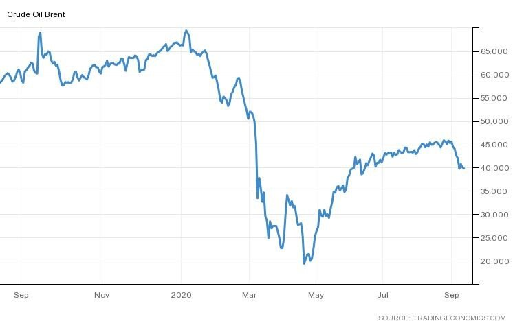

# A faltering recovery?

**Date:** September 14, 2020  
**Publisher:** Breakwave Advisors | **Category:** Market Insights  
**Original URL:** [https://www.breakwaveadvisors.com/insights/2020/9/13/a-faltering-recovery](https://www.breakwaveadvisors.com/insights/2020/9/13/a-faltering-recovery)  

---

> **Figure 1: By Ulf Bergman**  
> [Local Asset](file:///C:/Users/Dell/Github/Shipping/corpus/03-breakwave/insights/2020/assets/2020-09-14_a-faltering-recovery_img_image-asset_ba7f6c7a950a.jpeg)

AstraZeneca’s announcement a few days ago that a COVID-19 vaccine trial was temporarily suspended served as a timely reminder that we are still in the middle of the pandemic. The trial has since restarted in the UK, and the company is expressing some optimism that a vaccine could be ready by the end of the year. Whether such an assessment of the situation is overambitious or not is probably best left for the scientific community to judge. The key implication is, however, that the COVID-19 looks set to continue to dominate the news flow for the rest of the year and possibly well into the next.

Some recent economic data releases have painted a picture of a global economy surprising on the upside, with economic data pointing towards a stronger than expected rebound, and world trade volumes recovering faster than after the great financial crisis a decade ago. The bad news is that this is against a backdrop of increasing infection rates around the globe, with some nations potentially facing the dreaded second wave. New restrictions are likely to be put in place in many places. Total lockdowns, like in the first half of the year, look unlikely for the time being, as it is doubtful that there is much fiscal room for such measures anywhere. A more likely course of action will be local restrictions, with less severe negative economic impact. The rebound in economic activity that began during the summer could sail into considerable headwinds during the last part of the year, with the recovery stagnating.

The crude oil price could serve as a good illustration of a slowing momentum of the recovery, with Brent down more than ten percent since the beginning of the month. Traders see the recovery faltering and demand dipping for the black gold. The story of floating storage from last quarter is regaining its relevance, with large players, such as Trafigura, again signing up VLCC’s for long-term storage of crude at sea.

> **Figure 2: Crude Price**  
> [Local Asset](file:///C:/Users/Dell/Github/Shipping/corpus/03-breakwave/insights/2020/assets/2020-09-14_a-faltering-recovery_img_crudeprice_28b26fc721e7.jpg)

A potentially unpredictable and uneven recovery from a pandemic induced recession puts the focus on what the government stimulus plans can provide in terms of life support. That Chinese raw material imports are key to the fortunes of the dry bulk shipping is hardly anything new, but recent record quantities of import of iron ore have taken this to a new level. It has been interesting to see new monthly records month after month in the recent past, but without seeing the equivalent increase in steel output.

As stockpiles keep swelling, one asks for how long there is a political will to continue to tie up capital in strategic reserves of iron ore. For dry bulk shipping, a decision to start using the stockpiles would clearly be unwelcome. In the meantime, the political friction between China and Australia is adding a healthy amount of tonne-mile demand, as some Australian iron ore is replaced by more distant Brazilian ore.

Looking at the rest of the year from a pandemic perspective, the world looks like it will have to rely on governments to keep the wheels moving in a Keynesian way. As a miracle cure appears highly unlikely, one can only hope that the current initiatives by the authorities to limit the spread are reasonably successful and additional economic pain avoided.

---

**Tags:** Global Economy, Coronavirus, Tankers, Dry Bulk  
