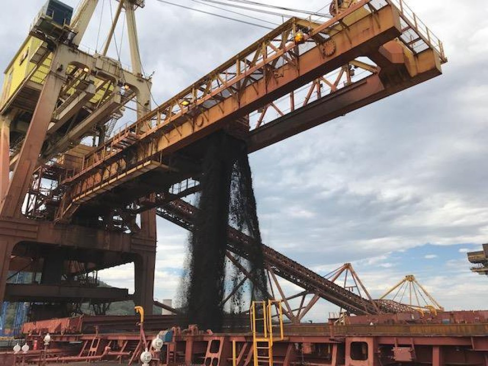
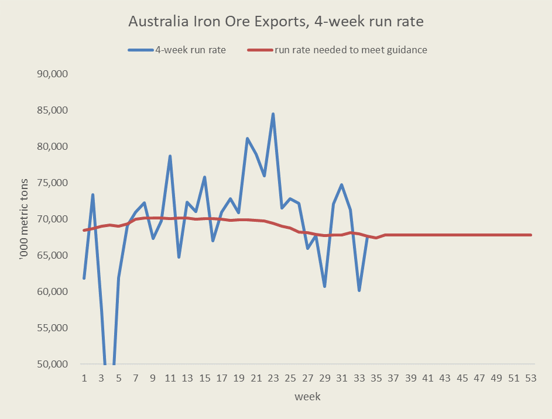
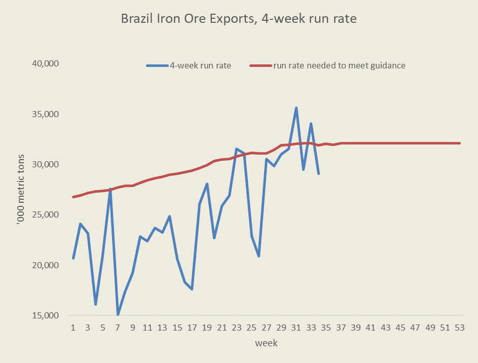
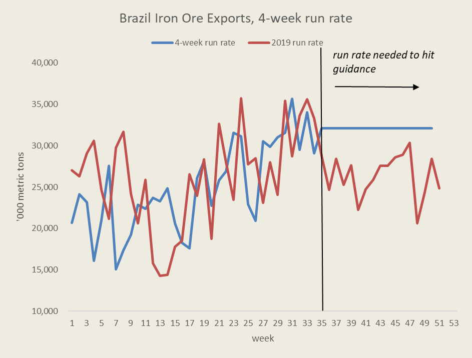
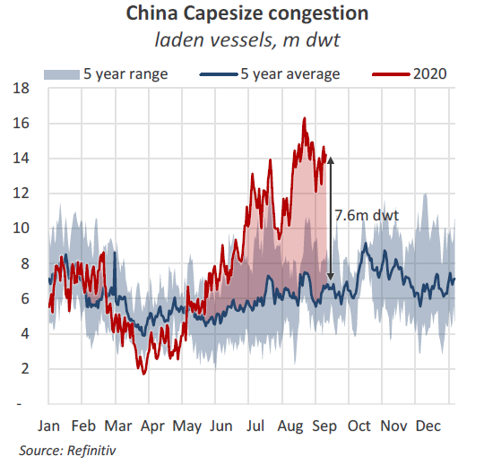

# Are we at an inflection point for Capesize rates?

**Date:** September 16, 2020  
**Publisher:** Breakwave Advisors | **Category:** Market Insights  
**Original URL:** [https://www.breakwaveadvisors.com/insights/2020/9/16/are-we-at-an-inflection-point-for-capesize-rates](https://www.breakwaveadvisors.com/insights/2020/9/16/are-we-at-an-inflection-point-for-capesize-rates)  

---

> **Figure 1: Ship26**  
> [Local Asset](file:///C:/Users/Dell/Github/Shipping/corpus/03-breakwave/insights/2020/assets/2020-09-16_are-we-at-an-inflection-point-for-capesize-rates_img_ship26_5f0b2d91676d.jpg)

Despite being a year for the records in terms of social impact and economic disruption due to the COVID-19 pandemic, 2020 has proven to be a year of a lot of similarities to 2019 if one looks strictly at dry bulk freight rates. The year begun with significant weakness due to the virus outbreak, which sunk Capesize rates towards zero, very similar to last year, when the rapture of the Brumadinho dam had a similar effect on the freight market.

Then, a strong late summer rally drove Capesize rates towards the mid-30,000 level, followed by a sharp correction down to the mid-20,000, though admittedly the correction this time around has been deeper than last year’s more controlled drop.

Freight futures for the fourth quarter are pointing towards 18,000, which is lower than the 22,000 realized last year while that is also below the level futures were trading this time last year (~25,000 in 2019). Yet, based on the iron ore macro environment, expectations are for a stronger season when it comes to iron ore exports, which should have a more positive impact on freight rates compared to last year.

Both Australia and Brazil iron ore exports have now recovered from earlier in the year and are running on target to hit their annual consensus. Looking first at Australia, a sharp increase in exports earlier in the summer compensated for the first quarter weakness, and now the run rate is basically at par with the level needed to reach almost 885 million tons of exports for 2020.

> **Figure 2: Aussie Run Rate**  
> [Local Asset](file:///C:/Users/Dell/Github/Shipping/corpus/03-breakwave/insights/2020/assets/2020-09-16_are-we-at-an-inflection-point-for-capesize-rates_img_aussierunrate_bda8bac1cabe.png)

In Brazil, the recovery has been more gradual, but the 4-week run rate has hit the 30+ million-ton mark, a level that if sustained, will mean that Brazil will export approximately 355 million tons for 2020, about 10 million tons above last year’s level.

> **Figure 3: Brazil Run Rate**  
> [Local Asset](file:///C:/Users/Dell/Github/Shipping/corpus/03-breakwave/insights/2020/assets/2020-09-16_are-we-at-an-inflection-point-for-capesize-rates_img_brazilrunrate_17c24e54fd00.png)

The path to getting to where we are today in terms of Brazilian exports has been bumpy but very similar to last year. Early in the season, exports collapsed, reflecting the COVID-19 outbreak combined with weather related disruptions. Then, a rush to increase export volumes throughout the summer has lead to a significant increase in the export run rate towards the 32 million ton mark. Still, total exports are down some 7% versus last year, but for the whole year there is an expectation that the actual number will exceed the 2019 level (at least based on Vale’s published guidance). This is due to September-December weakness in exports last year, as the dam incident continued to negatively affect export volumes from Vale’s mining system.

> **Figure 4: Finally**  
> *Finally, port congestion remains an issue for the overall shipping market, while when one looks at Capesize vessels in particular, the impact appears quite meaningful. As Braemar puts it:” August saw record levels of Capesize congestion in China, tying up 16m dwt at its peak (4.4% of the fleet), thanks to elevated arrivals of iron ore, quotas on coal imports, bad weather and Covid-19 testing procedures. Congestion at Australian anchorages stood at 11m dwt at the start of this week. 194% higher YoY”.*  
> [Local Asset](file:///C:/Users/Dell/Github/Shipping/corpus/03-breakwave/insights/2020/assets/2020-09-16_are-we-at-an-inflection-point-for-capesize-rates_img_brazilfuturesrtunrate_9a255377377f.png)

If Brazil manages to sustain the current run rate for the rest of the year, then indeed the annual export number will exceed last year’s total by ~10 million tons (355mt vs. 345mt).

What will that mean for dry bulk freight rates?

A sustained Brazilian export rate of above 30 million tons for the rest of the year should have a positive impact on Capesize rates, all else being equal. Compared to last year, when Brazilian exports dropped and yet Capesize rates remained relatively strong, the average should at least match the 2019 level (~22,000 was the realized Capesize rate in Q4 2019). Obviously, there are numerous factors affecting freight rates other than Brazilian iron ore exports, but if Brazil starts to absorb more and more Capesize vessels in late October-early November stems, then the Atlantic Capesize market should strengthen, and with that pulling the Capesize average higher.

> **Figure 5: Congestion**  
> [Local Asset](file:///C:/Users/Dell/Github/Shipping/corpus/03-breakwave/insights/2020/assets/2020-09-16_are-we-at-an-inflection-point-for-capesize-rates_img_congestion_e138b8e7d809.png)

**

---

**Tags:** Capesize, Shipping, Dry Bulk  
