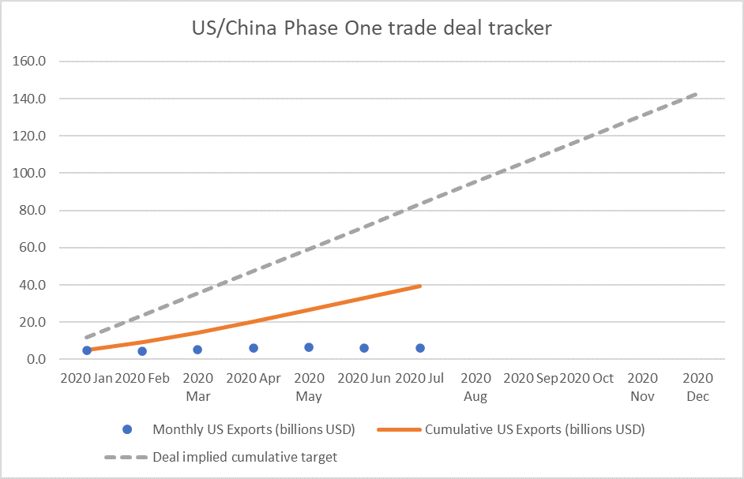

# Geopolitics - An Increasingly Tense World

**Date:** September 17, 2020  
**Publisher:** Breakwave Advisors | **Category:** Market Insights  
**Original URL:** [https://www.breakwaveadvisors.com/insights/2020/9/17/geopolitics-an-increasingly-tense-world](https://www.breakwaveadvisors.com/insights/2020/9/17/geopolitics-an-increasingly-tense-world)  

---

> **Figure 1: By Ulf Bergman**  
> [Local Asset](file:///C:/Users/Dell/Github/Shipping/corpus/03-breakwave/insights/2020/assets/2020-09-17_geopolitics-an-increasingly-tense-world_img_image-asset_b0c226ae061b.jpeg)

Does anyone remember the Phase One trade deal between the US and China, which was signed with great fanfare back in January this year? One can be forgiven for having let it slip from the immediate consciousness, together with the issues regarding fuel price spreads arising from the IMO2020 regulations. Both stories were expected to dominate the shipping and commodity news flows during this year but were overtaken by greater events. The trade deal was originally met with some optimism in the shipping world, as it stipulated a considerable increase in Chinese purchases of energy, agricultural commodities (e.g. soybeans) and manufactured goods from the US. Compliance with the deal would have added additional tonne-mile demand to both dry bulk and tanker shipping. Even the container lines could have benefited from a more balanced trade across the Pacific, with a stronger backhaul. However, recent data from the Peterson Institute for International Economics show that the deal is far from implemented, with the deal and reality appearing to be on different trajectories.

> **Figure 2: Source: Chad P**  
> *Source: Chad P. Bown. 2020. US-China Phase One Tracker: China’s Import Purchases. PIIE Chart, Peterson Institute for International Economics (September 10).*  
> [Local Asset](file:///C:/Users/Dell/Github/Shipping/corpus/03-breakwave/insights/2020/assets/2020-09-17_geopolitics-an-increasingly-tense-world_img_ulfpic_87f549695cde.png)

Clearly the pandemic has thrown some spanners in the works for the deal and it possible that trade volumes will get back on track in due course. Recent events and policies have rather made the US trade deficit with China even larger and it appears questionable if the deal will ever be more than a signed document. As the campaign for the White House heats up, it is easy to imagine a scenario with hardening rhetoric on trade and geopolitics, adding to the already strained trans-pacific relations.

> **Figure 3: Market Chart 3**  
> [Local Asset](file:///C:/Users/Dell/Github/Shipping/corpus/03-breakwave/insights/2020/assets/2020-09-17_geopolitics-an-increasingly-tense-world_img_image-asset_aa2a37816b2e.jpeg)

Another flashpoint with implications for the shipping industry is the ongoing diplomatic friction between Australia and China, with Australian iron ore and barley in the line of fire. As Australia is the nearest major supplier of the commodities to China, any substitutions mean longer transport distances which will support freight rates. Brazil is one of the beneficiaries of the spat, with iron ore output growing strongly.

Even among traditional allies there are trade tensions brewing, with the North Atlantic trade lane potentially coming under pressure with additional trade tariffs. Due to its relative size it will have less of an impact on the shipping sector, compared to Chinese related trades. However, it is an illustration of trade frictions going global. With global economic growth looking to be muted for the foreseeable future, due to lasting effects of the pandemic and climate change, trade is increasingly seen as a zero-sum game and national interests are replacing free trade.

Due to the nature of the shipping business, geopolitics can translate into physical hazards as well. Currently, there are several potential flashpoints that could directly affect the seaborne flow of goods. The ever-present risks of the Strait of Hormuz are well documented. In addition, The South China Sea and the Eastern Mediterranean are major trade lanes that could potentially face disruptions due to conflicts.

---

**Tags:** Shipping, Trade, Soybeans, Economics, China, Us  
