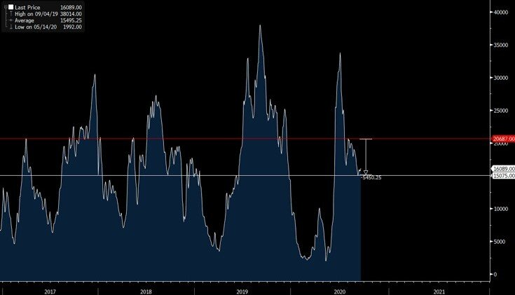
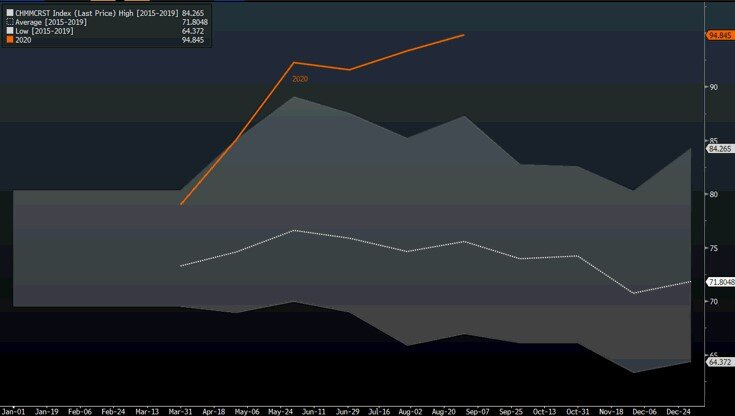
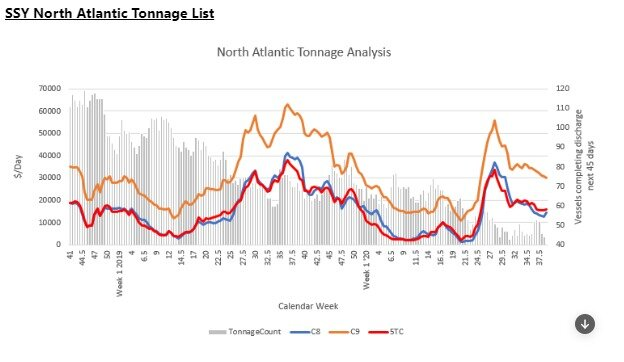

# Are Capesizes about to break out of their recent range?

**Date:** September 21, 2020  
**Publisher:** Breakwave Advisors | **Category:** Market Insights  
**Original URL:** [https://www.breakwaveadvisors.com/insights/2020/9/21/are-capesizes-about-to-break-out-of-their-recent-range](https://www.breakwaveadvisors.com/insights/2020/9/21/are-capesizes-about-to-break-out-of-their-recent-range)  

---

Since late July, the Capesize spot index has traded in a relatively tight range of about 5,000 (range of approximately 15,000 to 20,000), in an uneventful market dominated by small moves in both the Atlantic and Pacific regions. Although consolidation phases after significant rate moves are normal in shipping like it is in other financial markets, two months is a long time for shipping and thus a resolution should be coming sooner rather than later, especially as seasonality kicks in. Given the fundamental setup, a breakout higher is more likely, although the magnitude of the move is surely debatable with some upside potential already priced-in the futures curve.

### Capesize Spot Rates

> **Figure 1: China Monthly Steel Production Range vs 2020**  
> *China Monthly Steel Production range vs 2020*  
> **Interactive Data & Source:** [Ssyonline](https://www.ssyonline.com/) | [Local Asset](file:///C:/Users/Dell/Github/Shipping/corpus/03-breakwave/insights/2020/assets/2020-09-21_are-capesizes-about-to-break-out-of-their-recent-range_img_bcichart28229_42b4dcde11f0.jpg)

Iron ore export volumes remain healthy, and we anticipate such trend to remain in place for the foreseeable future. Although last week Brazilian iron ore export volumes declined to a 5-week low, such week-to-week variations are normal and although they affect the short term balance of the market, there is a tendency for a reversion to the mean, which time-wise should be positive for Capesizes over the next several weeks. Such high rate of exports should put upward pressure to the market, as supply remains constant which combined with high port congestion, points to a tightening balance going forward.

China’s demand for steel also fundamentally supports improving flows over the next several months. Steel consumption in China has been at record high rates and should surpass the 1 billion ton mark this year on strong underling demand coming from construction and manufacturing.

> **Figure 2: Chian Steel Production**  
> **Interactive Data & Source:** [Ssyonline](https://www.ssyonline.com/) | [Local Asset](file:///C:/Users/Dell/Github/Shipping/corpus/03-breakwave/insights/2020/assets/2020-09-21_are-capesizes-about-to-break-out-of-their-recent-range_img_chiansteelproduction_bf1097322bd9.jpg)

Although Capesize futures have also remained rangebound, there has been a more positive bias throughout last week and near dated prices have been slowly drifting higher. So far nothing has really materialized in the actual physical market, but when such optimism is reflected in the freight futures market, it is often a precursor of an upward move in spot rates. The Capesize ballast list (Capesize vessels steaming from Asia towards the Atlantic) is the lowest it has been for at least a year now according to[SSY](https://www.ssyonline.com/), which is quite promising for further tightening the Capesize market in the Atlantic region.

> **Figure 3: Source: Ssy**  
> [Local Asset](file:///C:/Users/Dell/Github/Shipping/corpus/03-breakwave/insights/2020/assets/2020-09-21_are-capesizes-about-to-break-out-of-their-recent-range_img_ssyballastlist_d3d8265d6b47.jpeg)

*Source: SSY*

Finally, weather-related delays as we enter the late autumn and winter months will also play a positive role in tightening the actual demand/supply balance in the market, while the end of the rain season in West Africa should mean more Guinea bauxite exports for the upcoming months, something that nowdays could potentially add additional pressure to the market with some 5-7 million tons (25-35 standard Capesizes vessels monthly) of monthly exports expected during the winter months.

---

**Tags:** Capesize, Dry Bulk  
