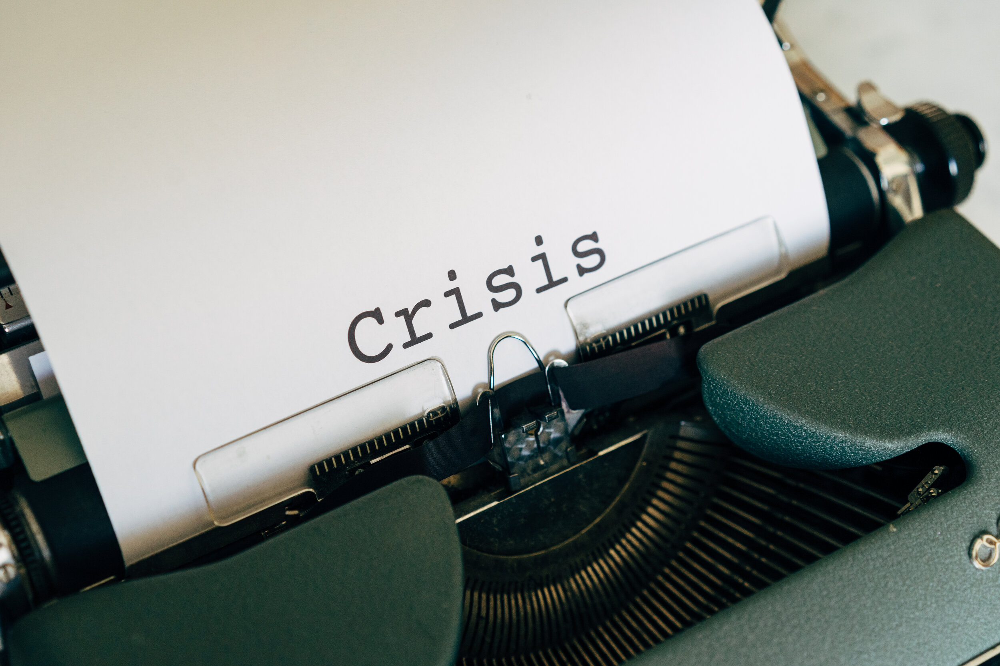
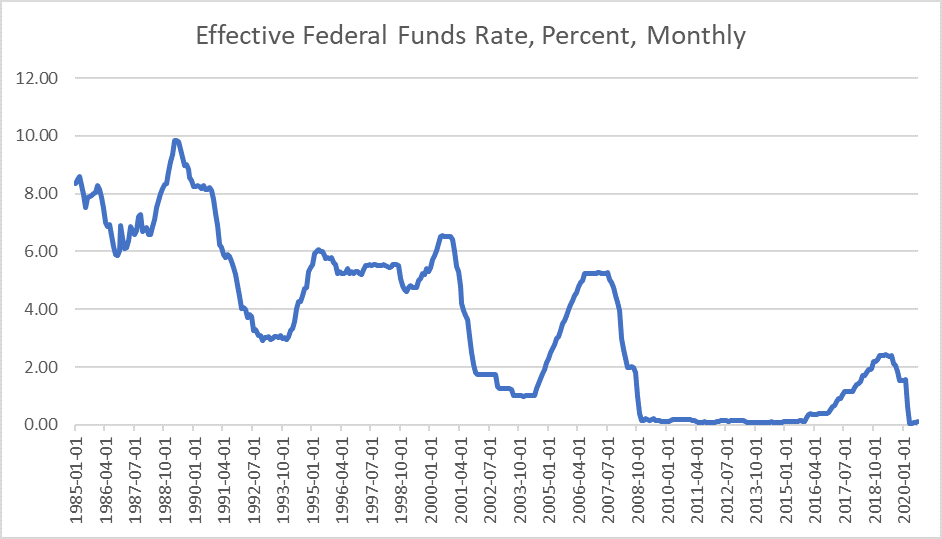
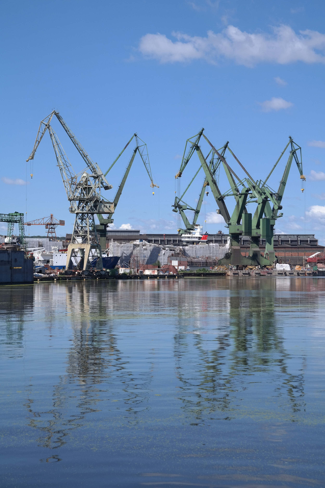

# What Will a Post-pandemic Recovery Look Like?

**Date:** September 21, 2020  
**Publisher:** Breakwave Advisors | **Category:** Market Insights  
**Original URL:** [https://www.breakwaveadvisors.com/insights/2020/9/21/what-will-a-post-pandemic-recovery-look-like](https://www.breakwaveadvisors.com/insights/2020/9/21/what-will-a-post-pandemic-recovery-look-like)  

---

> **Figure 1: By Ulf Bergman**  
> [Local Asset](file:///C:/Users/Dell/Github/Shipping/corpus/03-breakwave/insights/2020/assets/2020-09-21_what-will-a-post-pandemic-recovery-look-like_img_image-asset_62e5a133b221.jpeg)

Possibly a premature question, as there are still no effective treatments or vaccines available and infection rates are on the rise yet again. However, assuming a vaccine will be fund in the not too distant future, the answer to the question is likely to be quite different depending on what industry one is looking at. A recovery could be a rather uneven affair, both in terms of industrial sectors and regions. Posing the question to a cruise ship operator or an airline executive, the answer is likely to be quite gloomy and expectations of a quick return to 2019 levels subdued.

Air travel, for example, is projected not to return to pre-pandemic levels until 2022/3 at the earliest. The cruise shipping is facing a similar scenario and there is also the risk that both industries have lost business volumes permanently, with travelers changing their behaviors. Apart from the direct impact on the cruise liners, shipping suffers as demand for product tankers comes under pressure due to less need of moving fuel across the oceans. The travel and leisure industries look set to be among the worst affected, but the pain will be felt across many sectors. The US Federal Reserve appears to share the gloomy outlook of a slow recovery, as they announced last week that they do not expect to hike their historically low interest rates until the end of 2023 at least and not before the inflation has remained above two percent for some time.

> **Figure 2: Ulf Pic 2**  
> [Local Asset](file:///C:/Users/Dell/Github/Shipping/corpus/03-breakwave/insights/2020/assets/2020-09-21_what-will-a-post-pandemic-recovery-look-like_img_ulfpic2_78cf0a367d9c.png)

Despite a backdrop of a slow and gradual recovery towards pre-pandemic levels of economic activity, there could still be a silver lining for the shipping and commodities markets. The extensive stimulus programmes, announced by governments worldwide, could trigger a wave of infrastructure investments, which would drive demand and prices for commodities higher. Some pundits are suggesting the impact on the markets will be considerable with prices for industrial commodities, such as iron ore, surging as new investment projects are being announced in the near term.

China, India and the US are likely to be the main markets for infrastructure investments. The current occupant of the White House is rumored to be preparing a package worth one trillion USD of infrastructure investments, while his electoral opponent has pledged twice that amount for projects. Assuming plans are realistic and implemented, either presidency could prove beneficial for both shipping and hard commodities. China has also announced an aggressive plan for investments in infrastructure projects, which, if they materialize, will keep seaborne imports of hard commodities flowing into the country.

> **Figure 3: Market Chart 3**  
> [Local Asset](file:///C:/Users/Dell/Github/Shipping/corpus/03-breakwave/insights/2020/assets/2020-09-21_what-will-a-post-pandemic-recovery-look-like_img_image-asset_d45c29a392b8.jpeg)

In addition, we currently see historically thin orderbooks at the shipyards and, with the exception of LNG carriers, only a limited number of new vessels are set be launched over the next few years. The joint effects of the pandemic and a lack of clarity on future regulations and propulsion technology appears to have dampened shipowners’ appetite for new tonnage. A combination of near-zero net fleet growth and an increase in demand for seaborne transportation of commodities could prove beneficial for freight rates in the dry bulk shipping sector in the coming years.

---

**Tags:** Coronavirus, Global Economy  
