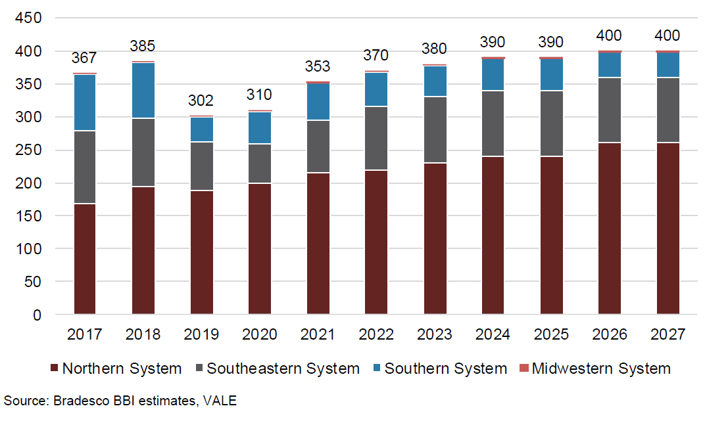

# Q4 Futures above 20k for the first time, as a wind of change blows through Capesizes

**Date:** September 23, 2020  
**Publisher:** Breakwave Advisors | **Category:** Market Insights  
**Original URL:** [https://www.breakwaveadvisors.com/insights/2020/9/23/wind-of-optimism-pushes-capesize-q4-futures-above-20k-for-first-time](https://www.breakwaveadvisors.com/insights/2020/9/23/wind-of-optimism-pushes-capesize-q4-futures-above-20k-for-first-time)  

---

> **Figure 1: Ship6**  
> **Interactive Data & Source:** [Breakwave Advisors Market Insights](https://www.breakwaveadvisors.com/insights/2020/9/16/are-we-at-an-inflection-point-for-capesize-rates) | [Local Asset](file:///C:/Users/Dell/Github/Shipping/corpus/03-breakwave/insights/2020/assets/2020-09-23_wind-of-optimism-pushes-capesize-q4-futures-above-20k-for-first-time_img_ship6_6afb0b54176f.jpg)

Capesize rates are back into rally mode, with the spot average approaching fast the psychologically important 20,000 mark (should get there by Friday), while futures have already broken out of their recent range and settled for the first time ever above 20,000 for this year’s fourth quarter contract. Optimism is in the air, and with the third quarter likely to settle above 20,000 as well, expectations are for a continuing push in the spot market as we approach the final stretch of the year. Smaller sizes (Panamax, Supramax) have yet to break out of their recent ranges, as spot rates are struggling to follow the dynamics of the larger ships, although indices remain in an upward trajectory as well.

The ingredients of the recent rally have been in place for quite sometime now, but the spark probably might have been related more to the recent volatility in iron ore prices, as a rush to cover transportation for already sold cargoes might have pushed miners and traders to pay up for ships, at least for certain dates.

> **Figure 2: “all-in-All**  
> *“All-in-all, if it all goes right, VALE could produce ~345-355mt in 2021. We acknowledge some delays could happen, or operations could have a more gradual-than-expected ramp-up. VALE seems confident 2021 will register a relevant step up in production. Even in cases that depend on tailings dams, new assets will support production restarts (the Torto dam in the case of Brucutu; Maravilhas III dam for Vargem Grande, new structure for Timbopeba in early 2021).”*  
> **Interactive Data & Source:** [Breakwave Advisors Market Insights](https://www.breakwaveadvisors.com/insights/2020/9/16/are-we-at-an-inflection-point-for-capesize-rates) | [Local Asset](file:///C:/Users/Dell/Github/Shipping/corpus/03-breakwave/insights/2020/assets/2020-09-23_wind-of-optimism-pushes-capesize-q4-futures-above-20k-for-first-time_img_vale_a2ba1d038768.png)

No matter what the actual trigger might have been (something that is only a guess at this point), the fundamentals of the Capesize market remain favorable. Vale, the large Brazilian miner, once again last week painted a positive picture on their production and exports outlook for the rest of the year, while more importantly, pointed to significant gains in production and exports for 2021. Readers of our posts might remember that Vale has not been the most reliable company in terms of guidance if one judges from history, but unfortunately the only insight one can get is from their own projections and forecasts. Bradesco BBI stated similar views in their most recent Vale report:

A ~350mt iron ore production level would mean almost 40mt increase in annual production, with the 1H of 2021 bearing the great majority of the y-o-y jump, given the very weak performance during the 1H of 2020. Vale produced 127mt in the 1H of 2020, and based on a 350mt level and Vale’s existing mine and port capacity limits, the 1H of 2021 could see a year-over-year increase of some 40mt (roughly 100 standard Capesizes) during a relatively short period of time. Thus it is puzzling that the 1H Capesize futures remain subdued, at roughly 11,000, but once again, the freight futures market usually looks back and makes assumptions about the future, most of the times disregarding new information and evolving fundamentals.

### Vale’s Production Growth Path

> **Figure 3: Vale Production Path**  
> **Interactive Data & Source:** [Breakwave Advisors Market Insights](https://www.breakwaveadvisors.com/insights/2020/9/16/are-we-at-an-inflection-point-for-capesize-rates) | [Local Asset](file:///C:/Users/Dell/Github/Shipping/corpus/03-breakwave/insights/2020/assets/2020-09-23_wind-of-optimism-pushes-capesize-q4-futures-above-20k-for-first-time_img_valeproductionpath_4c8f36876e23.png)

Near term, the catalysts we have stressed over the recent weeks,[here](https://www.breakwaveadvisors.com/insights/2020/9/16/are-we-at-an-inflection-point-for-capesize-rates)and[here](https://www.breakwaveadvisors.com/insights/2020/9/21/are-capesizes-about-to-break-out-of-their-recent-range), remain intact, and a revisit of the 30,000 level for Capesize spot rates over the coming weeks is a reasonable assumption, if indeed the iron ore exporting rates out of Brazil start to increase.

For now, the spot Capesize sector is tightening in both the Atlantic and Pacific basins. Shipping is a commoditized market where the lack of an “inventory draw” to balance the market is not possible like in other commodities (after all there is no readily available inventory of ships and sailing times are long) and thus swings in pricing can be violent during tight market balances.

---

**Tags:** Capesize, Dry Bulk, China  
