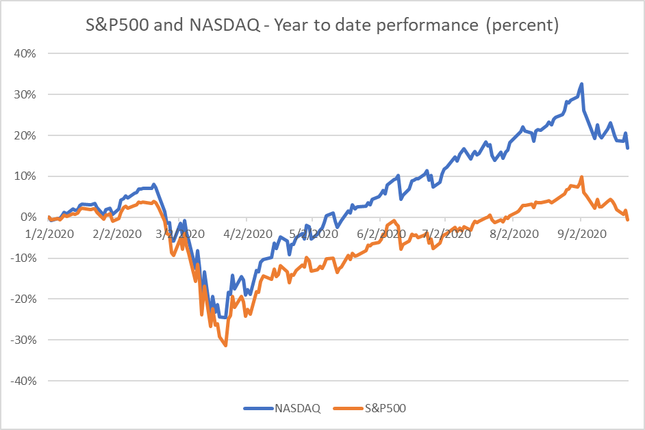

# Shipping Equities: Another lost year

**Date:** September 24, 2020  
**Publisher:** Breakwave Advisors | **Category:** Market Insights  
**Original URL:** [https://www.breakwaveadvisors.com/insights/2020/9/24/shipping-stock-performance](https://www.breakwaveadvisors.com/insights/2020/9/24/shipping-stock-performance)  

---

*By Ulf Bergman*

The US equity markets have had quite a year so far. The S&P 500 is currently at the same level it started the year at, while NASDAQ has outperformed and is showing a healthy return for the year so far. Both indices suffered heavy losses in the early part of the year and were down by 25 and 30 percent respectively in late March. The US equities markets recovered from their lows and recorded new highs earlier this month. Concerns over a resurgent pandemic have since seen both indices retreating.

> **Figure 1: Source: Yahoo Finance**  
> [Local Asset](file:///C:/Users/Dell/Github/Shipping/corpus/03-breakwave/insights/2020/assets/2020-09-24_shipping-stock-performance_img_ulfchart_764cb1050562.png)

source: Yahoo Finance

While the broader equity markets have recovered, albeit with considerable volatility, shipping stocks have continued to suffer badly. The pain has been felt across all the shipping sectors, with underperformance across the board.

Tanker equities had a good run in April, as the oil price war pushed charter rates to stratospheric levels. The demand for tanker tonnage has since subsided and tanker equities have headed south, together with the charter rates. Tanker operator Euronav is one of the better performers in the sector with its share price down some 30 percent, while Scorpio Tankers has lost around three quarters of its market value.

For dry bulk shipping equities, the picture has been equally bleak. Improving freight rates during the summer meant that some of the share price losses from the earlier part of the year were recuperated. However, many companies have halved their market capitalization, or indeed worse, so far this year. Hence, underperforming the markets where they are listed by a considerable margin.

> **Figure 2: Market Chart 2**  
> [Local Asset](file:///C:/Users/Dell/Github/Shipping/corpus/03-breakwave/insights/2020/assets/2020-09-24_shipping-stock-performance_img_image-asset_567f8fcfc5ca.jpeg)

Shipping equities have long had a reputation for poor returns and high volatility. For many institutional investors, such as pension funds, shipping stocks present a multiple of challenges, Often, they get eliminated in the early stages of the investment process, due to various technical issues. The market liquidity and/or capitalization can be too low for the fund manager, as trading in the shares could have a substantial adverse market impact and negate potential profits. In addition, factors such as limited analyst coverage, limited free float of the share or governance can often be reasons why a fund manager excludes them from consideration. The result is less institutional money flowing, relatively to the broader market, into the shipping equities, leading to even less liquidity and the vicious circle is established.

In the past, a direct exposure to commodities was difficult to establish for many investors. Investments in commodities typically required taking physical delivery and being able to store/transport the goods or using the derivatives markets. Neither of the options were realistic for most investors and the need for proxies arose. Traditionally, shares in oil, mining and shipping companies were bought to get a certain commodity exposure. The problem is that the equities tend to be poor substitutes for the real thing, as valuations tend to be based on other factors rather than commodity prices. Share prices of oil companies tend to exhibit quite low correlation with the crude oil prices. Similarly, shipping stocks tend to be poor substitutes for freight rates, with equity market valuations often below net asset values and reflecting company specific issues. The growth and innovation in the ETF market has, however, reduced the need for proxies, as it is often possible to get a direct exposure without physical ownership of the underlying assets.

---

**Tags:** Shipping Stocks, Tankers  
