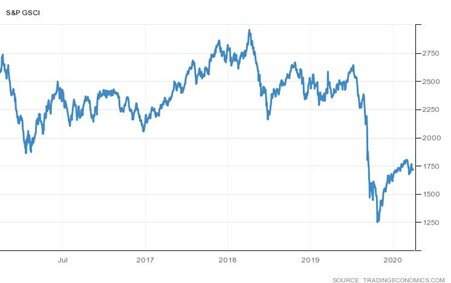
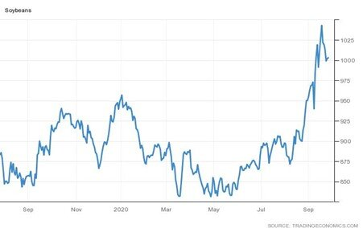

# Chinese Industrial Profits Continue to Recover

**Date:** September 28, 2020  
**Publisher:** Breakwave Advisors | **Category:** Market Insights  
**Original URL:** [https://www.breakwaveadvisors.com/insights/2020/9/28/chinese-industrial-profits-continue-to-recover](https://www.breakwaveadvisors.com/insights/2020/9/28/chinese-industrial-profits-continue-to-recover)  

---

> **Figure 1: By Ulf Bergman**  
> [Local Asset](file:///C:/Users/Dell/Github/Shipping/corpus/03-breakwave/insights/2020/assets/2020-09-28_chinese-industrial-profits-continue-to-recover_img_image-asset_fe835241eb2c.jpeg)

The OECD is projecting that only China will have positive growth this year among the G20 countries, with all the other members in recession. Data for the Chinese manufacturing sector, which were released on Sunday, are reinforcing this picture, as profits grew for the fourth consecutive month in August. Despite being a bit lower than the previous month, industrial profits increased by a healthy 19.1 percent in August year on year. The strong recovery in the last few months mean that profits for the first eight months of the year are only some four percent below the equivalent period last year, despite the lockdowns earlier in the year. The continued recovery in manufacturing profits were greeted positively by the equity markets around the world on Monday morning.

Raw material related manufacturing had a particularly strong August and benefiting from the resurgence in demand for commodities. On an aggregate level, commodities have recovered some of the losses incurred during Q1 and Q2 but are still well below the levels recorded in the early parts of the year, as illustrated by the S&P GSCI commodity index.

> **Figure 2: Source: Trading Economics**  
> [Local Asset](file:///C:/Users/Dell/Github/Shipping/corpus/03-breakwave/insights/2020/assets/2020-09-28_chinese-industrial-profits-continue-to-recover_img_ulfpic1_e69378bd7b77.jpg)

Source: Trading Economics

It is not only industrial commodities that are benefitting from the Chinese recovery. Soybeans reached a two year high in early September on rising demand from China, the world’s largest importer of the commodity. However, like many other commodities, it has retreated from the high levels recorded in the beginning of September on concerns of a resurgent pandemic, especially in Europe.

> **Figure 3: Source: Trading Economics**  
> [Local Asset](file:///C:/Users/Dell/Github/Shipping/corpus/03-breakwave/insights/2020/assets/2020-09-28_chinese-industrial-profits-continue-to-recover_img_ulfpic2_4c11387f7195.jpg)

Source: Trading Economics

China is also on course towards a new annual record for imports of liquified natural gas (LNG), with the majority arriving by sea. Analysts are expecting this year’s imported volumes to be ten percent above last year’s record levels. Increasing industrial activity is partially responsible for driving demand higher, but also a shift away from coal is contributing to the record levels.

> **Figure 4: Market Chart 4**  
> [Local Asset](file:///C:/Users/Dell/Github/Shipping/corpus/03-breakwave/insights/2020/assets/2020-09-28_chinese-industrial-profits-continue-to-recover_img_image-asset_5a508485dd02.jpeg)

Rising industrial profits, increasing economic activities and an increasing demand for energy are all supporting the China growth narrative and could provide support for both the commodity and the shipping markets for quite some time. However, there are also contradicting signs and some early indicators gathered by Bloomberg Economics point in the direction of some headwinds for the continued recovery. In early September, factors such as home and car sales weakened, which could potentially point toward a loss of momentum for the recovery in the domestic Chinese economy.

---

**Tags:** China, Economics, Global Economy  
