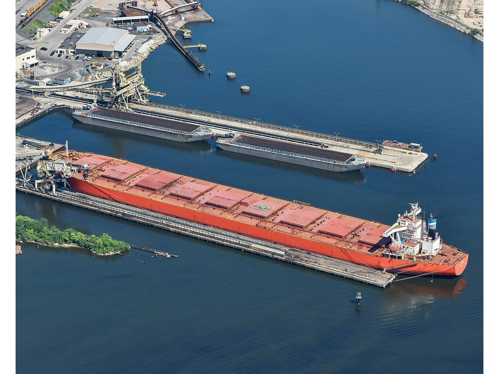
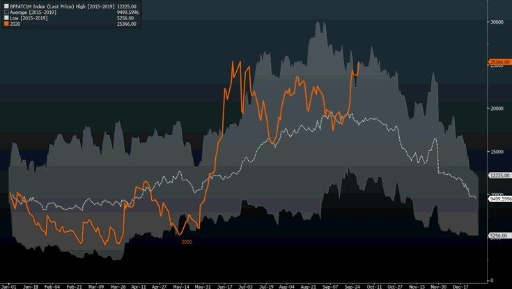
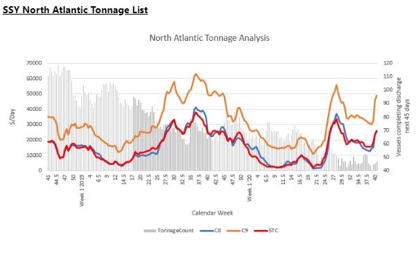

# The Capesize Market is ripe for another leg higher

**Date:** September 30, 2020  
**Publisher:** Breakwave Advisors | **Category:** Market Insights  
**Original URL:** [https://www.breakwaveadvisors.com/insights/2020/9/30/z4s8shgtj03f68cmfeb55n53fq2ne5](https://www.breakwaveadvisors.com/insights/2020/9/30/z4s8shgtj03f68cmfeb55n53fq2ne5)  

---

> **Figure 1: Front Month Capesize Future**  
> *Front month Capesize future*  
> **Interactive Data & Source:** [Breakwave Advisors Market Insights](https://www.breakwaveadvisors.com/insights/2020/9/16/are-we-at-an-inflection-point-for-capesize-rates) | [Local Asset](file:///C:/Users/Dell/Github/Shipping/corpus/03-breakwave/insights/2020/assets/2020-09-30_z4s8shgtj03f68cmfeb55n53fq2ne5_img_ship5_38283acf3eee.jpg)

Capesize spot rates carried on with their ascent undisturbed, as both the Pacific and the Atlantic markets continue to post gains day after day. Increasing Brazilian iron ore exports remain the main driver in the Atlantic while more cargo flow out of Canada and West Africa are adding fuel to the fire when it comes to the demand side. Given that the European economy still struggling, iron ore cargoes destined for the Continent (mainly from Canada) have now to find a new home, and China’s appetite for the steelmaking ingredient remains robust.

After all, readers of our columns know that the Capesize freight market was set up for such a move higher, which we have been pointing to[here](https://www.breakwaveadvisors.com/insights/2020/9/16/are-we-at-an-inflection-point-for-capesize-rates),[here](https://www.breakwaveadvisors.com/insights/2020/9/21/are-capesizes-about-to-break-out-of-their-recent-range)and[here](https://www.breakwaveadvisors.com/insights/2020/9/23/wind-of-optimism-pushes-capesize-q4-futures-above-20k-for-first-time)for the past few weeks now.

Despite the strong momentum in the spot market, freight futures remains generally unimpressed, in a rerun of last summer’s rally where a similar behavior was observed: The front month futures contract cautiously following the spot market, since it will inevitably price against the spot market, while further down the curve, market participants remain worried about the sustainability of any spot rate above the 20,000 mark. As an example, the 2021 average rate for Capesizes is stuck in the 13,000-14,00 range for months now, irrespective of the spot market, but more importantly, the ever evolving fundamentals of dry bulk, which if anything, are gradually improving albeit from a multi-decade low starting point.

> **Figure 2: Ships That Transport Coal and Iron Ore to China Are Seeing A**  
> *Ships that transport coal and iron ore to China are seeing a surge in earnings as the nation’s demand for commodities rises, despite concerns about a resurgence in cases of Covid-19 in many parts of the world.*  
> **Interactive Data & Source:** [Bloomberg News](https://www.bloomberg.com/news/articles/2020-09-29/commodity-shipping-overcomes-covid-on-china-infrastructure-spend?sref=LdmM6Tbp) | [Local Asset](file:///C:/Users/Dell/Github/Shipping/corpus/03-breakwave/insights/2020/assets/2020-09-30_z4s8shgtj03f68cmfeb55n53fq2ne5_img_frontmonthfuture_7151973909fc.jpg)

The hesitation is more psychological than fundamental, in our view. The world remains messy, economies especially in the western world are struggling to find a footing, while China’s impressive steel demand is the subject of strong debates in the analyst community in respect to the sustainability of the current strength. As[Bloomberg reports](https://www.bloomberg.com/news/articles/2020-09-29/commodity-shipping-overcomes-covid-on-china-infrastructure-spend?sref=LdmM6Tbp), this is also puzzling for a lot of market participants and investors:

*To help offset the economic impact of the pandemic, China’s government boosted infrastructure spending. That’s translated into robust demand for steel, and the nation’s mills have been producing record volumes of the alloy this year. Asia’s top economy makes more than half of the world’s steel.*

Simply put, ships that transport coal and iron ore to China are seeing a surge in earnings as the nation’s demand for commodities rises, despite concerns about a resurgence in cases of Covid-19 in many parts of the world. Freight futures reflect market expectations about, well the future, and as such the picture they paint is gloomier. However, the great thing about freight futures is that eventually they have to follow the spot market, and although day-to-day trading can be heavily affected by sentiment, the spot market is the one that eventually will determine the performance of such investments.

In the physical market, Owners and operators of Capesize vessels stand today in a position of strength, and once this becomes more evident, freight rates will resume their move even higher during the next few months as strong cargo flows and a constraint vessel supply pushes the market imbalance further. A case in point is the chart below that shows how violent the upside move in freight rates last week was, once the supply of ships in the Atlantic basin dropped to multiyear lows, according to SSY:

> **Figure 3: Ssy Ballast List 9 30**  
> **Interactive Data & Source:** [Theguardian](https://www.theguardian.com/australia-news/2020/sep/29/covid-cases-among-crew-of-bulk-carrier-now-anchored-off-port-hedland-climbs-to-17) | [Local Asset](file:///C:/Users/Dell/Github/Shipping/corpus/03-breakwave/insights/2020/assets/2020-09-30_z4s8shgtj03f68cmfeb55n53fq2ne5_img_ssyballastlist9-30_508e86780f34.jpeg)

This is a reflection of a tightening trend that readers of our columns already have read about, and it relates to port congestion and vessel delays due to the COVID-19 pandemic. The[recent example](https://www.theguardian.com/australia-news/2020/sep/29/covid-cases-among-crew-of-bulk-carrier-now-anchored-off-port-hedland-climbs-to-17)of a Capesize vessel stuck in Australia for at least two weeks now due to a number of crew members testing positive for the virus and the[new stricter rules](https://www.tradewindsnews.com/regulation/china-tightens-crew-health-checks-after-four-cosco-seafarers-test-positive-for-covid-19/2-1-882197)relating to vessels arriving to China that will add to further delays for arriving vessels, are only two examples of the ever evolving rules and regulations impacting shipping and causing considerable disruption in the global logistical chain.

For dry bulk, with the fourth quarter officially starting tomorrow, the current setup is one of the best we have seen in recent years: Capesize spot rates are currently at the high end of their recent seasonal range, demand for iron ore transportation should further intensify due to seasonality, while vessel supply is currently being disrupted due to COVID-19 related issues.

**The ingredients for a considerable rally in rates are there, and that should be enough to propel the market to new seasonal highs soon.**

---

**Tags:** Shipping, Coronavirus, China, Capesize  
