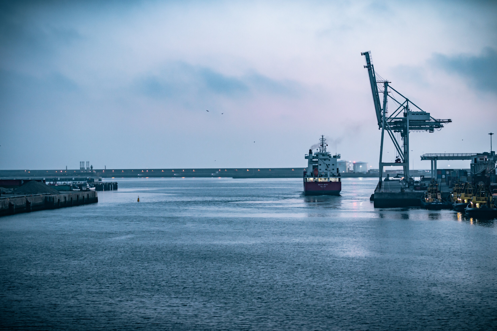
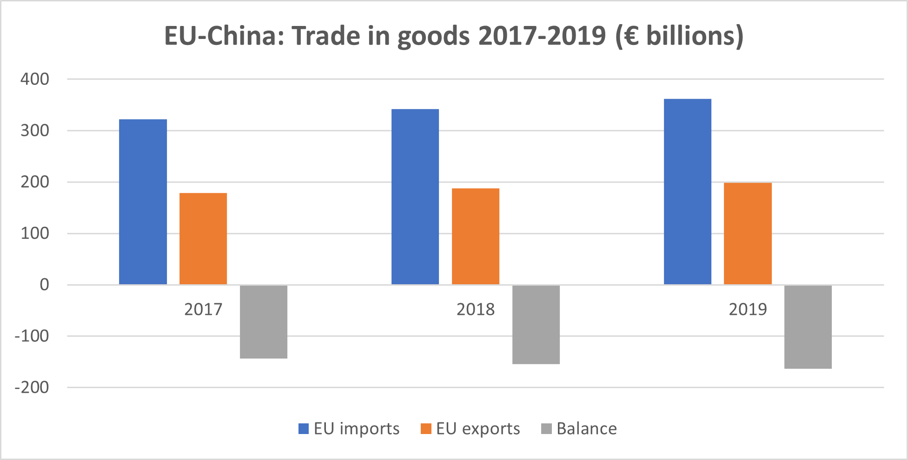

# Global Trade: More Friction Ahead

**Date:** October 01, 2020  
**Publisher:** Breakwave Advisors | **Category:** Market Insights  
**Original URL:** [https://www.breakwaveadvisors.com/insights/2020/10/1/global-trade-more-friction-ahead](https://www.breakwaveadvisors.com/insights/2020/10/1/global-trade-more-friction-ahead)  

---

> **Figure 1: By Ulf Bergman**  
> [Local Asset](file:///C:/Users/Dell/Github/Shipping/corpus/03-breakwave/insights/2020/assets/2020-10-01_global-trade-more-friction-ahead_img_image-asset_cebc81573e47.jpeg)

To be polite, one could label the first debate ahead of the presidential election in the US as inconclusive. From a global trade and shipping perspective, an observer can be forgiven for feeling none the wiser. The agenda was decidedly domestic and details on future foreign relations remained elusive.

However, at this stage there is little to indicate that a change of occupant of the White House would drastically alter the trade policies and the current commercial frictions between the US and China. Although it is possible the tone might change. Any hardening of the rhetoric between now and election day could potentially pause the current increase in US exports of soybeans to China, as Chinese buyers have been quick to respond to any worsening of relations between the two countries in the past. Any developments in that direction would be bad news for the medium sized tonnage in the dry bulk sector, as current shipments of agricultural commodities out of the US Gulf to China add to the ton-mile demand.

EU leaders are also likely to announce a desire to rebalance the economic relationship with China this week, with a greater degree of reciprocity in the trade between the two sides. A push towards finalizing the EU-China Comprehensive Investment Agreement is likely to be high on the agenda from the European perspective. The EU is China’s second largest trading partner, while China is EU’s largest. For now, at least, relations between the two look set to be less confrontational than across the Pacific, with Europe limiting Chinese direct investments rather than resorting to trade war and tariffs.

> **Figure 2: Source: European Commission**  
> [Local Asset](file:///C:/Users/Dell/Github/Shipping/corpus/03-breakwave/insights/2020/assets/2020-10-01_global-trade-more-friction-ahead_img_ulfpic5_a7438e861d88.png)

Source: European Commission

The World Trade Organization (WTO) also looks set to award the EU the right to impose tariffs on four billion dollars’ worth of US exports, as part of the long-running dispute in relation to state subsidies to aircraft manufacturers Airbus and Boeing. European tariffs on American goods could have a negative impact on the Transatlantic container trade, with some items allegedly slated for 100 percent tariffs. If US coal and grains exports were to be targeted as well, the dry bulk shipping sector could benefit with European buyers having to seek more distant sources and tying up tonnage in longer voyages.

> **Figure 3: Market Chart 3**  
> [Local Asset](file:///C:/Users/Dell/Github/Shipping/corpus/03-breakwave/insights/2020/assets/2020-10-01_global-trade-more-friction-ahead_img_image-asset_88cf3dbd77d1.jpeg)

If the EU will impose the new tariffs ahead of the US election remains to be seen, but an escalating trade war between the two sides looks like the last thing needed with fragile recoveries on both sides of the pond. The Eurozone posted its strongest industrial growth in two years in September, according to IHS Markit, but the growth was centered on Germany and other areas more modest. The European Central Bank also expects the recovery to be slow and uneven. The US posted better than expected unemployment figures today, but levels remain well above of the ones recorded before the COVID-19 pandemic.
