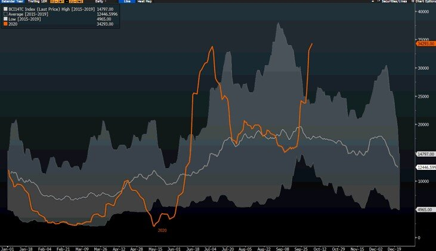
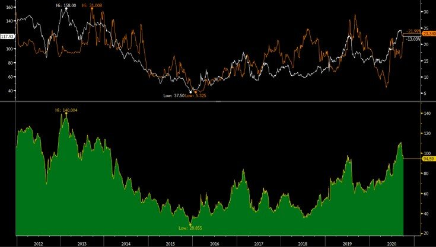
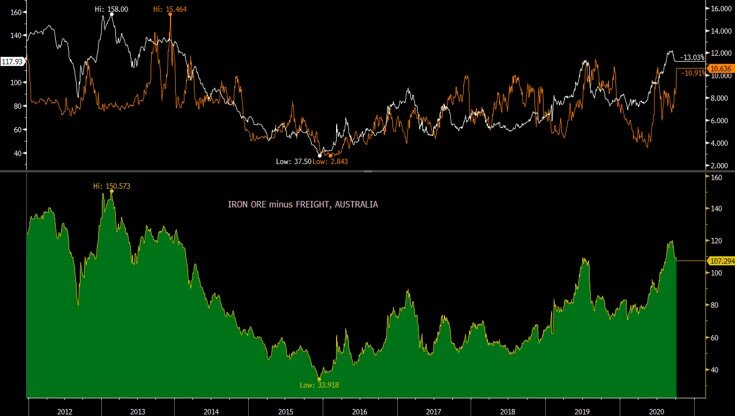

# The Fall of Icarus: The inevitability in shipping, but its all about averages

**Date:** October 05, 2020  
**Publisher:** Breakwave Advisors | **Category:** Market Insights  
**Original URL:** [https://www.breakwaveadvisors.com/insights/2020/10/5/capesize-rates](https://www.breakwaveadvisors.com/insights/2020/10/5/capesize-rates)  

---

> **Figure 1: Capesize Spot Rates**  
> *Capesize Spot Rates, 5-year Range*  
> **Interactive Data & Source:** [Breakwave Advisors Market Insights](https://www.breakwaveadvisors.com/insights/2020/9/16/are-we-at-an-inflection-point-for-capesize-rates) | [Local Asset](file:///C:/Users/Dell/Github/Shipping/corpus/03-breakwave/insights/2020/assets/2020-10-05_capesize-rates_img_icarus_5f64f582ffd6.jpg)

The myth of Daedalus and Icarus tells the story of a father and a son who used wings to escape from the island of Crete. Icarus has become better-known as the flyer who fell from the sky when the wax that joined his wings was melted by the heat of the sun, despite his father’s warnings.

As Capesize rates are about to reach decade highs soon, it is easy for investors who follow the market to dismiss it as another short term spike. Indeed, history has taught us that this is usually the case: Freight rates are volatile and rarely plateau at extreme levels, whether highs or lows. Inevitably, there will be a correction, and that is in the mind of market participants from the minute rates started rallying. However, for shipping investors, either in the freight futures market or most of the physical market,**it is all about averages**.

But first, how unusually high are Capesize freight rates today? As we discussed and as the chart below shows, indeed we are hovering at the high end of the past several years’ range, and with the decade highs at about 42,000 reached in 2013, it will not be surprising to surpass such level soon.

> **Figure 2: Iron Ore Price Minus Freight**  
> *Iron Ore Price minus Freight, Brazil*  
> **Interactive Data & Source:** [Breakwave Advisors Market Insights](https://www.breakwaveadvisors.com/insights/2020/9/16/are-we-at-an-inflection-point-for-capesize-rates) | [Local Asset](file:///C:/Users/Dell/Github/Shipping/corpus/03-breakwave/insights/2020/assets/2020-10-05_capesize-rates_img_capes10-5_6e2f08bb4a51.jpg)

However, the absolute time charter equivalent rate does not really tell the whole story. After all, what matters is the price the major miners pay for freight, and such price tells a whole different story. In fact, one can argue that we are**sitting at multi-year lows**in such relative pricing for the major Australian and Brazilian miners.

How is that possible with Capesize rates in the mid-30,000?

Most of the Capesize freight market reflects the price a miner pay to transport iron ore from their mining facilities to consumers around the world, mainly in China. This is always quoted in USD per ton of cargo. As such, the price that miners pay relative to the price of their product, namely iron ore, is what matters from their perspective.**Such relative pricing is at 7-year lows**(meaning the price of freight as a percentage of delivered product is at 7-year lows). The chart below show the net-of-freight price that Brazilian miners receive, on average, based on the delivered price of iron ore to China minus the cost of freight (which in the market is referred as C3).**Net profit currently is at 7-year highs.**

> **Figure 3: Iron Ore Price Minus Freight**  
> *Iron Ore Price minus Freight, Australia*  
> **Interactive Data & Source:** [Breakwave Advisors Market Insights](https://www.breakwaveadvisors.com/insights/2020/9/16/are-we-at-an-inflection-point-for-capesize-rates) | [Local Asset](file:///C:/Users/Dell/Github/Shipping/corpus/03-breakwave/insights/2020/assets/2020-10-05_capesize-rates_img_iominusc3_044c632a1a0d.jpg)

A similar picture is also painted for Australian miners, where the**profitability**(iron ore net of freight) is also at**multi-year highs**:

> **Figure 4: Io Minus C5**  
> **Interactive Data & Source:** [Breakwave Advisors Market Insights](https://www.breakwaveadvisors.com/insights/2020/9/16/are-we-at-an-inflection-point-for-capesize-rates) | [Local Asset](file:///C:/Users/Dell/Github/Shipping/corpus/03-breakwave/insights/2020/assets/2020-10-05_capesize-rates_img_iominusc5_49b596d78873.jpg)

Obviously, it is supply and demand that drives the price of freight, and the above are just indications of how willing majors are to pay up given their existing profit dynamics. If supply exceeds demand, then the market will inevitably drop. But for now, iron ore majors are enjoying some of their highest margins in years when it comes to net of freight prices.

However, as one looks at today’s rates and makes assumptions about the future especially when it relates to freight market tops, it is useful to keep in mind that iron ore prices and market balance are vastly different than a few years ago and given than iron ore prices are usually reported on a CFR basis (including the cost of freight) the market dynamics have also shifted probably in favor of shipowners.

Finally, the fourth quarter is here, and as we have stressed[again](https://www.breakwaveadvisors.com/insights/2020/9/16/are-we-at-an-inflection-point-for-capesize-rates)and[again](https://www.breakwaveadvisors.com/insights/2020/9/3/capesize-rates-where-do-we-stand-vs-the-past), the market balance tends to tighten as we progress towards the end of the calendar year. The freight futures curve is**steeply backwardated**reflecting traders expectations for an imminent correction. This is inevitable at some point, but once again is the averages that matter and if the correction is shallow enough or further out versus expectations, then futures prices are too conservative.

Icarus flew too close to the sun, and as a result his wings melted and fell apart. Capesize rates are flying high at the moment, but iron ore prices are there for support.**Can Capes fly even higher?**

---

**Tags:** Shipping, Dry Bulk, Brazil, China  
