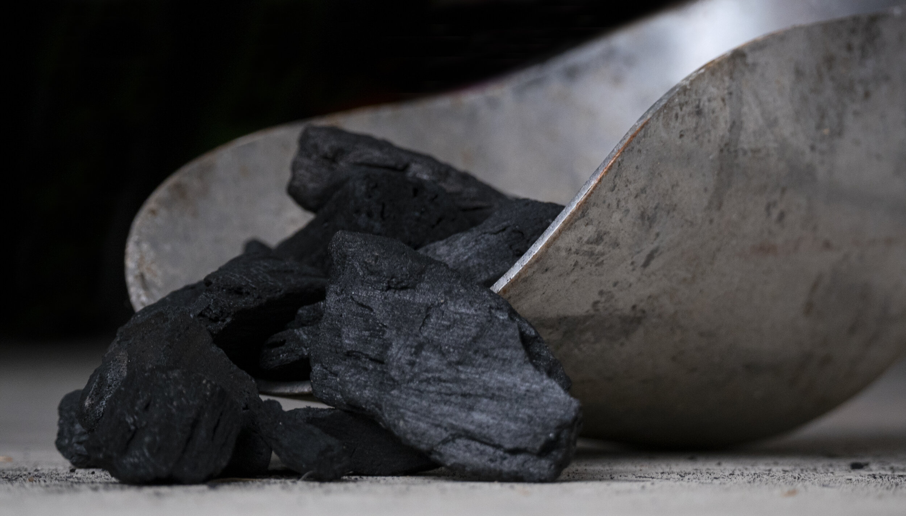

# Ongoing Climb in Coal India’s Production and Offtake

**Date:** October 05, 2020  
**Publisher:** Breakwave Advisors | **Category:** Market Insights  
**Original URL:** [https://www.breakwaveadvisors.com/insights/2020/10/5/ongoing-climb-in-coal-indias-production-and-offtake](https://www.breakwaveadvisors.com/insights/2020/10/5/ongoing-climb-in-coal-indias-production-and-offtake)  

---

> **Figure 1: Market Chart 1**  
> [Local Asset](file:///C:/Users/Dell/Github/Shipping/corpus/03-breakwave/insights/2020/assets/2020-10-05_ongoing-climb-in-coal-indias-production-and-offtake_img_image-asset_ec21beb0ac08.jpeg)

Coal India produced 40.5 million tons of coal last month, which marks a month-on-month increase of 3.3 million tons (9%) and a year-on-year increase of 9.7 million tons (32%). This marks the largest production seen since May and is the largest year-on-year growth seen in at least seven years (our data goes back through 2014). Offtake (the amount of coal sent to customers) totaled 46.5 million tons. This marks a month-on-month increase of 2.2 million tons (5%) and a year-on-year increase of 11.3 million tons (32%). Offtake has now increased for four consecutive months, and as with production, offtake last month increased on a year-on-year basis by the largest amount in at least seven years.

Fortunately for the dry bulk market, India’s power plant coal stockpiles have continued to decline despite the ongoing climb in Coal India’s production and offtake. India’s hydropower production has been facing pressure, which in turn has been supporting coal-derived electricity generation. India’s economy also continues to slowly recover. These two developments have continued to lead to an increase in coal consumption, which in turn has continued to lead to a decline in India’s power plant coal stockpiles. This is a supportive element for Indian coal import prospects.

---

**Tags:** Coal, India  
