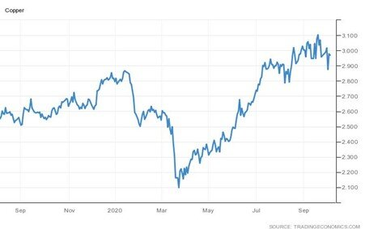
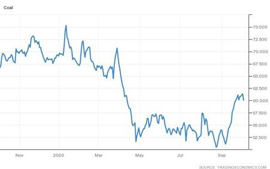

# Industrial Commodities: More Than Just Iron Ore

**Date:** October 06, 2020  
**Publisher:** Breakwave Advisors | **Category:** Market Insights  
**Original URL:** [https://www.breakwaveadvisors.com/insights/2020/10/5/industrial-commodities-more-than-just-iron-ore](https://www.breakwaveadvisors.com/insights/2020/10/5/industrial-commodities-more-than-just-iron-ore)  

---

*By Ulf Bergman*

> **Figure 1: Copper Prices Over the Last 12 Months (Usd/lbs)**  
> *Copper prices over the last 12 months (USD/lbs)*  
> [Local Asset](file:///C:/Users/Dell/Github/Shipping/corpus/03-breakwave/insights/2020/assets/2020-10-06_industrial-commodities-more-than-just-iron-ore_img_image-asset_a342fccb9280.jpeg)

In the last few months iron ore has dominated the headlines, as far as industrial metals are concerned, with Chinese imports breaking new records month after month. Copper, often seen as a bellwether commodity for industrial production, has also staged a considerable recovery from its pandemic low in March. Despite recording one of its worst ever daily drops last week, the metal is still up around 40 percent since the end of the first quarter and is currently trading near levels not seen for the last two years.

The Chinese industry is the world’s top consumer of copper and it is often used as a leading indicator for the country’s industrial output. A Citigroup tracker of the use of copper in various industries is also pointing towards a robust demand for the metal, with the three-month average at its highest level since the beginning of 2017. The strong demand for copper could indicate that the Chinese economic recovery is unlikely to run out of steam anytime soon and the demand for industrial commodities can be expected to remain firm.

> **Figure 2: Thermal Coal Prices Over the Last 12 Months (Usd/metric Tonne)**  
> *Thermal coal prices over the last 12 months (USD/metric tonne)*  
> [Local Asset](file:///C:/Users/Dell/Github/Shipping/corpus/03-breakwave/insights/2020/assets/2020-10-06_industrial-commodities-more-than-just-iron-ore_img_ulfcopper_37eb6efffaff.jpg)

Coal on the other hand has had a less spectacular recovery since the lows in the early parts of the second quarter this year, with prices only recently gaining on the back of increasing demand from electricity producers. Despite rallying around twenty percent in September, prices are still well below the pre-pandemic levels.

Global seaborne coal flows decreased by around 100 million tonnes in the first seven months of the year, partly due to a decline in economic activity on the back of the pandemic. However, the thermal coal trade is also facing a more existential threat, with more and more nations committing to a decarbonisation process. China being one of the latest nations to join that club, aiming at phasing out all coal-fired power stations by 2050. Coal transportation will still account for a considerable portion of the tonnage of the world’s dry bulk fleet in the near term but will come under pressure in the years to come, as measures to reduce the use of fossil fuels are introduced. Still it is unlikely to be a rapid process with some countries, such as Vietnam, still recording rising imports of coal.

> **Figure 3: Ulf Coal**  
> [Local Asset](file:///C:/Users/Dell/Github/Shipping/corpus/03-breakwave/insights/2020/assets/2020-10-06_industrial-commodities-more-than-just-iron-ore_img_ulfcoal_8a83275c665e.jpg)

---

**Tags:** China, Coal, Copper  
