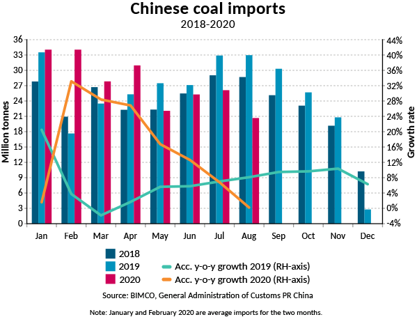
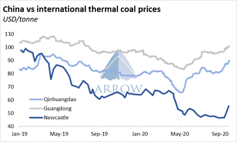
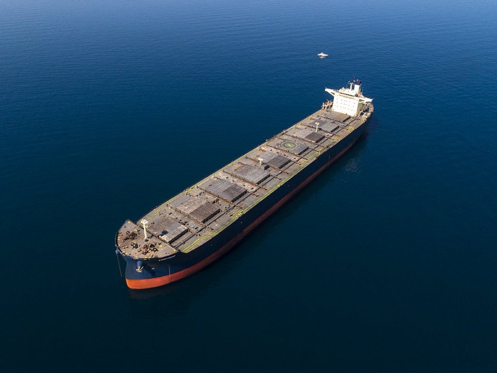

# China is a black box when it comes to Coal shipping

**Date:** October 07, 2020  
**Publisher:** Breakwave Advisors | **Category:** Market Insights  
**Original URL:** [https://www.breakwaveadvisors.com/insights/2020/10/7/chinas-coal-black-box-for-shipping](https://www.breakwaveadvisors.com/insights/2020/10/7/chinas-coal-black-box-for-shipping)  

---

> **Figure 1: “Staggering High Growth in January Through April Has Been**  
> *“Staggering high growth in January through April has been replaced with monthly coal import growth rates in May through August below the levels recorded in the same months of 2019.*  
> **Interactive Data & Source:** [Bimco](https://www.bimco.org/news/market_analysis/2020/20201001_chinese_coal_imports_first_eight_months) | [Local Asset](file:///C:/Users/Dell/Github/Shipping/corpus/03-breakwave/insights/2020/assets/2020-10-07_chinas-coal-black-box-for-shipping_img_image-asset_f48bc316de0a.jpeg)

Coal is the second most important commodity for dry bulk behind iron ore, and in the last several years, coal trading has been a swing factor when it comes to the strength of the broader dry bulk market. With most of the world rapidly eliminating coal from its energy mix, especially in the western world, China has been left as the only demand growth region for coal as it continues to add considerable coal power generation capacity in its energy mix.

For dry bulk, such a development is welcomed news, although it does not totally offset declining demand elsewhere especially given the relatively short distances involved (Indonesia, South Africa and Australia are the three major exporting regions when it comes to coal). After all, thermal coal shipping volumes seem to have peaked in 2017 and have been in a mild decline ever since.

BIMCO is out with[an update](https://www.bimco.org/news/market_analysis/2020/20201001_chinese_coal_imports_first_eight_months)on coal trading as it relates to dry bulk, and it paints a rather bleak picture for the commodity:

*This year’s coal import volumes have seen the lowest growth rate in the past three years. In the first eight months of this year, 220.7 million tonnes of coal have been imported by China, just 473 thousand tonnes more than in 2019, recording a 0.2% growth.*

*The drop in coal imports has resulted in less business for the dry bulk fleet. Between May and August this year, there were 26.2 million tonnes less imported compared to the same period last year. The drop in volumes means that ship owners lost an equivalent of 351 Panamax loads,”*s*ays Peter Sand, BIMCO’s Chief Shipping Analyst.*

*“So far, strong Chinese iron ore imports have managed to compensate for the decline in coal volumes, supporting dry bulk freight rates,” Sand says.”*

> **Figure 2: “Meanwhile**  
> *“Meanwhile, imports dropped sharply in recent months as a growing number of ports exhausted their annual import quotas. Despite a surge in the first four months of the year, seaborne arrivals in 2020 totaled 207.7 million tonnes as of 4 October. This marks a 5.8% decrease from the 219.8mt shipped during the same period in 2019.*  
> [Local Asset](file:///C:/Users/Dell/Github/Shipping/corpus/03-breakwave/insights/2020/assets/2020-10-07_chinas-coal-black-box-for-shipping_img_chinesecoalimportsbimco_b4d34d1b305d.png)

Source: Bimco

Indeed, coal imports to China saw an impressive four-month run earlier in the year, with a very high growth rate that has now almost turned negative as a lot of Chinese ports have hit their annual quota. Arrow Research explains:

*Growing supply tightness coupled with high domestic prices have prompted talks among trading circles that China might ease import restrictions in Q4. Low port inventories, particularly at northern ports, further fuel the rumors. Average inventories held at the ports of Qinhuangdao, Caofeidian and Jingtang as of 30 September are 26.7% lower year-on-year and 17% below their three-year average for this time of year.*

> **Figure 3: So Far**  
> *So far, the rumors remain unsubstantiated. Weekly coal arrivals have been sliding steadily since the beginning of Q3. Last week, only 3.1mt of coal arrived at Chinese ports, the weakest volume since December 2018. However, further gains in domestic prices could force the authorities to ease import restrictions in the coming weeks.”*  
> [Local Asset](file:///C:/Users/Dell/Github/Shipping/corpus/03-breakwave/insights/2020/assets/2020-10-07_chinas-coal-black-box-for-shipping_img_arrowcoalinventories_5b1c9249c7c3.png)

Source: Arrow Research

Relative pricing plays a role when it comes to coal trading as, after all, it is a highly tradable physical market. As Arrow Research shows, relative pricing has more recently benefited imports, as Australian coal is a much cheaper option for Chinese coal end users:

> **Figure 4: Source: Arrow Research**  
> [Local Asset](file:///C:/Users/Dell/Github/Shipping/corpus/03-breakwave/insights/2020/assets/2020-10-07_chinas-coal-black-box-for-shipping_img_arrowcoalprices_3cef6f2a9103.png)

Source: Arrow Research

> **Figure 5: Ship25**  
> [Local Asset](file:///C:/Users/Dell/Github/Shipping/corpus/03-breakwave/insights/2020/assets/2020-10-07_chinas-coal-black-box-for-shipping_img_ship25_cae1951c7f4c.jpg)

The dry bulk market has gained from a surge in coal trading earlier in the year, mainly driven by strong imports into China, a trend that is now winding down. However, with iron ore volumes substantially increasing compared to the first half of the year, for the larger segments of the dry bulk market the impact is a net positive as iron ore remains the dominant commodity when it comes to Capesizes. For the smaller sizes though, not so much. The impact on Panamax and Supramax segments were the quotas not being relaxed will be more meaningful, something that is already observed in the Panamax and Supramax freight markets.

Coal trading has always been a hard to forecast market, as relative pricing and shifting trends in the global power generation market has proven difficult factors to predict. China consumes more than 4 billion tons of coal per year, importing approximately 5% of its needs. Yet, China accounts for ~20% of seaborne coal while all Asia absorbs roughly 80% of all coal shipped. Small changes in importing trends for that part of the world can have a disproportional impact on shipping demand and thus a significant influence on spot dry bulk rates coming from a commodity that seems to be in a steady structural decline for years to come.

---

**Tags:** Coal, China  
