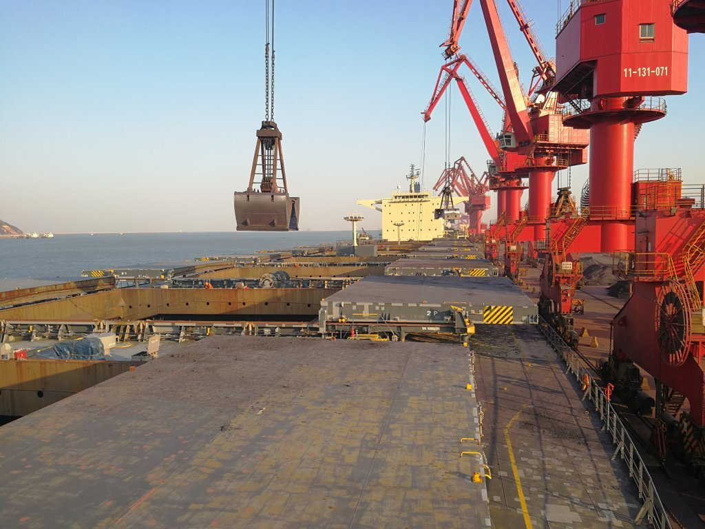

# Moderate Dry Bulk Fleet Growth

**Date:** October 12, 2020  
**Publisher:** Breakwave Advisors | **Category:** Market Insights  
**Original URL:** [https://www.breakwaveadvisors.com/insights/2020/10/11/moderate-dry-bulk-fleet-growth](https://www.breakwaveadvisors.com/insights/2020/10/11/moderate-dry-bulk-fleet-growth)  

---

> **Figure 1: Ship21**  
> [Local Asset](file:///C:/Users/Dell/Github/Shipping/corpus/03-breakwave/insights/2020/assets/2020-10-12_moderate-dry-bulk-fleet-growth_img_ship21_257dca2ede6f.jpg)

Approximately 40 dry bulk vessels were delivered last month. This is 14 more than were delivered in August. Last month saw the delivery of 7 handysize vessels, 10 handymax vessels, 13 panamax vessels, and 10 capesize vessels. In comparison, August saw the delivery of 5 handysize vessels, 4 handymax vessels, 10 panamax vessels, and 7 capesize vessels. Also of note is that approximately 18 dry bulk vessels were scrapped last month. This is 13 more than were scrapped in August. Last month saw the removal of 8 handysize vessels, 2 handymax vessels, 3 panamax vessels, and 5 capesize vessels. In comparison, August saw the removal of 2 handysize vessels, 1 handymax vessel, 1 panamax vessel, and 1 capesize vessel.

Fleet growth remains an issue that continues to most negatively affect the panamax and handymax markets. During the first nine months of this year, the panamax fleet grew by a net addition of 122 vessels (130 newbuildings were delivered while only 8 panamax vessels were scrapped). During the same period, the handymax fleet grew by a net addition of 96 vessels (114 newbuildings were delivered while only 18 handymax vessels were scrapped). Overall, fleet growth in these segments remains a headwind and the panamax and handymax markets have remained most vulnerable to any significant turns in spot cargo volume. As we have also continued to examine in our work, fleet growth in the capesize and handysize fleets has stayed much lower. During the first nine months of the year, the capesize fleet grew by a net addition of only 44 vessels (85 newbuildings were delivered and 41 Capes were scrapped). During the same period, the handysize fleet grew by a net addition of just 17 vessels (46 newbuildings were delivered and 29 handysize vessels were scrapped).

---

**Tags:** Shipping, Dry Bulk  
