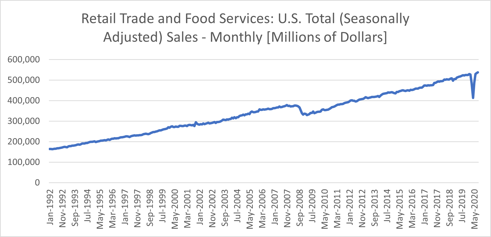
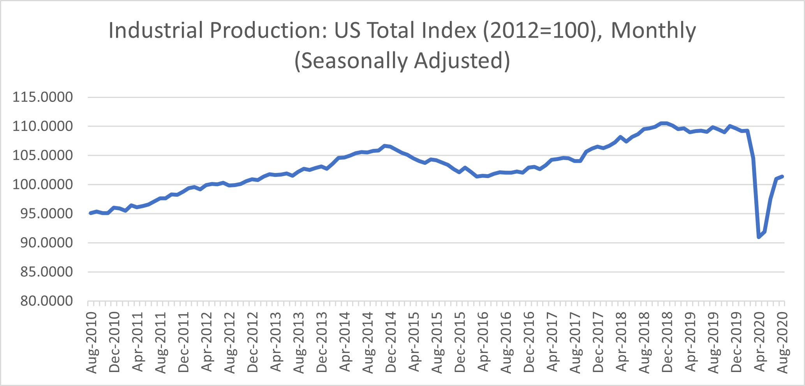

# Will the US Consumers Keep Spending?

**Date:** October 12, 2020  
**Publisher:** Breakwave Advisors | **Category:** Market Insights  
**Original URL:** [https://www.breakwaveadvisors.com/insights/2020/10/12/will-the-us-consumers-keep-spending](https://www.breakwaveadvisors.com/insights/2020/10/12/will-the-us-consumers-keep-spending)  

---

> **Figure 1: By Ulf Bergman**  
> [Local Asset](file:///C:/Users/Dell/Github/Shipping/corpus/03-breakwave/insights/2020/assets/2020-10-12_will-the-us-consumers-keep-spending_img_image-asset_3d02aa63731b.jpeg)

Consumer spending accounts for around two-thirds of economic activity in the US and as such it is an important gauge of the health of the world’s largest economy. Friday this week will see the release of the data for consumer spending in September. After a sharp fall in the consumer activity during the first half of the year, as the pandemic forged its grip on the economy, retail spending has rebounded sharply with new highs recorded consecutively in June, July and August. The rapid return of the consumers has led to some pundits to believe the US economy on the path of a V-shaped recovery.

However, last month’s release of the August data was weaker than expected by many economists. The data for September is expected to put consumer spending on yet another record level, but there are concerns that the growth will face some considerable headwinds going forward. Increasing COVID-infection rates across the country, the end of extra unemployment benefits and the uncertainty on the size and timing of a new stimulus package are factors that all could contribute to a cooling of the consumer sentiment. Given the importance of the consumer to the US economy, any loss of momentum could derail an already fragile recovery.

> **Figure 2: Source: Us Census Bureau**  
> *Source: US Census Bureau*  
> [Local Asset](file:///C:/Users/Dell/Github/Shipping/corpus/03-breakwave/insights/2020/assets/2020-10-12_will-the-us-consumers-keep-spending_img_ulf20_f0a409b01891.png)

The strength of the recovery in consumer spending has surprised many US retailers, who are embarking on a major restocking exercise as a result. The trans-Pacific container trade is one of the beneficiaries of the resilience of the US consumer, with shipping volumes expected to be strong throughout the fourth quarter and possibly beyond. Record levels of US consumer spending are also another contributing factor to the strong recovery seen in recent months for Chinese industrial production.

The rapid return of the consumers is not just an American phenomenon, with consumer sales currently above their pre-pandemic levels in some parts of Europe as well. The Chinese consumption, on the other hand, have remained subdued despite the country’s stronger economic recovery. However, early indicators suggest that the spending during the recent Golden Week was higher than expected.

The September data for US industrial production will also be released on Friday, which is another important gauge of the health of the US economy. The consensus is pointing towards another month of recovery, but, unlike the consumer activity, total levels remain depressed and on levels not seen since 2013. The strong pick-up in consumer spending in the last few months has not been matched by the industrial production, which is likely to further contribute to the negative US trade balance.

> **Figure 3: Source: Federal Reserve Bank of St**  
> *Source: Federal Reserve Bank of St. Louis*  
> [Local Asset](file:///C:/Users/Dell/Github/Shipping/corpus/03-breakwave/insights/2020/assets/2020-10-12_will-the-us-consumers-keep-spending_img_ulf21_e703cb3cba7c.png)

---

**Tags:** Economics, Global Economy  
