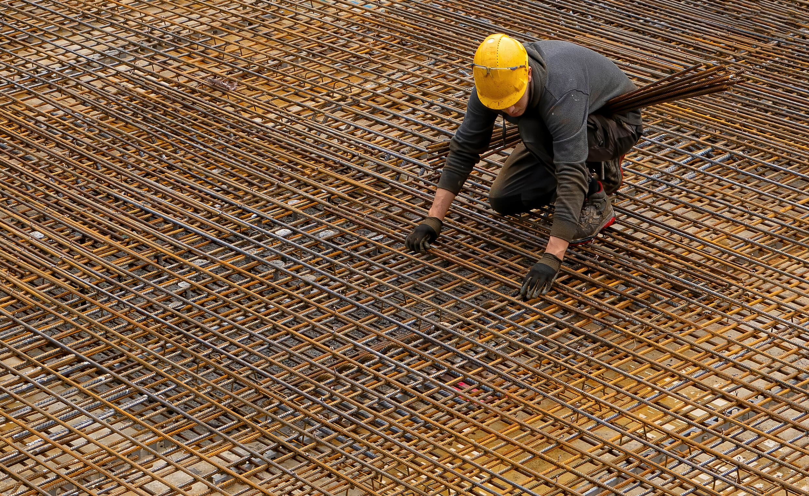
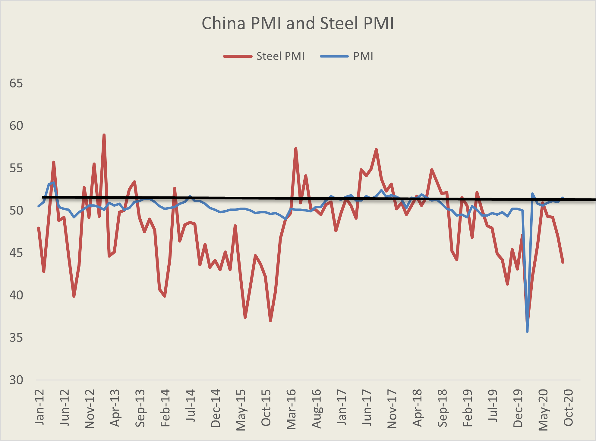
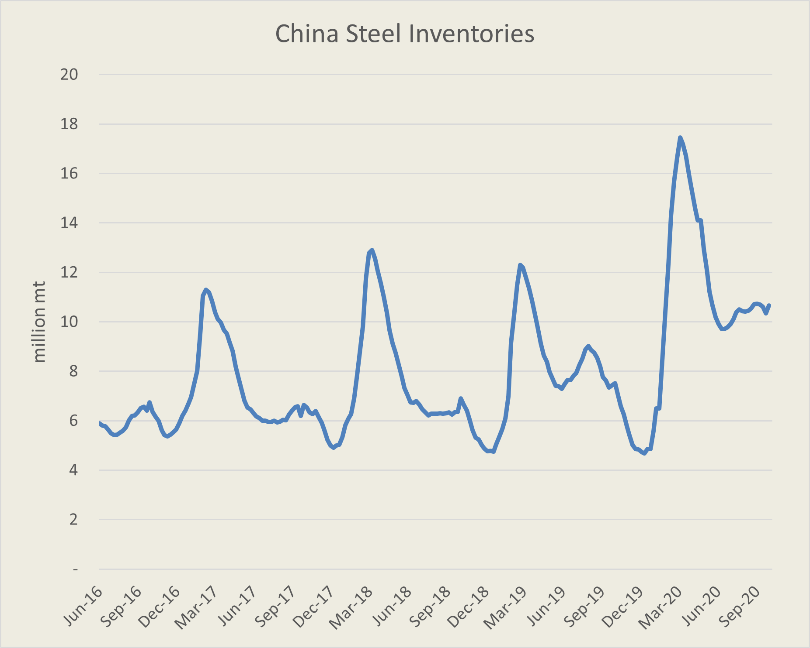
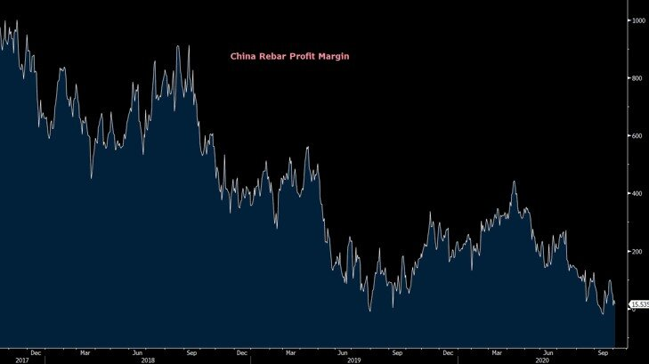

# Is China's Steel Industry a Bubble About to Pop?

**Date:** October 14, 2020  
**Publisher:** Breakwave Advisors | **Category:** Market Insights  
**Original URL:** [https://www.breakwaveadvisors.com/insights/2020/10/13/is-chinas-steel-industry-a-bubble-about-to-pop](https://www.breakwaveadvisors.com/insights/2020/10/13/is-chinas-steel-industry-a-bubble-about-to-pop)  

---

> **Figure 1: China’s Steel Pmi Points to Harder Times Ahead**  
> *China’s Steel PMI points to harder times ahead*  
> **Interactive Data & Source:** [Bhp](https://www.bhp.com/media-and-insights/prospects/2020/08/bhps-economic-and-commodity-outlook/#chineseeconomicgrowth) | [Local Asset](file:///C:/Users/Dell/Github/Shipping/corpus/03-breakwave/insights/2020/assets/2020-10-14_is-chinas-steel-industry-a-bubble-about-to-pop_img_image-asset_aef5168f38db.jpeg)

Over the last two decades China’s steel industry has been a major force behind global commodity trading especially as it relates to iron ore and coking coal. Having gone through numerous transformations over the years, China’s steel production capacity has expanded year after year with demand pushing above the 1 billion tonne mark last year for the first time ever, signifying the relentless appetite for steel utilized in construction and manufacturing in the second largest economy in the world. Yet, again and again, market participants and industry analysts have predicted the ultimate peak in China’s steel intensity and the potential subsequent decline in demand, something that obviously has not materialized as of yet. As we enter the new decade, China’s steel industry is a strong as ever. This year, however, there are some very unique circumstances that could potentially be signaling some trouble ahead.

First and foremost, China’s steel industry remains in a technical recession if one were to look at what the industry itself says about future prospects. China’s steel PMI, an indication of the near term outlook as viewed by the steel sector, remains deep in contraction territory, rapidly approaching 2015 levels. More importantly, despite the significant stimulus applied to the Chinese economy over the past several months, the domestic steel industry has failed to reach PMIs consistent with strong expansion levels.

> **Figure 2: Steel Production Increasing But Inventories Are Going Up Too**  
> *Steel production increasing but inventories are going up too*  
> **Interactive Data & Source:** [Bhp](https://www.bhp.com/media-and-insights/prospects/2020/08/bhps-economic-and-commodity-outlook/#chineseeconomicgrowth) | [Local Asset](file:///C:/Users/Dell/Github/Shipping/corpus/03-breakwave/insights/2020/assets/2020-10-14_is-chinas-steel-industry-a-bubble-about-to-pop_img_steelpmi_5138ae6ad4d5.png)

China’s steel PMI is a more volatile series versus China’s official manufacturing PMI, but it also reflects only part of the Chinese economy. One can easily see however that the industry has been consistently more bearish about the future over the last decade, although there have been instances of strong expansion, albeit brief. As of September, the outlook remained quite bleak. The industry as a whole is back deep into contraction territory, especially as it relates to new orders. Such level is quite inconsistent with the broader China manufacturing PMI that is back to expansion territory after spending most of the earlier part of the year in contraction (for those not familiar with how PMI works, the index is a diffusion index, with levels above 50 signifying expansion and below 50 contraction). Where have the PMI’s in the 60s and 70s recorded in the 2000s gone? And is such a slower activity an indication of a maturing industry that is about to flip to negative growth rates?

Despite such a bearish stance by the country’s steel industry, year-to-date steel production is some 3% higher from the record highs of last year, and most likely will once again exceed the 1 billion tonne mark for the second year in a row. However, one thing that is quite different this time around is the increase in inventory levels following the pandemic outbreak earlier in the year but also the persistence of such high levels year to date.

> **Figure 3: China’s Steel Mill Profitability Is Being Challenged**  
> *China’s steel mill profitability is being challenged*  
> **Interactive Data & Source:** [Bhp](https://www.bhp.com/media-and-insights/prospects/2020/08/bhps-economic-and-commodity-outlook/#chineseeconomicgrowth) | [Local Asset](file:///C:/Users/Dell/Github/Shipping/corpus/03-breakwave/insights/2020/assets/2020-10-14_is-chinas-steel-industry-a-bubble-about-to-pop_img_chinasteelinventory_8c1c02c915f2.png)

Nevertheless, apparent demand remains above last year’s run rate, but it is not significantly above such level as the production figures imply. If most of the produced steel ends up in storage, what does that say about the near and medium term demand trends? More importantly, can a drawdown in steel inventories lead to a restocking cycle for iron ore, which will be bullish dry bulk freight or are we in a new plateau for inventories across the steel spectrum?

The fact of the matter is that steel mills in China are struggling, and such a low profitability might be the reason for the bearish views expressed through the steel PMI survey. The “squeeze” in iron ore supply out of Brazil following last year’s dam accident has basically created a major problem for steel mills by increasing iron ore prices faster than corresponding steel prices, and now high raw material costs combined with relatively low end user demand has pushed profitability to multi-year lows.

> **Figure 4: ” … We Firmly Believe That**  
> *” … we firmly believe that, by mid–century, China will almost double its accumulated stock of steel in use, which is currently 7 tonnes per capita, on its way to an urbanization rate of around 80 per cent14 and living standards around two–thirds of those in the United States…. our base case is that Chinese steel production has entered a plateau phase, with the literal peak to occur no later than the middle of this decade..”*  
> **Interactive Data & Source:** [Bhp](https://www.bhp.com/media-and-insights/prospects/2020/08/bhps-economic-and-commodity-outlook/#chineseeconomicgrowth) | [Local Asset](file:///C:/Users/Dell/Github/Shipping/corpus/03-breakwave/insights/2020/assets/2020-10-14_is-chinas-steel-industry-a-bubble-about-to-pop_img_chinaprofitmargin_47040d4edbb9.jpg)

Add to the above the potential for high coking coal prices given the ongoing dispute between China and Australia, (Australia is a major supplier of coking coal to Chinese steel mills) and a storm is brewing for an industry that is so vital for shipping.

All of the above leaves once again the future growth of China’s steel industry into question. But this is not the first time and most likely won’t be the last. The probabilities of overcoming such obstacles and post new highs in terms of apparent demand have been stacked against China for years now, and such a trend might not be about to change anytime soon. As[BHP more recently stated](https://www.bhp.com/media-and-insights/prospects/2020/08/bhps-economic-and-commodity-outlook/#chineseeconomicgrowth):

Betting against China’s steel industry has been a loosing proposition for many years. Old habits die hard, and steel is such a significant part of China’s economy that there might be more years of solid growth still ahead of us.

---

**Tags:** Shipping, Dry Bulk, Steel, China  
