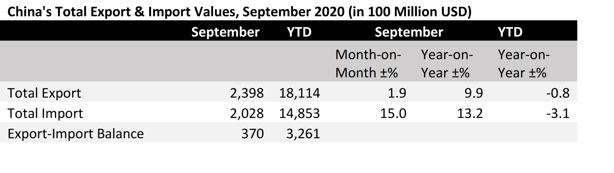
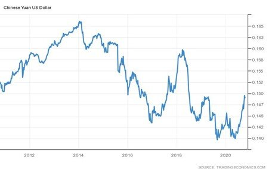

# The Chinese Economy Continues to Show Strength – Exports and Imports on the Rise

**Date:** October 15, 2020  
**Publisher:** Breakwave Advisors | **Category:** Market Insights  
**Original URL:** [https://www.breakwaveadvisors.com/insights/2020/10/15/the-chinese-economy-continues-to-show-strength-exports-and-imports-on-the-rise](https://www.breakwaveadvisors.com/insights/2020/10/15/the-chinese-economy-continues-to-show-strength-exports-and-imports-on-the-rise)  

---

*By Ulf Bergman*

> **Figure 1: The Chinese Economy Continues to Show Considerable Strength**  
> *The Chinese economy continues to show considerable strength, with exports rising for the fourth consecutive month in September and beating the economists’ expectations yet again. The exports increased by just shy of ten percent in US dollar terms, compared to the same month last year and it was also 1.9 percent higher than the previous month. However, despite the recent solid statistics, the total export volumes for the year-to-date are still lagging compared to the same period last year.*  
> [Local Asset](file:///C:/Users/Dell/Github/Shipping/corpus/03-breakwave/insights/2020/assets/2020-10-15_the-chinese-economy-continues-to-show-strength-exports-and-imports-on-the-rise_img_image-asset_a9014baed263.jpeg)

The rise in exports are to a great extent driven by coronavirus related products, such as medical supplies and electronics for medical and homeworking use. Hence, many observers are expecting exports to continue to improve on year-on-year basis in the coming months, so the full-year figures could still eclipse last year’s levels.

However, headwinds may pick up with rising COVID-infection rates in Europe or with any new trans-Pacific tensions, which could put Chinese exports under some pressure.

> **Figure 2: Source: General Administration of Customs of People’s Republic**  
> *Source: General Administration of Customs of People’s Republic of China*  
> [Local Asset](file:///C:/Users/Dell/Github/Shipping/corpus/03-breakwave/insights/2020/assets/2020-10-15_the-chinese-economy-continues-to-show-strength-exports-and-imports-on-the-rise_img_ulf23_c78fb6dde7e8.png)

Although the increase in export activities were impressive, the real headline grabber was the growth of the imports. Expected to grow by just below half of a percent, it registered its largest ever monthly jump with an increase of over thirteen percent. The recent rebound of the Chinese economy has fuelled its appetite for imported commodities, such as iron ore and soybeans. Volumes of iron ore imports increased by some nine percent in September bringing the total for the first three quarters to 868 million tonnes, an increase of almost eleven percent compared to the same period last year.

> **Figure 3: Market Chart 3**  
> [Local Asset](file:///C:/Users/Dell/Github/Shipping/corpus/03-breakwave/insights/2020/assets/2020-10-15_the-chinese-economy-continues-to-show-strength-exports-and-imports-on-the-rise_img_image-asset_73473d81961e.jpeg)

Not only commodities drove Chinese imports to the record level in dollar terms, with electronics and high-tech accounting for a considerable portion of the increase. New US sanctions on the sale of semiconductors to Huawei and fears of additional restrictions on high-tech imports from the US led many Chinese importers to increase their stocks to limit future disruptions.

The robust growth in trade is pointing towards a continued healthy recovery, which may put the country back on its pre-COVID growth trajectory. The third-quarter gross domestic product data will be released on Monday and many economists expect it to be in the five to six percent range, where we have been used to see it for some time.

The recent strong recovery of the Chinese economy has also strengthened the Chinese currency to an eighteen-month high against the dollar, after trading near its decade lows in May. A stronger Yuan makes imports cheaper and may contribute to a continued strong inflow of dollar denominated commodities. Whilst the IMF recently said that the global economic recovery will be “long, uneven and uncertain”, a strengthening Chinese currency and a growing industrial production are likely to be supportive for the dry bulk shipping sector in the near future.

> **Figure 4: Ulf 22**  
> [Local Asset](file:///C:/Users/Dell/Github/Shipping/corpus/03-breakwave/insights/2020/assets/2020-10-15_the-chinese-economy-continues-to-show-strength-exports-and-imports-on-the-rise_img_ulf22_0cb118401e36.jpg)

---

**Tags:** China, Economics  
