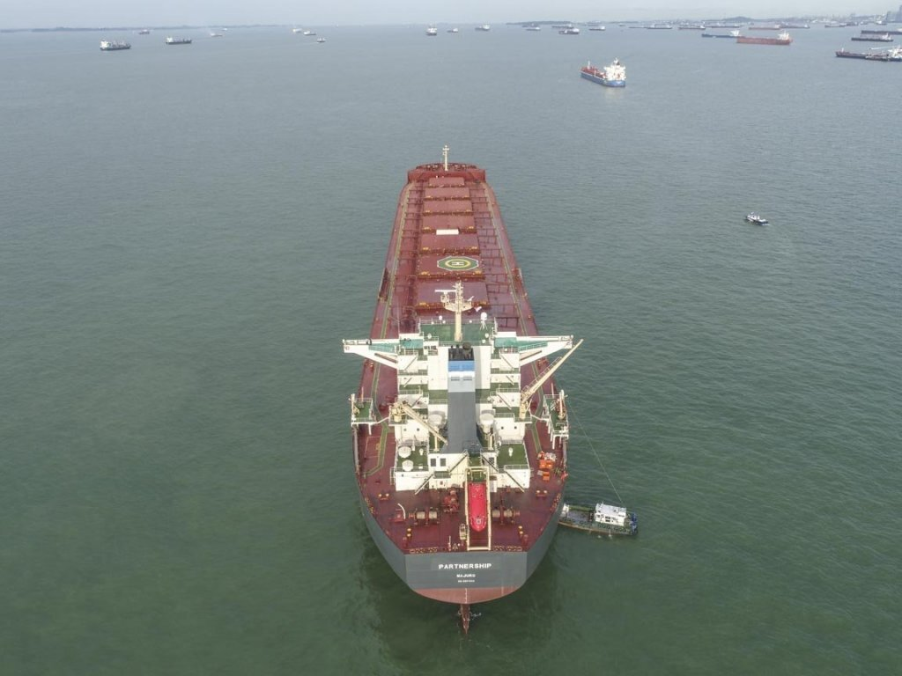
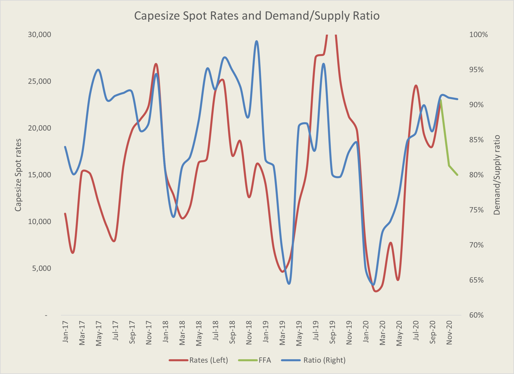
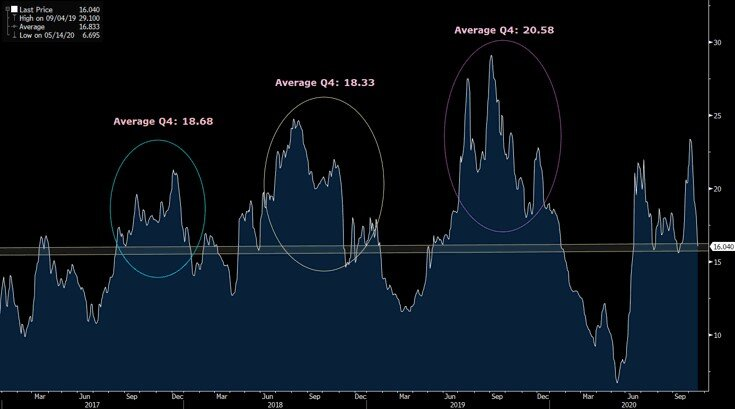

# Is the Winter Rally Over for Capesizes?

**Date:** October 19, 2020  
**Publisher:** Breakwave Advisors | **Category:** Market Insights  
**Original URL:** [https://www.breakwaveadvisors.com/insights/2020/10/19/is-the-dry-bulk-winter-rally-over](https://www.breakwaveadvisors.com/insights/2020/10/19/is-the-dry-bulk-winter-rally-over)  

---

> **Figure 1: Ship31**  
> [Local Asset](file:///C:/Users/Dell/Github/Shipping/corpus/03-breakwave/insights/2020/assets/2020-10-19_is-the-dry-bulk-winter-rally-over_img_ship31_3c5776a81ad6.jpg)

So far, October has been a disappointing month for dry bulk, to say the least. A surge in Capesizes that started in mid-September and pushed rates from 15,000 towards the 35,000 level in less than two weeks, failed to provide some much needed confidence that better times might lie ahead, and as a result, rates tumbled back down to where they started at, namely the mid-to-high teens range. Although there were valid reasons for the strength in rates just only a month ago, cargo flow suddenly dried up and vessels ballasting towards Brazil increased and, as a result, owners once again started to offer their ships at ever cheaper levels, leading to a cascade effect that drove rates in both the Atlantic and the Pacific back down towards the range that futures have been predicting for months now.

The natural question now is: Is it over or another move higher might be in the cards?

While running the risk of repeating ourselves and sounding like the ever optimist (especially given the current bearishness in the market) we tent to believe it is not over just yet. We remain surprised by the intensity of the downward move in rates, as the mid-20,000 level in Capesizes seemed to have been a reasonable level for a bounce, and with rates now back in the teens, our confidence is also shaken as is for many market participants. What can cause rates to turn back up? And are we close to the bottom or, more surprisingly, we can see even weaker rates ahead?

> **Figure 2: Iron Ore Pellets**  
> [Local Asset](file:///C:/Users/Dell/Github/Shipping/corpus/03-breakwave/insights/2020/assets/2020-10-19_is-the-dry-bulk-winter-rally-over_img_ironorepellets_4425ade9df22.jpg)

Making predictions in such a volatile environment requires a lot of humbleness. Nevertheless, as in any other market, we turn back to fundamentals and look what lies ahead for cargo flows versus available tonnage. Surprisingly, looking at such balance, we continue to see a tightening trend, pointing to higher rates ahead versus expectations. However, starting from a lower level now, any rally means lower averages for the period versus our initial expectations, but if one looks at the futures curve, the upside potential compared to what is priced in seems quite favorable.

The chart below shows the ratio of Australia and Brazil iron ore cargo flow versus the global Capesize fleet (blue line) and the level for Capesize rates (red line) and freight futures (green line). It is a volatile relationship after all, but directionally we see a lot of promise in the predictive power of such a relationship, especially for near to medium term. Overshooting or undershooting is part of the main characteristic of freight, but given the direction that freight futures are pointing to versus the balance of supply and demand, we believe the futures remain overly pessimistic for the next few months.

> **Figure 3: Brazil-China Freight Costs in Usd/ton**  
> *Brazil-China freight costs in USD/ton*  
> [Local Asset](file:///C:/Users/Dell/Github/Shipping/corpus/03-breakwave/insights/2020/assets/2020-10-19_is-the-dry-bulk-winter-rally-over_img_s26doctober20_8e689d1b26a9.png)

Looking at seasonality and the important Brazil-China trade, and once again freight costs are back to what we view as ‘resistance” level, not from a technical standpoint but more of the level that owners might be willing to accept for a trip that last more than 90 days (roundtrip) in the middle of the winter.

As the chart below shows, for the last three years, the cost per ton for the Brazil-China route (referred in the shipping market as C3) has been approximately $18-$20 USD per ton during the fourth quarter of the year. Currently, based on futures, such level is less than $17/ton. Obviously nothing says that it can not be even lower, but seasonality plays a role in shipping, and we don’t see a reason why this year such level should be below the average of the last three years.

> **Figure 4: C3 Historical**  
> [Local Asset](file:///C:/Users/Dell/Github/Shipping/corpus/03-breakwave/insights/2020/assets/2020-10-19_is-the-dry-bulk-winter-rally-over_img_c3historical_d5d7f8e20d13.jpg)

As we sit in mid-October, and following a collapse in spot rates in less than two weeks time, it is tough to be optimistic (as it was also tough to be pessimistic when rates were 35,000). Shipping is cyclical, and both for owners and financial players (i.e. freight futures traders) it is the averages that matter. The Capesize October contract seems that it will settle above the trading range of the period prior to becoming current month, while even just two weeks before becoming the current month market participants were pricing October at 18,000. Now such contract is on its path of settling above 23,000 (still two weeks to go though) after having touched 28,000 just two weeks ago. Volatility is back, and with that humility is also necessary when dealing with such wide ranges out outcomes.

As we stand, and with the November and December futures now priced at an average of ~16,000, how confident are market participants of the future path of spot rates?

The final stretch of the year will be quite interesting…

---

**Tags:** Shipping, Dry Bulk, Capesize  
