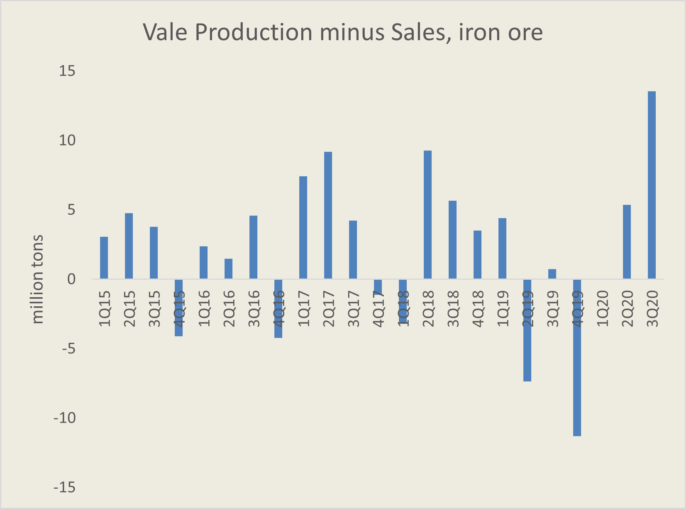

# Vale: Where Is All the Iron Ore Going to?

**Date:** October 20, 2020  
**Publisher:** Breakwave Advisors | **Category:** Market Insights  
**Original URL:** [https://www.breakwaveadvisors.com/insights/2020/10/20/vale-where-is-all-the-iron-ore-going-to](https://www.breakwaveadvisors.com/insights/2020/10/20/vale-where-is-all-the-iron-ore-going-to)  

---

Vale, the Brazilian mining company, yesterday reported third quarter production figures, and although production numbers were generally in line with expectations, reported sales for iron ore were well below what the historical relationship between production and sales would have pointed to. In fact, despite iron ore production being about 2mt above last year’s level, iron ore sales were almost 11mt below last year. Such a variation can have a major impact on shipping volumes, although it is unclear what the size of such impact is at any given time. As the chart below shows, the rebuilding of inventories that were drawn down late last year was significant during the past two quarters.

> **Figure 1: Invenotry Vale**  
> [Local Asset](file:///C:/Users/Dell/Github/Shipping/corpus/03-breakwave/insights/2020/assets/2020-10-20_vale-where-is-all-the-iron-ore-going-to_img_invenotryvale_66c93eff62a7.png)

Vale mentioned that in September such discrepancy had started to normalize, with further alignment (sales vs. production) expected for the rest of the year. Based on the reported numbers, Vale can hit their production target of ~310mt for 2020 but sales will fall well short of such number, most likely some 20mt+ below that. For shipping, it is not what is produced, but what is shipped, and despite production ending up being higher versus last year, sales volume will most likely end up being lower.

> **Figure 2: Porto Teluk**  
> [Local Asset](file:///C:/Users/Dell/Github/Shipping/corpus/03-breakwave/insights/2020/assets/2020-10-20_vale-where-is-all-the-iron-ore-going-to_img_porto-teluk_7197bca2bc4b.jpg)

Teluk Rubiah Terminal, Malaysia

Vale maintains iron ore inventories in lots of places around the globe. Most of such stocks are used for blending and product optimization, something that Vale has focused a lot in the last several years. Malaysia is the most well known distribution center for Vale, where both blending and product optimization takes place. More importantly, Vale maintains iron or inventories in several ports in China, used also for blending but also satisfying on-time demand on the ground. Vale has held as much a 56mt of inventories around the world in late 2018, although the disruption following the Brumandinho dam rapture in early 2019 led to a significant drop in such levels. Rebuilding such inventories remains crucial for Vale’s product and price optimization strategy. However, long hull shipments might get hurt during such process as Vale uses mainly its Valemax fleet to move product to storage facilities around the world.

Unfortunately, if production is hard to forecast, inventory adjustments are even harder to predict as Vale provides production guidance and not sales guidance. Using a 1:1 ratio works most of the times, but the significant production disruption following the dam rapture has complicated Vale’s logistics even further. Assuming that most of the inventory rebuilding is done, the sales-to-production ratio should normalize going forward, but this remains to be seen as the global logistical chain of the giant miner remains a puzzle.

---

**Tags:** Shipping  
