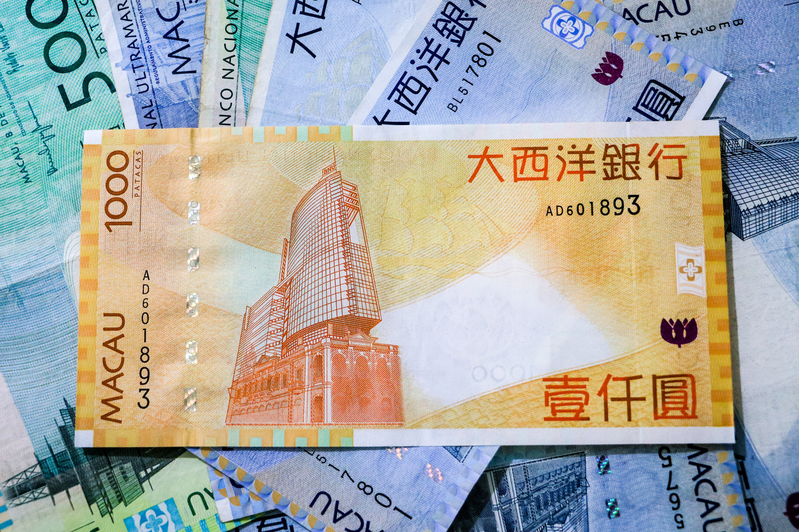
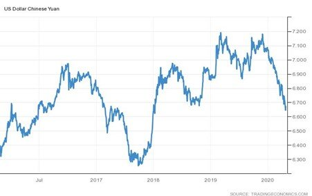

# China: Strong Recovery Fuels Currency Appreciation

**Date:** October 23, 2020  
**Publisher:** Breakwave Advisors | **Category:** Market Insights  
**Original URL:** [https://www.breakwaveadvisors.com/insights/2020/10/22/china-strong-recovery-fuels-currency-appreciation](https://www.breakwaveadvisors.com/insights/2020/10/22/china-strong-recovery-fuels-currency-appreciation)  

---

> **Figure 1: By Ulf Bergman**  
> [Local Asset](file:///C:/Users/Dell/Github/Shipping/corpus/03-breakwave/insights/2020/assets/2020-10-23_china-strong-recovery-fuels-currency-appreciation_img_image-asset_6a12d3d59b89.jpeg)

From a European perspective, one can be forgiven for seeing the storm clouds gathering at the horizon and a sense of gloom descending, as COVID-19 infection rates rise rapidly, and new social restrictions are imposed across the continent. In addition, reports that many European SME’s see a high risk of bankruptcy within the next six months are adding to a rather gloomy picture. Many other parts of the world also paint equally bleak pictures.

The silver lining for dry bulk shipping is that China keeps releasing strong economic data and, in addition, this week the Chinese central bank, the People’s Bank of China, lent its voice to the chorus of voices predicting positive growth for the Chinese economy for the full year. The governor of the PBOC said earlier this week that the economy is likely to expand this year, while at the same time the economy’s debt level is increasing faster than the growth due to the impact of the pandemic. The debt ratio is, however, expected to stabilize next year, as the PBOC is expecting the economy to pick up further next year.

As the Chinese economy has rebounded quicker and stronger that the rest of the world, international investors’ appetite for Chinese assets have increased and appreciating the Yuan to levels against the dollar not seen for quite some time.

> **Figure 2: Ulf 30**  
> [Local Asset](file:///C:/Users/Dell/Github/Shipping/corpus/03-breakwave/insights/2020/assets/2020-10-23_china-strong-recovery-fuels-currency-appreciation_img_ulf30_10bd42c35eec.jpg)

The strong levels against the dollar are partially due to a strong inflow of foreign capital driven by a considerable interest rate-premium over the rest of the world, but also due to a weakness of the US dollar. The Yuan has gained around six percent relative to the dollar since May, despite official attempts to rein in the appreciation. There are reports that the Chinese authorities will increase the amount of capital it allows to flow out of the country, which would signal confidence in the economy from policy makers but also that the Yuan’s gains may have reached the limit of what is perceived as acceptable.

A strong currency is a bit of a double edge sword for the Chinese economy, as it could hurt the competitiveness of its products in the export markets. From a shipping perspective, the container trade out of China to the US and Europe could see some negative impact with a continued strong Yuan. On the other hand, as commodities tend to be priced in US dollars and a strong Chinese currency makes imports cheaper, which could make a case for increasing inventories. For dry bulk shipping a strong Yuan looks desirable, as it could further stimulate volumes imported. Especially as a part of the industrial commodities would go to the announced domestic infrastructure projects and not be re-exported.

It remains to be seen if the Yuan will continue to appreciate, as the PBOC has multiple tools to its disposal to control the exchange rate. However, a continued divergence on the rate of economic recovery between China and the rest of the world could potentially overwhelm the tools available to the policy makers, with a further strengthening of the currency as a result.

---

**Tags:** China, Yuan, Economics  
