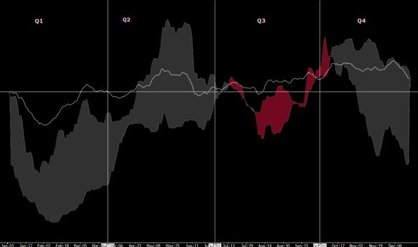
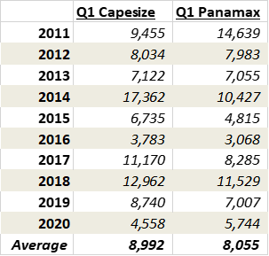
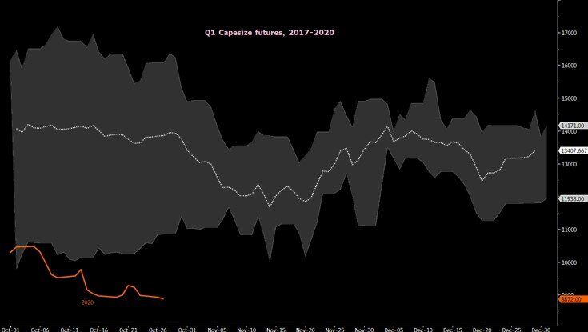
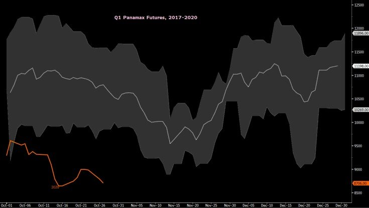
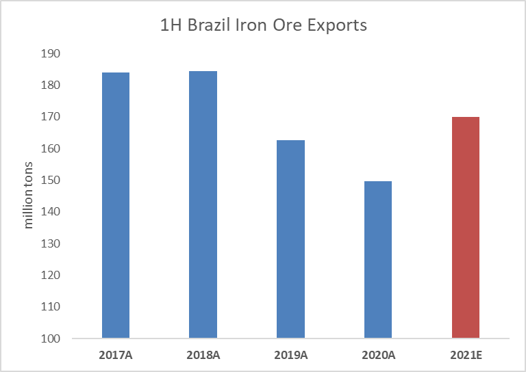

# Can Q1 Dry Bulk Rates Surprise?

**Date:** October 28, 2020  
**Publisher:** Breakwave Advisors | **Category:** Market Insights  
**Original URL:** [https://www.breakwaveadvisors.com/insights/2020/10/28/can-q1-dry-bulk-rates-surprise](https://www.breakwaveadvisors.com/insights/2020/10/28/can-q1-dry-bulk-rates-surprise)  

---

Shipping is cyclical and it is well known in the industry that for dry bulk the first quarter is considered the weakest period of any given year for various reasons related to both supply and demand of raw materials. Such seasonality is, most of the times, reflected in the futures market, where the first quarter contracts trade below each subsequent quarter well in advance. This year is no exception. Despite the ups and downs in spot rates, the first quarter 2021 contracts for dry bulk have been trading in a narrow range and well below the rest of them respective annual contract, reflecting the broader expectation for another seasonally weak period.

Yet, as in a lot of other markets, profits are made and lost when the reality is different than expectations. With Q1 futures remaining depressed and some 50% below spot (for Capesize rates), is there an opportunity or the future is well priced-in?

### Baltic Dry Index Seasonality, Last 20 Years

> **Figure 1: BDI Seasonality**  
> **Interactive Data & Source:** [En Wikipedia](https://en.wikipedia.org/wiki/Brumadinho_dam_disaster) | [Local Asset](file:///C:/Users/Dell/Github/Shipping/corpus/03-breakwave/insights/2020/assets/2020-10-28_can-q1-dry-bulk-rates-surprise_img_bdiseasonality_7a7eaab8bc3c.jpg)

Looking at recent history, indeed first quarter rates have been experiencing significant weakness early in the year, with some notable exceptions. As the table below shows, realized rates during the first quarter of each year for Capesize and Panamax have been particularly weak both on an absolute as well as relative basis.

> **Figure 2: Capesize Q1 Futures**  
> *Capesize Q1 futures, 2017-2020*  
> **Interactive Data & Source:** [En Wikipedia](https://en.wikipedia.org/wiki/Brumadinho_dam_disaster) | [Local Asset](file:///C:/Users/Dell/Github/Shipping/corpus/03-breakwave/insights/2020/assets/2020-10-28_can-q1-dry-bulk-rates-surprise_img_settlements_7170d416cb42.png)

However, given the low level of absolute rates, a small change in the average realized rate can make a big difference on a percentage terms. Take for example the current level of Q1 Capesize futures: At ~8500, if the actual settlement ends up being closer to 2017/2018, say at approximately12,000, the potential represents an almost 40% upside. Of course, we also have years like 2016 or 2020 when the downside risk is also significant, although both of these years represent special circumstances (2016 China slowdown, 2019 COVID-19). Then there is 2014, an outlier with a strong countercyclical uptick that, if matched, would potentially represent a 100%+ return for the Q1 2021 contract.

But it is not only the realized rates that point to some discrepancy. The futures market is also more pessimistic than usual. Looking at the past four years, first quarter futures are trading below their usual level, despite a robust spot market.

> **Figure 3: Panamax Q1 Futures**  
> *Panamax Q1 futures, 2017-2020*  
> **Interactive Data & Source:** [En Wikipedia](https://en.wikipedia.org/wiki/Brumadinho_dam_disaster) | [Local Asset](file:///C:/Users/Dell/Github/Shipping/corpus/03-breakwave/insights/2020/assets/2020-10-28_can-q1-dry-bulk-rates-surprise_img_q1capes_aa0addbf7713.jpg)

The story is similar when one looks at Panamax futures, a relatively more stable and less volatile market versus Capesizes.

> **Figure 4: Q1 Panamax**  
> **Interactive Data & Source:** [En Wikipedia](https://en.wikipedia.org/wiki/Brumadinho_dam_disaster) | [Local Asset](file:///C:/Users/Dell/Github/Shipping/corpus/03-breakwave/insights/2020/assets/2020-10-28_can-q1-dry-bulk-rates-surprise_img_q1panamax_f5e91c083616.jpg)

So, is the market too pessimistic or are we again set up for a significant drop in spot rates that will drag all the way to the middle of next year?

For Capesizes, the last two years offered some of the most challenging times in terms of iron ore exports. In 2018, the[Brumadinho dam rapture](https://en.wikipedia.org/wiki/Brumadinho_dam_disaster)in late January threw the Capesize market into a tailspin, something that is affecting Brazilian iron ore exports up to this day. In 2020, the global pandemic had a profound impact on every aspect of the global economy, naturally also affecting shipping.

> **Figure 5: Brazil 1h Exports**  
> [Local Asset](file:///C:/Users/Dell/Github/Shipping/corpus/03-breakwave/insights/2020/assets/2020-10-28_can-q1-dry-bulk-rates-surprise_img_brazil1hexports_93f2c9e053b6.png)

Both of the above major events are still affecting dry bulk to some extend. However, the trajectory of both disruptions is on the positive side, with exports out of Brazil recovering and expected to continue to improve while the Chinese economy seems to be handling the COVID-19 issues better than the rest of the world with steel demand at record highs. As a result, we expect Brazilian iron ore exports during the first half of next year to reach their highest level in three years, yet total below the record-high 2017/2018 periods.

With higher exports usually come stronger freight rates. Yet, as the charts above show, the market is expecting a much lower rate environment versus a more “normal’ year. This is perfectly understandable, since we are definitely not living in normal times. However, if indeed iron ore exports end up recovering as fast as mining majors are guiding to and absent any weather related disruptions (especially heavy rains in Brazil), it seems that the odds of a better than priced first quarter is on the side of the bulls.

It is indeed early to call freight rates for Q1 as we still have a lot of activity remaining for the rest of this year. However, the opportunity in freight lies on calling sentiment, not actual supply/demand balance, as by then it will be too late and the market will have already adjusted. Sentiment for the first quarter dry bulk rates is currently very low. The opportunity of a steep backwardated curve is real and the risk/reward balance this time around appears quite favorable versus previous years.
