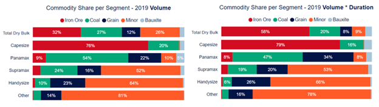
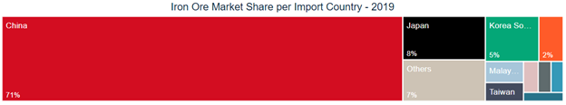
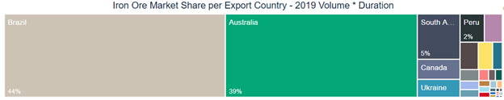
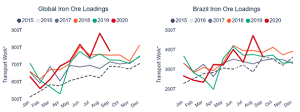
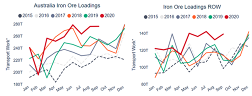
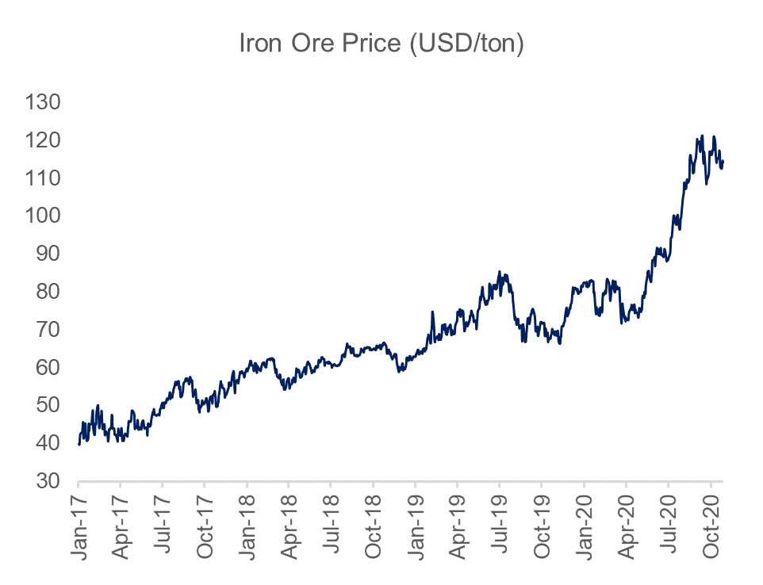
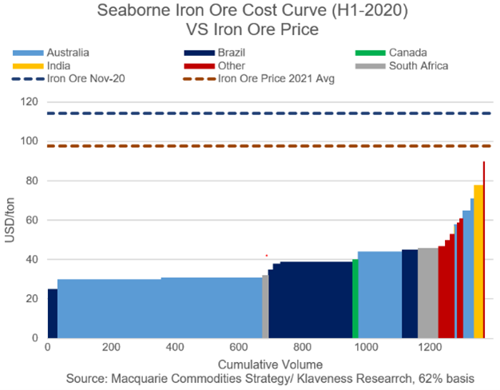

# 2021 Dry Bulk Outlook - Will Iron Ore Exports Be Able to Meet Demand?

**Date:** October 30, 2020  
**Publisher:** Breakwave Advisors | **Category:** Market Insights  
**Original URL:** [https://www.breakwaveadvisors.com/insights/2020/10/29/2021-dry-bulk-outlook-iron-ore](https://www.breakwaveadvisors.com/insights/2020/10/29/2021-dry-bulk-outlook-iron-ore)  

---

*By*[*Peter Lindström*](mailto:pel@klaveness.com)

In the following weeks Klaveness Research will in a series of articles have a look at how we believe the fundamentals impacting dry bulk freight rates are shaping up for 2021.

In[last week’s article](https://www.breakwaveadvisors.com/insights/2020/10/22/2021-dry-bulk-outlook)we started off by having a look at the big picture. In this week’s article we will drill further into the details of the fundamental drivers for iron ore, which is the single biggest dry bulk commodity. In subsequent reports we will drill further down into the other major dry bulk commodity groups of coal, grains, bauxite and minor bulks before we finish off with a look at the supply side.

### The Link Between the Iron Ore Trade and Dry Bulk Freight Rates

The iron ore share in total dry bulk trade measured by volume was 32%* in 2019 and is as such the largest commodity group. The demand for vessels cannot simply be derived from volume - we need to take distance and trade inefficiencies into account as well - as time spent on the total transport work is what ultimately impacts the aggregated demand for vessels. A widely used metric in the shipping industry is ton-mile, which simply is tonnes carried x distance traveled. This is a better gauge for vessel demand than only looking at tons carried, but in Klaveness Research we prefer another measure - Volume x Duration - which looks at the total time spent on the transport work and multiplies this with tonnes carried. We believe this is a better way to measure the demand for vessels as it also captures some of the inefficiencies on the various trades, such as congestion. If we measure the iron ore share in total dry bulk trade by using the Volume x Duration metric, we end up with a massive 58% market share* in 2019. In the first nine months of 2020 the market share of iron ore has increased another percentage point.

> **Figure 1: Klav 20**  
> **Interactive Data & Source:** [Breakwave Advisors Market Insights](https://www.breakwaveadvisors.com/insights/2020/10/22/2021-dry-bulk-outlook) | [Local Asset](file:///C:/Users/Dell/Github/Shipping/corpus/03-breakwave/insights/2020/assets/2020-10-30_2021-dry-bulk-outlook-iron-ore_img_klav20_4341f7c7cd2e.png)

If we break it down by segment, we clearly see that the iron ore transport work is unevenly distributed among the sizes. While iron ore constituted 79% of the Cape demand in 2019, the market share quickly drops as we move down the sizes with Panamaxes at 8%, Supramaxes at 4% and Handies at a meager 1%.

Iron ore’s high market share in Capesize demand makes the link between the seaborne iron ore trade volumes and Capesize freight rates direct and intuitive. However - maybe less intuitively - the iron ore trade also has a big impact on freight rates in the smaller segments, through substitution effects. Due to economies of scale the Capesize segment can normally offer the cheapest freight on a per ton basis. This is the reason why Capesize is the preferred carrier of iron ore and coal on trade routes which have the necessary infrastructure to accommodate these large vessels. The fact that the cape fleet is so dependent on one single commodity group makes it the most volatile segment in terms of freight. High iron ore volumes increase cape utilization, higher utilization leads to higher freight rate, which from time to time makes Panamax freight less expensive on a per ton basis. When this happens, we often see “Cape splits”, which typically means that one Capesize vessel is substituted with two Panamax vessels. Somewhat ironically these Cape splits seldom occur on the iron ore trade but usually on the coal trades. Cape splits lead to higher Panamax freight rates which again can make Supramax/Ultramax cheaper than Panamax on a per ton basis, which means cargo volume is cascaded down into the geared segment.

### Iron Ore Demand

Steel is primarily produced using one of two methods: Blast Furnace or Electric Arc Furnace. 98%** of the mined iron ore is linked to blast furnace steel production which uses coke, iron ore and limestone to produce pig iron. The competing Electric Arc Furnace method uses scrap steel and electricity to produce molten steel.

As we touched upon in[last week’s article](https://www.breakwaveadvisors.com/insights/2020/10/22/2021-dry-bulk-outlook)the biggest iron ore importer in the world is by far China. China’s market share in global steel production year to date is 58%. The fact that more than 90% of Chinese steel production is based on the blast furnace method, while the percentage for the rest of the world is around 55% (2019 data is not available) means that China’s demand for iron ore exceeds the Chinese share in global steel production. Combined with a low quality in the domestic iron ore, the vast majority of China’s demand is covered through imports. 71% of all seaborne export of iron ore in 2019 was destined for China. In the first 9 months of this year the market share of China has increased further to 76% as steel production in the country has increased 3.9% year on year, while steel production in the rest of the world collectively is down 13.3%.

> **Figure 2: Klav 21**  
> **Interactive Data & Source:** [En Wikipedia](https://en.wikipedia.org/wiki/Brumadinho_dam_disaster) | [Local Asset](file:///C:/Users/Dell/Github/Shipping/corpus/03-breakwave/insights/2020/assets/2020-10-30_2021-dry-bulk-outlook-iron-ore_img_klav21_c2fd1136c2b5.png)

Covid-19 has without doubt negatively impacted steel demand and production in the world outside of China. Although we currently see a resurgence in global infections in the Western World, we believe it is likely that the adverse effects from Covid-19 on global industrial production will be less in 2021 compared to this year, either through vaccines or through increased knowledge about how to keep the wheels turning while at the same time keeping the virus under control. Thus, we believe that steel production will grow in the world outside of China in 2021 and that the magnitude of the growth will be negatively correlated with the growth rates in Covid-19 hospitalizations.

Chinese steel demand had a week start of the year as the economy was hit by Covid-19. After suppressing the spread of the virus within the country, the Chinese government has initiated a series of big infrastructure investments to stimulate the economy. The positive effect of these investments will last well into the new calendar year, but it is difficult to assess the growth rates for Chinese steel production for 2021 as a whole.

All in all, the demand growth in iron ore for next year is uncertain, but in our view likely to be positive.

However, we firmly believe that what happens on the demand side for iron ore is of less importance in 2021. The reason is that the iron ore market currently is in a large deficit, something which is clearly reflected in the current spot and future prices of iron ore. Hence, we believe that there will be a buyer in 2021 for every ton of decent quality iron ore that is produced. Thus, it is the growth rates in iron ore supply which will be of importance in 2021.

### Iron Ore Supply

Australia is by far the largest iron ore exporter in the world with a 65% market share in global export in 2019, followed by Brazil in second place at 20%. If we use our Volume x Duration metric we see a different picture where Brazil at 44% is more important for dry bulk vessel demand than Australia at 39%. While all other exporters are marginal with an accumulated market share of 17%.

> **Figure 3: Klav 22**  
> **Interactive Data & Source:** [En Wikipedia](https://en.wikipedia.org/wiki/Brumadinho_dam_disaster) | [Local Asset](file:///C:/Users/Dell/Github/Shipping/corpus/03-breakwave/insights/2020/assets/2020-10-30_2021-dry-bulk-outlook-iron-ore_img_klav22_cbeb861d00f7.png)

The[Brumadinho dam disaster](https://en.wikipedia.org/wiki/Brumadinho_dam_disaster)was a negative shock for the dry bulk market as the long-distance iron ore export out of Brazil contracted about 13%* year on year (yoy) in 2019.

The Brazilian iron ore export has a seasonality where exports tends to start off at low pace in Q1 due to adverse weather before increasing through the year, a pattern that coincides with the seasonality in the Capesize freight market. This year’s Q1 suffered from torrential rain which together with the prevailing negative effects from the Brumadinho disaster resulted in the weakest Q1 export performance since 2015. Since then, Brazilian iron ore exports have been trending higher resulting in year to date exports on par with last year. Vale has clear ambitions to increase their production from about 310Mt in 2020 to 400Mt in a couple of years’ time. We believe that the ton mile intensity of iron ore exports from Brazil will increase in the region of 20-30Mt in 2021.

> **Figure 4: Klav 23**  
> [Local Asset](file:///C:/Users/Dell/Github/Shipping/corpus/03-breakwave/insights/2020/assets/2020-10-30_2021-dry-bulk-outlook-iron-ore_img_klav23_567498ddba52.png)

Australian iron ore exports have had a strong growth of 4.9% in volumes year to date. Measured by our Volume x Duration metric the performance has been even better at +7.7%.

> **Figure 5: Klav 24**  
> [Local Asset](file:///C:/Users/Dell/Github/Shipping/corpus/03-breakwave/insights/2020/assets/2020-10-30_2021-dry-bulk-outlook-iron-ore_img_klav24_5a53324e3c6d.png)

> **Figure 6: Klav 25**  
> [Local Asset](file:///C:/Users/Dell/Github/Shipping/corpus/03-breakwave/insights/2020/assets/2020-10-30_2021-dry-bulk-outlook-iron-ore_img_klav25_7010b1f18176.png)

At the time of writing the Nov-20 iron ore futures contract for 62% iron ore CFR China is trading at 112$/ton. The average of the future curves for 2021 is 98$/ton. Both the spot price and the future prices are way above the cost curve of both the major and the minor Australian mining companies. Thus the incentive to increase supply is clearly evident and we believe it is likely that the iron ore producers in Australia will be able to increase their exports in 2021 by at least 20-30Mt.

> **Figure 7: All Trade Growth Numbers in This Article Is Derived From Our**  
> **All trade growth numbers in this article is derived from our in-house analytical platform which includes data and material from AXSMarine, all rights reserved.*  
> [Local Asset](file:///C:/Users/Dell/Github/Shipping/corpus/03-breakwave/insights/2020/assets/2020-10-30_2021-dry-bulk-outlook-iron-ore_img_klav26_f06c2a7e49dd.png)

Iron ore exports in the rest of the world are up close to 30% year to date on the back of soaring iron ore prices. This is largely due to a 65% year on year increase in Indian exports. This is one of the few areas where Supramaxes has benefitted directly from higher iron ore exports due to a 82% market share in shipments.

If we also exclude India from the rest of the world numbers then exports in the rest of the world are up a meager 1.7%. We expect iron ore exports outside of Australia and Brazil to grow in the coming year as futures prices are well above their cost curves.

Alltogether we believe that it is very likely that we will see a ramp up in global iron ore exports in 2020. With Brazil a big contributor in the expected volume growth, this should have a substantial positive contribution on dry bulk fleet utilization, in particular in the Capesize segment but also in the smaller segments through substitution effects.

Next week we will take a closer look at how the fundamental drivers for coal is shaping up for 2021. In subsequent reports we will take a closer look at the other commodity groups (grains, minor bulks and bauxite) before we finish up the series with a look on the supply side.

***Source: Wikipedia*

---

**Tags:** Shipping, Dry Bulk, Capesize  
