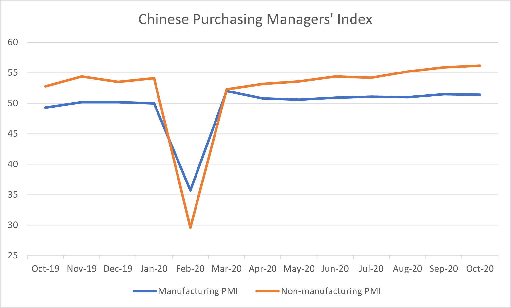
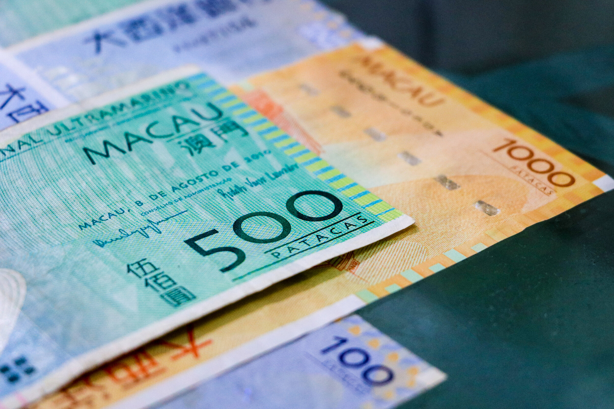

# China: The Success Story Maintains Its Momentum

**Date:** November 02, 2020  
**Publisher:** Breakwave Advisors | **Category:** Market Insights  
**Original URL:** [https://www.breakwaveadvisors.com/insights/2020/11/2/china-the-success-story-maintains-its-momentum](https://www.breakwaveadvisors.com/insights/2020/11/2/china-the-success-story-maintains-its-momentum)  

---

> **Figure 1: By Ulf Bergman**  
> [Local Asset](file:///C:/Users/Dell/Github/Shipping/corpus/03-breakwave/insights/2020/assets/2020-11-02_china-the-success-story-maintains-its-momentum_img_image-asset_f638a50a3d81.jpeg)

The reporting surrounding the Chinese economic recovery may start sounding like a broken record, with positive data being released almost on a weekly basis. The weekend saw the latest instalment in the ongoing saga, with the release of the official purchasing managers’ index (PMI). For the eighth consecutive month the index remained above 50, signaling an expansion of the economic activities in the manufacturing sector. The most recent reading was broadly in line with economists’ expectations and only slightly below September’s level. As the indicator is often considered more forward looking than many other data releases, it is indicating that the industrial production is expected to maintain its positive momentum in the near future, contributing to the current Chinese success story. The main raw material inventory index also fell from the previous month, suggesting that the growth in the manufacturing industry is starting to consume industrial inventories and there might be an increase in imports of commodities as a result.

Perhaps even more positive for the Chinese economy, the non-manufacturing PMI was stronger than expected and registered the highest level since 2013. The expansion in the services industry is reflecting an increased consumer spending, as the domestic economy continues to recover from the earlier lockdowns and consumer confidence returning.

> **Figure 2: Source: National Bureau of Statistics of China**  
> *Source: National Bureau of Statistics of China*  
> [Local Asset](file:///C:/Users/Dell/Github/Shipping/corpus/03-breakwave/insights/2020/assets/2020-11-02_china-the-success-story-maintains-its-momentum_img_ulf40_58cc93c4ae3a.png)

Against a backdrop of a worsening pandemic outlook, it is unlikely that the impressive GDP growth of the third quarter, in many countries, could be repeated in the last quarter of the year. The increasing economic headwinds, most notably across Europe, could put Chinese export volumes under pressure, but a robust domestic economy could offset some of the negative effects. It also unlikely that many governments will allow their economies to grind to a complete standstill like in the earlier parts of the year, as the fiscal headroom have shrunk considerably for such measures. In many countries, the new restrictions are attempting to balance the need for less human interactions, to limit the spread of the virus, with the need to maintain economic activities and consumer spending. Hence, the effects on international trade could be manageable and, from a Chinese perspective, the positive momentum maintained.

> **Figure 3: Market Chart 3**  
> [Local Asset](file:///C:/Users/Dell/Github/Shipping/corpus/03-breakwave/insights/2020/assets/2020-11-02_china-the-success-story-maintains-its-momentum_img_image-asset_39c1d8c00011.jpeg)

Alongside the release of the strong PMI data, some details on the next five-year plan are starting to emerge. The Chinese leadership will be looking to continue to build up their strategic reserves of energy and raw materials, which together with a recovery, that is maintaining its momentum, will continue to fuel Chinese demand for seaborne transportation. However, the leadership’s stated goal to lower carbon emissions could over time alter the nature of the tonnage demand somewhat. An increase in the use of scrap metal rather than producing metals from scratch could favour the smaller vessels in the dry bulk sector in the medium to long-term, as they are more suitable for that trade.

---

**Tags:** China, Shipping  
