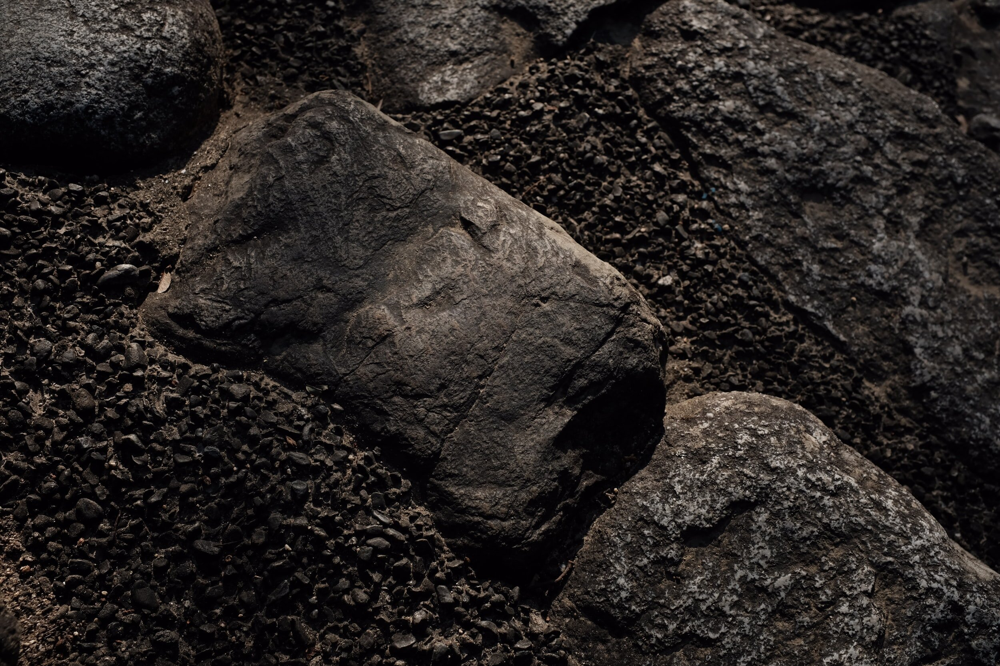
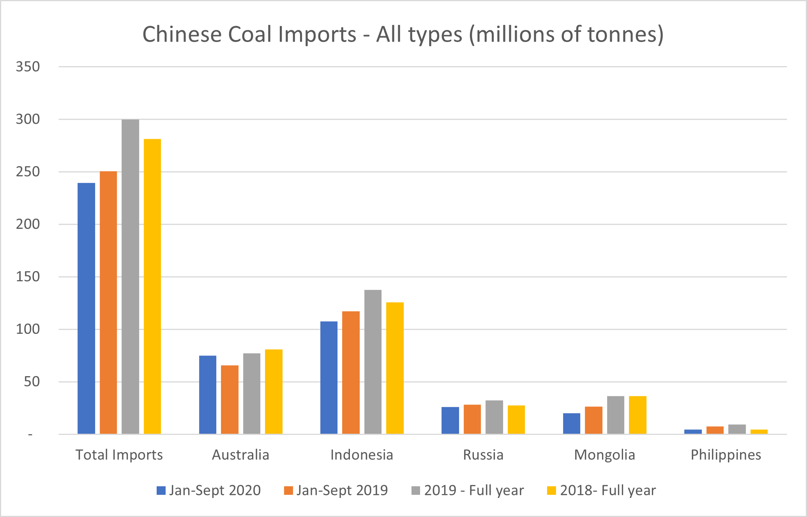
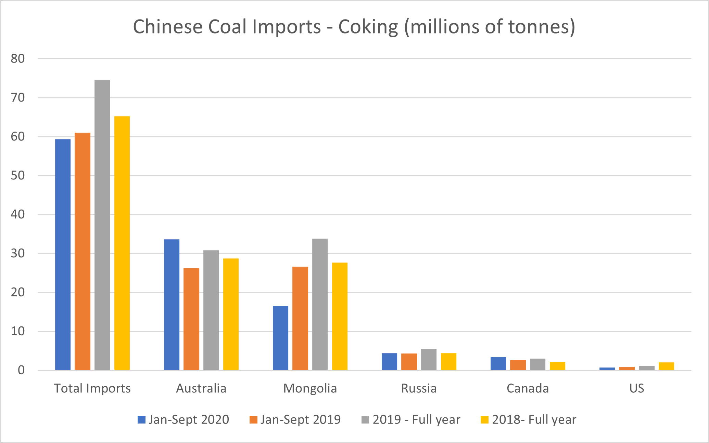

# Australian Exports to China Facing More Disruptions

**Date:** November 05, 2020  
**Publisher:** Breakwave Advisors | **Category:** Market Insights  
**Original URL:** [https://www.breakwaveadvisors.com/insights/2020/11/5/australian-exports-to-china-facing-more-disruptions](https://www.breakwaveadvisors.com/insights/2020/11/5/australian-exports-to-china-facing-more-disruptions)  

---

> **Figure 1: By Ulf Bergman**  
> [Local Asset](file:///C:/Users/Dell/Github/Shipping/corpus/03-breakwave/insights/2020/assets/2020-11-05_australian-exports-to-china-facing-more-disruptions_img_image-asset_fb28d0a19eb1.jpeg)

The ongoing political friction between China and Australia has heated up quite a few notches in the last few days, with additional trade restrictions imposed by China on multiple Australian products. The spat between the two nations is a long running saga, which has turned increasingly acrimonious this year. Authorities in China have orally informed traders that many products imported from Australia will not clear customs, from as early as this week. The new ban covers a wide array of products from wine and lobster to coal and some other commodities, but with the notable exclusions of both natural gas and iron ore. Disrupting the large flow of iron ore and LNG from Australia could have a negative impact on the industrial production in China and potentially slowing the Chinese economic recovery. Hence, political considerations are likely to have been superseded by economic calculations.

Despite the long-standing grievances between Beijing and Canberra, it is possible that Australia is not the real target per se but is convenient for making an example, with the actual message aimed at the US. Timed to coincide with an, as yet, inconclusive American presidential election and recent reports that the Chinese President Xi wants to speed up trade talks with the European Union, Japan and Korea, it is possible to view the measures against Australia as a strong signal to a new US administration.

Coal is the third largest export constituent of Australian exports to China, marginally behind LNG and well below iron ore in terms of value. The three commodities accounts for approximately three quarters of Australian exports to China, but with iron ore and LNG excluded from the ban, for the time being at least, the impact on total export volumes will be reduced. Coal and other lesser commodities, such as copper, illustrates the trade divergence between the two countries with exports being relative more important for Australia than the imports are for China. Australian exports of copper to China account for more than half of total output, while it only accounts for around five percent of Chinese imports. Hence, making it easy for Chinese buyers to find replacement volumes on different shores.

Despite the rising tensions this year, Australia’s portion of the total Chinese coal imports has risen during the first nine months of the year, with volumes rising despite falling Chinese coal imports. With a complete ban on Australian coal China needs to find a substitute for about a third of its imports. Unless domestic production and imports from Indonesia can pick up the slack, Chinese purchasers must look towards more distant shores and, hence, increase the tonne-mile demand in the dry bulk shipping sector.

> **Figure 2: Source: General Administration of Customs of the People’s**  
> *Source: General Administration of Customs of the People’s Republic of China*  
> [Local Asset](file:///C:/Users/Dell/Github/Shipping/corpus/03-breakwave/insights/2020/assets/2020-11-05_australian-exports-to-china-facing-more-disruptions_img_ulf50_766a5e7de5cc.png)

Coking coal used in the steel production accounts for around a quarter of the total Chinese coal imports, with Australia and Mongolia being the dominant suppliers. A prohibition of imports from Australia would remove approximately half of the coking coal volumes (based on 2019 volumes). In the medium to long-term, China is looking to increase its imports from Mongolia considerably, with new railways being laid down to accommodate this trade flow. However, in the short-term the lost imports from Australia looks likely to be replaced by other seaborne imports. Depending on where from the replacement volumes would come, the demand for the dry bulk tonnage carrying it would change. Supply from the Russian Pacific ports would reduce the distance travelled, but if the replacement supply were to come from across the Pacific there would be a significant increase in the tonne-mile demand.

> **Figure 3: Source: General Administration of Customs of the People’s**  
> *Source: General Administration of Customs of the People’s Republic of China*  
> [Local Asset](file:///C:/Users/Dell/Github/Shipping/corpus/03-breakwave/insights/2020/assets/2020-11-05_australian-exports-to-china-facing-more-disruptions_img_ulf51_70bfbf3668ef.png)

With iron ore excluded from the current blacklist, the current seaborne trade between Australia and China should, in theory at least, continue as before for the ore carrying vessels. However, a further worsening of relations could increase Chinese appetite for Brazilian iron ore on the expense of Australian ore, which would push up the demand for dry bulk tonnage.

---

**Tags:** China, Australia, Coal  
