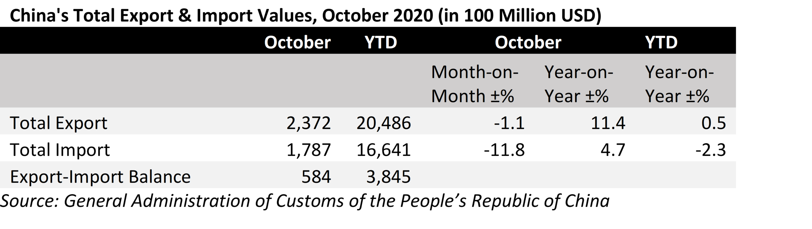

# Chinese Imports: Seasonality Hits

**Date:** November 10, 2020  
**Publisher:** Breakwave Advisors | **Category:** Market Insights  
**Original URL:** [https://www.breakwaveadvisors.com/insights/2020/11/10/chinese-imports-seasonality-hits](https://www.breakwaveadvisors.com/insights/2020/11/10/chinese-imports-seasonality-hits)  

---

> **Figure 1: By Ulf Bergman**  
> [Local Asset](file:///C:/Users/Dell/Github/Shipping/corpus/03-breakwave/insights/2020/assets/2020-11-10_chinese-imports-seasonality-hits_img_image-asset_f996e64aa9dc.jpeg)

Perhaps lost in the news flow surrounding the US presidential election, the latest instalment in the Chinese recovery narrative was released over the weekend. Data from the Chinese customs authority showed total imports continuing to rise in October, although growth rates were not reaching the same dizzy heights as in the preceding month. Unlike recent months’ releases, the data set was not entirely positive. On an aggregate level imports failed to meet expectations by quite a margin, but with a year-on-year growth just below five percent the data point towards a domestic economy with considerable momentum left.

Exports were more in line with previous reading and the year-to-date numbers are now greater than last year, although the volumes could come under pressure during the last part of the year with many markets in the midst of a second wave of the pandemic.

> **Figure 2: Ulf 60**  
> [Local Asset](file:///C:/Users/Dell/Github/Shipping/corpus/03-breakwave/insights/2020/assets/2020-11-10_chinese-imports-seasonality-hits_img_ulf60_116da01e0702.png)

Somewhat disappointing, especially from a shipping perspective, was the decline in commodity imports, which fell compared to September. Most major commodities were affected by slowing demand from Chinese purchasers, with the impact of national holidays in the early part of the month being a contributing factor. Iron ore recorded a fifth month with volumes north of 100 million tons, but demand can be expected to soften going forward as the steel production traditionally slows during the winter months. Soybean imports fell to a six-month low, but behind these numbers there is another story evolving. While total volumes and imports from Brazil fell, there were an increase in volumes from the US in an attempt to catch up with the annual quotas implied by the trade deal agreed back in January.

The late-year increase in Chinese commodity imports from the US could potentially be seen as a political hedge ahead of the US presidential elections. However, a change at the top in the US is nevertheless unlikely to change the overall narrative, as Joe Biden has expressed similar reservations on China during the campaign as the current administration. Many pundits have, however, argued that a Biden presidency will be good for the dry bulk shipping sector, as he is seen as friendlier towards free-trade and rule-based international relations. A US trade policy with less focus on sanctions and tariffs could increase the flow of commodities across the oceans.

> **Figure 3: Ship16**  
> [Local Asset](file:///C:/Users/Dell/Github/Shipping/corpus/03-breakwave/insights/2020/assets/2020-11-10_chinese-imports-seasonality-hits_img_ship16_80cce75b5324.jpg)

Since the US elections Chinese futures on agricultural commodities have also fallen, as analysts and traders are expecting increasing imports of US agricultural commodities on the back of additional bilateral trade agreements and improving relations. There are also some suggestions that China will seek to renegotiate the Phase One deal agreed earlier in the year, as some view it as unrealistic. It is unlikely that any new deal would alter the fundamentals very much, but with a less confrontational approach the trade volumes could potentially rise. An increase in US exports of grains to China would, for example, be good news for the dry bulk shipping, with additional tonne-mile demand from the long-distance trade flow. Also, given the current tensions with Australia, the US could be beneficiary of Chinese buyers seeking to replace Australian supplies, which would be positive for the freight rates.

---

**Tags:** China, Trade  
