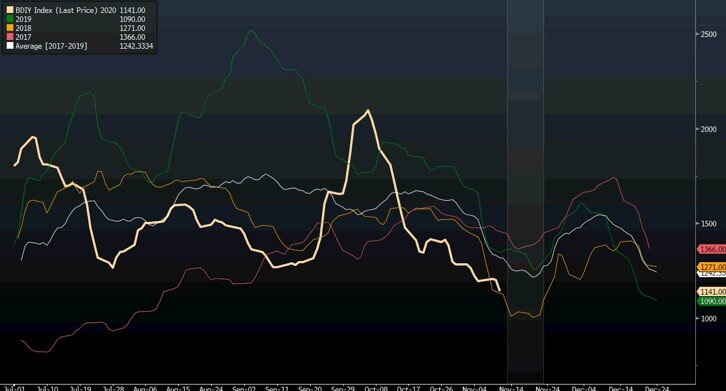
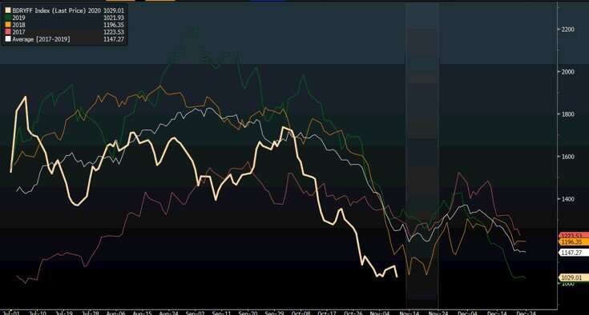

# Dry Bulk: Turnaround Turkey Day?

**Date:** November 11, 2020  
**Publisher:** Breakwave Advisors | **Category:** Market Insights  
**Original URL:** [https://www.breakwaveadvisors.com/insights/2020/11/11/capesize-market-turnaround-thanksgiving](https://www.breakwaveadvisors.com/insights/2020/11/11/capesize-market-turnaround-thanksgiving)  

---

> **Figure 1: Baltic Dry Index**  
> *Baltic Dry Index, 2017-2020*  
> **Interactive Data & Source:** [Argusmedia](https://www.argusmedia.com/en/news/2152701-colombias-cerrejon-and-union-begin-strike-talks) | [Local Asset](file:///C:/Users/Dell/Github/Shipping/corpus/03-breakwave/insights/2020/assets/2020-11-11_capesize-market-turnaround-thanksgiving_img_image-asset_44d7bece65c1.jpeg)

Capesize rates remain under pressure with the spot market continuing to trail last year’s levels since mid October. Looking back, the short lived rally in early October that pushed Capesize rates to almost 35,000 per day, seems to have been a short squeeze in the Atlantic market rather than a more robust tonnage imbalance, and as a result, now the charterers are in full control over the fate of the spot market across the major Capesize demand centers, namely Australia and Brazil. The[Colombia coal strike](https://www.argusmedia.com/en/news/2152701-colombias-cerrejon-and-union-begin-strike-talks)remains a major obstacle for the Transatlantic market to recover, while Brazil’s iron ore exports, which have been fluctuating from week to week, have failed to provide a significant source of tonnage demand, with[Very Large Ore Carriers](https://en.wikipedia.org/wiki/Valemax)(VLOC) remaining in amble supply so far.

Australia’s iron ore export rate has been performing surprisingly better than expected, but the short distance to China makes the specific trade less important for the dry bulk market. Smaller size ships (Panamax, Supramax) have been stuck in a very narrow range, at levels that are barely profitable for owners, and despite a robust grain export program out of the US Gulf, the anticipated lift in rates never really took place.

As the dry bulk market remains under pressure, we went back and looked at what the last few years might tell us about a short term bottom inside the fourth quarter. Although there will always be differences from year to year, there has been an interesting pattern since 2017, where spot rates tend to bottom during the period before the US Thanksgiving holiday week. As the chart below shows, the period between November 15-November 22 has been a consolidation phase prior to a final rally into the end of the year, based on the Baltic Dry Index:

> **Figure 2: BDI Composition: 40% Capesize**  
> *BDI composition: 40% Capesize, 30% Panamax, 30% Supramax*  
> **Interactive Data & Source:** [Solactive](https://www.solactive.com/indices/?index=DE000SLA4BY3) | [Local Asset](file:///C:/Users/Dell/Github/Shipping/corpus/03-breakwave/insights/2020/assets/2020-11-11_capesize-market-turnaround-thanksgiving_img_bdithxgiving_5087b767288f.jpg)

******While there might be some more room to the downside for spot rates, the freight futures market is already at the lowest point in the last three years, likely having priced in the worst case scenario of the last three years already (in addition, the chart below is based on prices even before todays’ sharp drop in futures). The[Breakwave Dry Freight Futures Index](https://www.solactive.com/indices/?index=DE000SLA4BY3)(BDRYFF) is based on futures prices with an average duration of ~3 months and a composition similar to the[Baltic Dry Index](https://www.bloomberg.com/quote/BDIY:IND):

### Breakwave Dry Freight Futures Index, 2017-2020

> **Figure 3: Bdryff Composition: 50% Capesize Futures**  
> *BDRYFF composition: 50% Capesize futures, 40% Panamax futures, 10% Supramax futures*  
> [Local Asset](file:///C:/Users/Dell/Github/Shipping/corpus/03-breakwave/insights/2020/assets/2020-11-11_capesize-market-turnaround-thanksgiving_img_bdryfftkxgiving_500a60e4c1ac.jpg)

So, based on such a seasonal pattern, what has been the performance following such short term bottoms prior to Thanksgiving week?

The table below summarizes the bottom-to-top performance of the Baltic Dry Index and of the Breakwave Dry Freight Futures Index over the last three years:

> **Figure 4: Table Season**  
> [Local Asset](file:///C:/Users/Dell/Github/Shipping/corpus/03-breakwave/insights/2020/assets/2020-11-11_capesize-market-turnaround-thanksgiving_img_tableseason_64f1661d2f43.png)

Currently the Breakwave Dry Freight Futures Index is at the lowest point in three years, sitting even below 2018 levels (despite the fact that spot rates are above 2018 levels). With less than two weeks left before Thanksgiving week, the spot market remains under pressure, in a similar fashion to the last three years. More importantly, the first quarter Capesize futures are**some 20%+ below**the lowest trading value of the first quarter contract over the last three years and**35% below the average**value over the last three years (similar discounts appear in the Panamax and Supramax markets). Yet, the spot market is not that much different as the BDI chart above demonstrates ( although admittedly is at the low end of the range). Pessimism is abound, which so far has proven a wise strategy given the recent weakness in spot rates.

US Thanksgiving week starts on November 23. Will history repeat itself, or is this time different? Turkey Day is just around the corner...

---

**Tags:** Capesize, Dry Bulk, Brazil  
