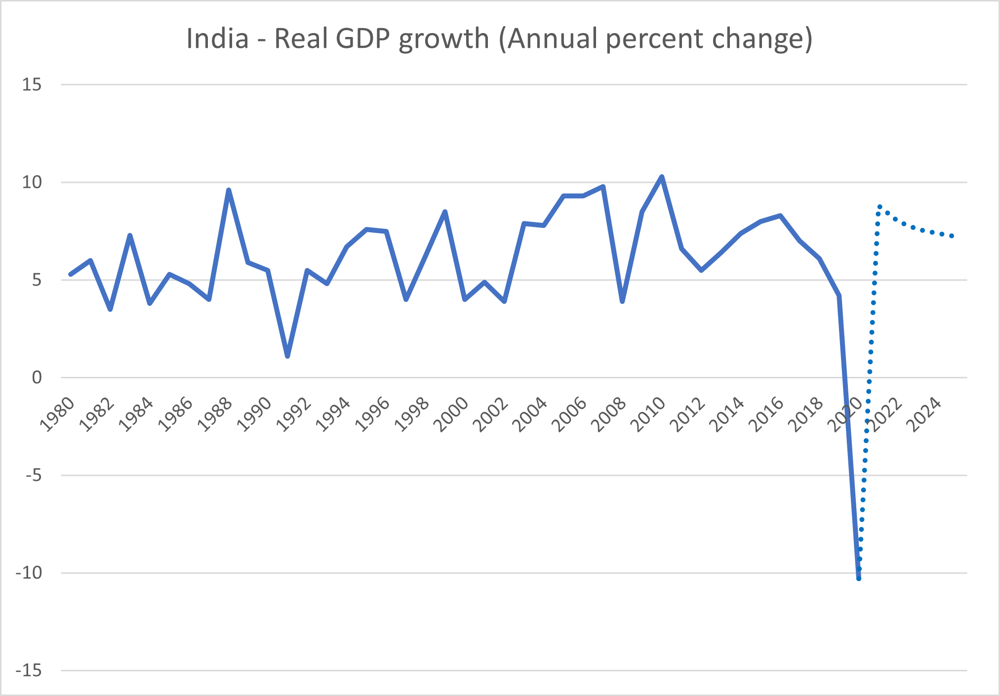

# Vaccine Hopes and India Facing Recession

**Date:** November 12, 2020  
**Publisher:** Breakwave Advisors | **Category:** Market Insights  
**Original URL:** [https://www.breakwaveadvisors.com/insights/2020/11/12/vaccine-hopes-and-india-facing-recession](https://www.breakwaveadvisors.com/insights/2020/11/12/vaccine-hopes-and-india-facing-recession)  

---

> **Figure 1: By Ulf Bergman**  
> [Local Asset](file:///C:/Users/Dell/Github/Shipping/corpus/03-breakwave/insights/2020/assets/2020-11-12_vaccine-hopes-and-india-facing-recession_img_image-asset_5177ec238392.jpeg)

The better than expected data from Pfizer’s COVID19 vaccine trial released earlier in the week provided a much-needed light in the end of the pandemic-tunnel. In combination with the US election results pointing towards a more trade friendly administration, the news on the progress with a vaccine injected some exuberance into the equity markets. Perhaps a bit surprising, shipping equities in general participated in the rally on Monday and have managed to hold on to the gains in what appears to be a decent week for the industry in the equity markets.

Much of the momentum has however been lost for the broader equity markets, as increasing COVID-19 cases are providing a timely reality check. Even if Pfizer’s vaccine was to be approved in the not too distant future, the logistical challenges to roll out a global vaccination programme are considerable and not to mention time-consuming. The time frame could well cover a significant part of next year and, hence, global demand destruction looks likely to continue for some time. Fiscal stimulus plans are likely to remain in place for the foreseeable future, as nations around the globe, with the possible exclusion of China, will face an uncertain path to recovery.

As a result of the pandemic, India looks likely to record an unprecedented recession, with the third quarter likely to be the second straight in negative territory. The IMF is projecting that the economy will shrink by just over than ten percent in the twelve-month period ending in March, before returning to strong growth next year. In light of the economic challenges the country is facing, the Indian government is extending its stimulus package to fifteen percent of the gross domestic product. Soaring infection rates earlier in the year forced the country into a lockdown in the second quarter. The world’s second most populous country look set to be the worst performing emerging market this year.

However, recent high-frequency data suggest that the Indian economy is recovering, with indicators such as automobile sales and manufacturing output showing strength. Although India is nowhere near as influential as China on the commodity and shipping markets, a return to healthy growth levels could see rising seaborne imports of coal, which collapsed during the second and third quarters, and provide some support for dry bulk shipping demand.

> **Figure 2: Source: Imf**  
> [Local Asset](file:///C:/Users/Dell/Github/Shipping/corpus/03-breakwave/insights/2020/assets/2020-11-12_vaccine-hopes-and-india-facing-recession_img_ulf70_f1d528d5346a.png)

Source: IMF

Given the current political tensions between Australia and China, with Chinese authorities blacklisting Australian coal, it is possible to envisage that Australian thermal coal finds an alternative market in India and adding some nautical miles to the voyage. However, it remains to be seen how China intends to replace the volumes from Australia and how that will affect the aggregate tonne-mile demand picture.

---

**Tags:** COVID-19, India, China  
