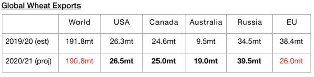
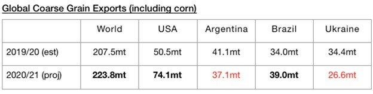
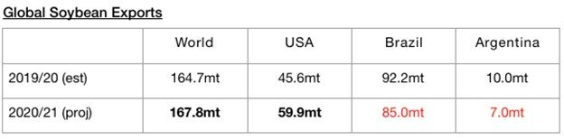
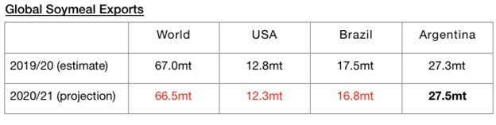

# Global Grain Trade Estimate Raised

**Date:** November 16, 2020  
**Publisher:** Breakwave Advisors | **Category:** Market Insights  
**Original URL:** [https://www.breakwaveadvisors.com/insights/2020/11/16/global-grain-trade-estimate-raised](https://www.breakwaveadvisors.com/insights/2020/11/16/global-grain-trade-estimate-raised)  

---

> **Figure 1: Market Chart 1**  
> [Local Asset](file:///C:/Users/Dell/Github/Shipping/corpus/03-breakwave/insights/2020/assets/2020-11-16_global-grain-trade-estimate-raised_img_image-asset_b99ac93d3dbb.jpeg)

The United States Department of Agriculture (USDA) has released its latest trade forecast. Global grain exports for the 2020/21 cycle are now expected to total 458.9 million tons. This is 1.8 million tons more than was forecast last month and would mark a year-on-year jump of 16.7 million tons (4%) from the 457.1 million tons estimated for 2019/20. Global wheat exports are now expected to total 190.8 million tons. This is 900,000 tons more than was forecast last month and would mark a year-on-year decline of just 1 million tons. Year-on-year increases in wheat exports are expected from major exporters including Russia, the United States, Canada, and Australia. However, a very large decline continues to be expected from the European Union.

> **Figure 2: Como1**  
> [Local Asset](file:///C:/Users/Dell/Github/Shipping/corpus/03-breakwave/insights/2020/assets/2020-11-16_global-grain-trade-estimate-raised_img_como1_7d5023110bbf.jpg)

Also of note is that the USDA’s forecast for global coarse grain exports has been raised slightly to 223.8 million tons. This is 900,000 tons more than was forecast last month and would mark a year-on-year increase of 16.3 million tons (8%). Year-on-year increases in coarse grain exports are expected from major exporters including the United States and Brazil. Year-on-year declines are expected from Argentina and Ukraine.

> **Figure 3: Como2**  
> [Local Asset](file:///C:/Users/Dell/Github/Shipping/corpus/03-breakwave/insights/2020/assets/2020-11-16_global-grain-trade-estimate-raised_img_como2_4a6df42ebda0.jpg)

In addition, the forecast for global soybean exports (soybeans are not technically classified as a grain) has been lowered slightly to 167.8 million tons. This is 100,000 tons less than was forecast last month but would mark a year-on-year increase of 3.1 million tons (2%). A very large year-on-year increase in soybean exports is still expected from the United States on the strength of this year’s robust harvest and strong demand from China. Year-on-year declines are still expected from Brazil and Argentina.

> **Figure 4: Como3**  
> [Local Asset](file:///C:/Users/Dell/Github/Shipping/corpus/03-breakwave/insights/2020/assets/2020-11-16_global-grain-trade-estimate-raised_img_como3_64b0a50b7ea4.jpg)

Regarding soymeal, the USDA is now predicting that global soymeal exports will total 66.5 million tons. This is 1.3 million tons (-2%) less than was forecast last month and would mark a year-on-year decline of just 500,000 tons (-1%). Small year-on-year decline are expected from the United States and Brazil, while a small year-on-year in exports continues to be expected from Australia.

> **Figure 5: Como4**  
> [Local Asset](file:///C:/Users/Dell/Github/Shipping/corpus/03-breakwave/insights/2020/assets/2020-11-16_global-grain-trade-estimate-raised_img_como4_fbdcf1e3f5fe.jpg)

---

**Tags:** Grains, Corn, Soybeans, Wheat  
