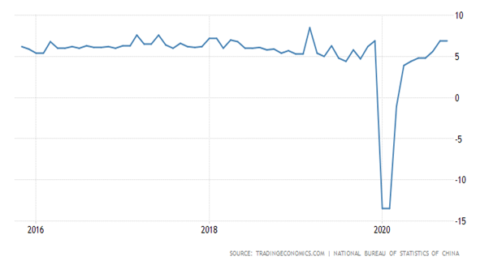
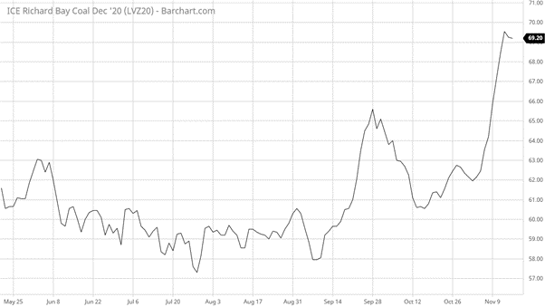

# China Continues to Be the Economic Outlier

**Date:** November 17, 2020  
**Publisher:** Breakwave Advisors | **Category:** Market Insights  
**Original URL:** [https://www.breakwaveadvisors.com/insights/2020/11/17/china-continues-to-be-the-economic-outlier](https://www.breakwaveadvisors.com/insights/2020/11/17/china-continues-to-be-the-economic-outlier)  

---

*By Ulf Bergman*

Industrial production in China keeps rising, with the data for October showing better than expected growth and in line with the previous month’s strong growth. The Chinese economic strength is at odds with most other countries, which again are grappling with rising COVID19 infection rates and new social restrictions. High-frequency data recently published by Bloomberg also showed economic activity dropping sharply in Europe, as new lockdowns and curbs take effect. While China is on course for yet another strong quarter, with the recovery taking a distinct V-shape, many other countries are at risk of falling back into negative territory in the last quarter of the year, after posting strong numbers in the third quarter. In China, the recovery in consumer spending also remains strong, although the October data failed to live up to economists’ high expectations, fueling the continued growth in industrial production and potentially offsetting some weaknesses in the export markets. Retail sales showed a broad recovery, with growth across most categories.

### Chinese Industrial Production (Monthly Growth Yoy%)

> **Figure 1: Source: Trading Economics**  
> *Source: Trading Economics*  
> [Local Asset](file:///C:/Users/Dell/Github/Shipping/corpus/03-breakwave/insights/2020/assets/2020-11-17_china-continues-to-be-the-economic-outlier_img_ulf70_eee9425226a0.png)

Against a backdrop of ever-increasing industrial production in China, the domestic production of coal fell in October compared to the month before and was only marginally higher than a year ago. Despite a desire to build up inventories ahead of the winter, domestic output has been hampered by extensive safety inspections following mining accidents and failed to meet expectations. Currently the coal inventories in the trans-shipment port of Qinhuangdao are around fifteen percent below the minimum levels, as indicated by the main economic planning agency. Hence, imports of coal are likely to see an increase in the near-term, as a continued industrial growth is likely to spur a continued growth in electricity consumption. The current year-on-year increase in electricity production is just below five percent.

With the current, yet unofficial, ban of imports of Australian coal in place, Chinese buyers must find alternative sources. Sources for the quantities of quality coal that need to be replaced are somewhat limited, but coal from South African is seen as likely a candidate. Prices for Richard Bay coal have risen considerably from their mid-October lows in anticipation of increased Chinese interest and, as a substitute, it would also add a healthy amount of tonne-mile demand to the dry bulk shipping sector.

### Ice Richards Bay Coal (Usd per Tonne)

> **Figure 2: Source: Barchart**  
> *Source: Barchart.com*  
> [Local Asset](file:///C:/Users/Dell/Github/Shipping/corpus/03-breakwave/insights/2020/assets/2020-11-17_china-continues-to-be-the-economic-outlier_img_ulf71_9c79a9b6b003.png)

The ban on coal imports from Australia has also seen trade patterns shifting somewhat, with seaborne export volumes in October only down slightly compared to the preceding month. The more distant shores of India, South Korea and Japan have increased their imports of Australian coal, making up for some of the losses associated to the blacklisting in China, while increasing the shipping distances.

---

**Tags:** China, Economics  
