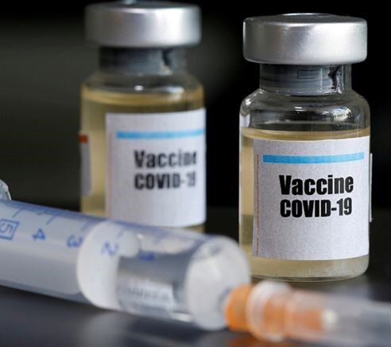
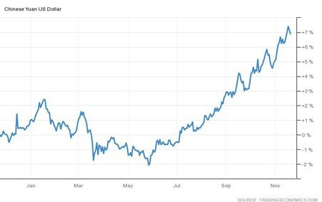

# The Macro Picture of a Vaccine Driven Economic Recovery

**Date:** November 19, 2020  
**Publisher:** Breakwave Advisors | **Category:** Market Insights  
**Original URL:** [https://www.breakwaveadvisors.com/insights/2020/11/19/cf527dg9mqfbwf42pjrynzrlll1pvl](https://www.breakwaveadvisors.com/insights/2020/11/19/cf527dg9mqfbwf42pjrynzrlll1pvl)  

---

*By Ulf Bergman*

> **Figure 1: Vaccine**  
> [Local Asset](file:///C:/Users/Dell/Github/Shipping/corpus/03-breakwave/insights/2020/assets/2020-11-19_cf527dg9mqfbwf42pjrynzrlll1pvl_img_vaccine_c2b44a386a77.jpg)

The world is almost spoilt for choice, with two vaccines showing great potential with the initial findings. Pfizer’s first announcement sent equities and oil soaring, but with sentiments cooling considerably fairly quickly as reality set in. Moderna subsequently published even stronger test statistics on their vaccine, only to be outdone by Pfizer’s second batch of test data. Optimism has started to be on a more stable footing, as the results point towards a solution to the pandemic and that the initial release was not just a fluke. There are also several other vaccine research projects due to publish their initial findings in the near future. Based on the strong results, Pfizer is likely to file for regulatory approval shortly and start the wheels moving for vaccinating the world’s population.

So, all is fine, and we can all get back to work? Well, sadly not the case, at least in the sort-term. Assuming Pfizer, Moderna and any other company get their approvals, the immediate manufacturing and logistics challenges must be considered substantial. Both programmes also require people to receive two injections a few weeks apart, which means that some fifteen billion doses need to be manufactured. Adding to the complexities, both vaccines are temperature sensitive and require to be shipped and stored at low temperatures, with Pfizer’s vaccine requiring to be kept at around minus 80 degrees Celsius (-112 degrees Fahrenheit) during transport and storage. Hence, there are some suggestions that a meaningful level of global vaccinations will only be reached in the latter part of next year. There are also some concerns that a vaccinated person can carry the coronavirus, without falling ill, and pass it on to people who have not yet received a vaccine. Hence, social distancing and other restrictions may well be the theme for most of next year as well.

The biggest short-term effect is likely to be a pick-up in business and consumer sentiment, with a light perceived to be in the end of the tunnel. Investment decisions, that have been put off due to the pandemic and lockdowns, are more likely to materialise and, likewise, consumers may be more likely to spend.

Given the time-lag involved in getting the world vaccinated, governments are unlikely to rein in on any stimulus packages at this stage. The President of the European Central Bank, Christine Lagarde, said earlier in the week that, while the news on vaccines were “encouraging”, governments should make pandemic relief available “without delay”. The ECB is also preparing a monetary stimulus package that will be presented next month. Once the European stimulus measures come online, they are likely to support industrial production and infrastructure investments, which could lead to a recovery in the demand for commodities in the region. On the other side of the Atlantic, any additional fiscal assistance is looking increasingly likely to be delayed due to the politics of the aftermath of the US presidential election.

In the short to medium-term it looks like we will see more of the same, but with additional volumes of fiscal stimulus becoming available. The current Chinese success story on industrial production shows no signs of abating, supporting a continued strong demand for industrial commodities. The strong performance of the Chinese economy is also fuelling a stronger Yuan and, in a break with tradition, The People’s Bank of China has not attempted to limit the gains. So far, the strengthening of the currency has not affected the exports negatively and that is likely to explain the lack of action from the central bank. Also, the appreciating currency makes dollar denominated commodities cheaper for Chinese buyers, which will support a continued healthy flow of seaborne shipments to Chinese ports.

### 12-Month Performance of the Chinese Yuan vs. the Us Dollar (%)

> **Figure 2: Source: Trading Economics**  
> *Source: Trading Economics*  
> [Local Asset](file:///C:/Users/Dell/Github/Shipping/corpus/03-breakwave/insights/2020/assets/2020-11-19_cf527dg9mqfbwf42pjrynzrlll1pvl_img_ulf80_dfd751ace8e4.jpg)

Following a series of coal mine accidents, Chinese authorities are stepping up safety inspections in the coming year, which could reduce domestic production and require imported coal to make up for any shortfall. Inventories in some ports are already below the desired levels and strong industrial growth is driving electricity production higher, indicating that imports of thermal coal are likely to increase.

The outlook for commodities into the first part of next year looks bullish, with a continued healthy demand from Chinese buyers and a likely pickup in demand in Europe. China will still be the dominant player for many commodities, but perhaps slightly less so with increasing activities in Europe and elsewhere.

> **Figure 3: Market Chart 3**  
> [Local Asset](file:///C:/Users/Dell/Github/Shipping/corpus/03-breakwave/insights/2020/assets/2020-11-19_cf527dg9mqfbwf42pjrynzrlll1pvl_img_image-asset_2deebdc1fda2.jpeg)

The rollout of vaccines will over time see the gradual switch to spending on services, as consumers and companies are less and less constrained by social restrictions. Beleaguered industries, such as leisure and airlines, can be expected to start recovering, leading to an increase in the demand for jet and other distillate fuels, drawing down storage and increasing production. Such an increase in fuel demand could potentially push up shipping bunker fuel prices, as some jet fuel and similar feedstock have found their way into the blending of shipping’s low sulphur fuel because of the glut. Tanker shipping is, however, unlikely to recover until vaccination levels have reached a critical mass with increasing global mobility.

An increase in spending on services at the expense of industrial products in a vaccine driven global economic recovery could be a somewhat bearish signal for commodities, but it is not likely to be a concern for the immediate future.

---

**Tags:** Global Economy, COVID-19, Shipping  
