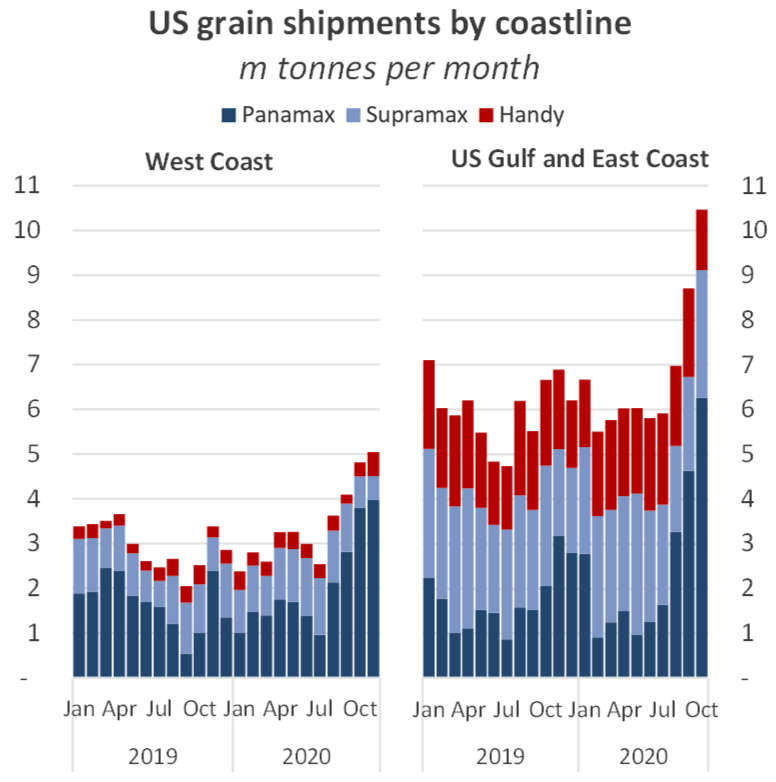
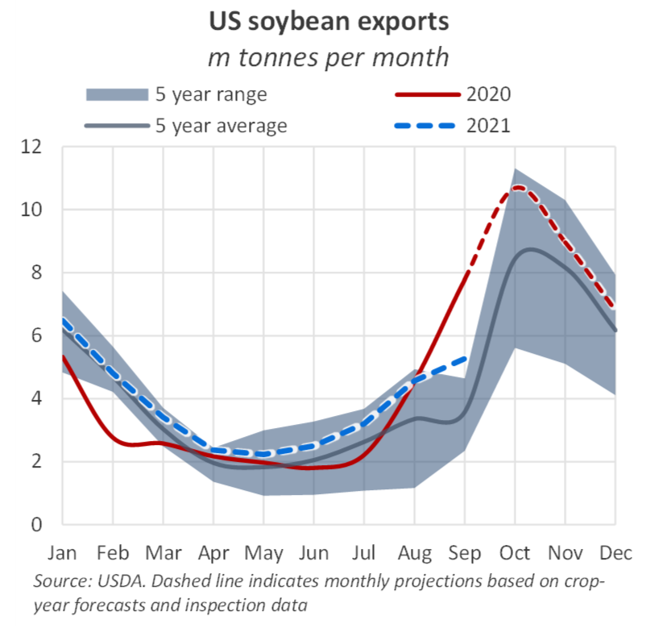
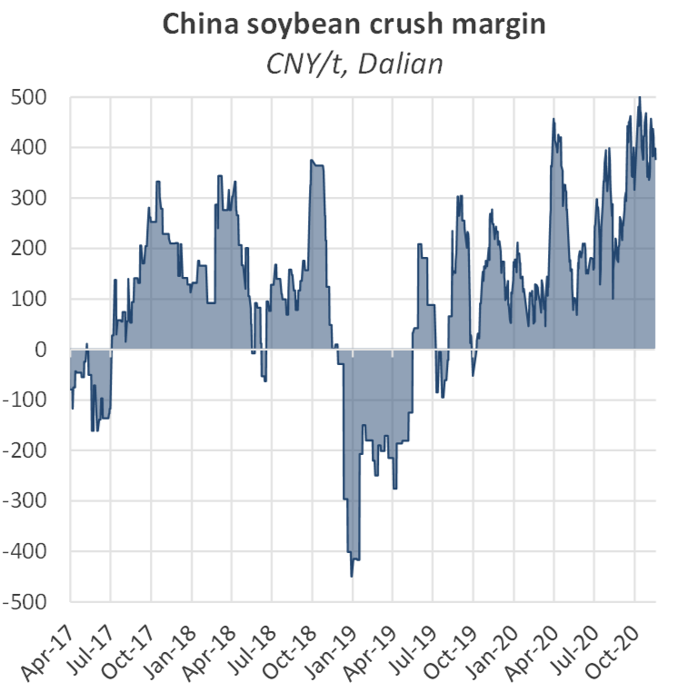
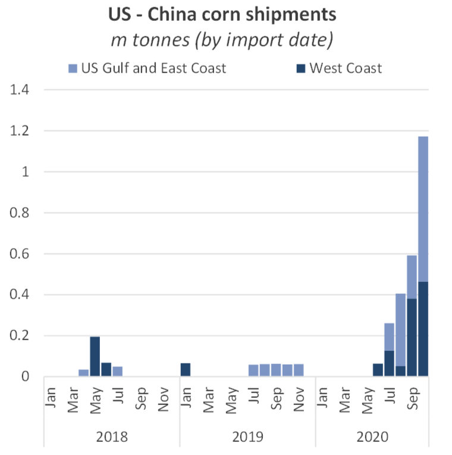
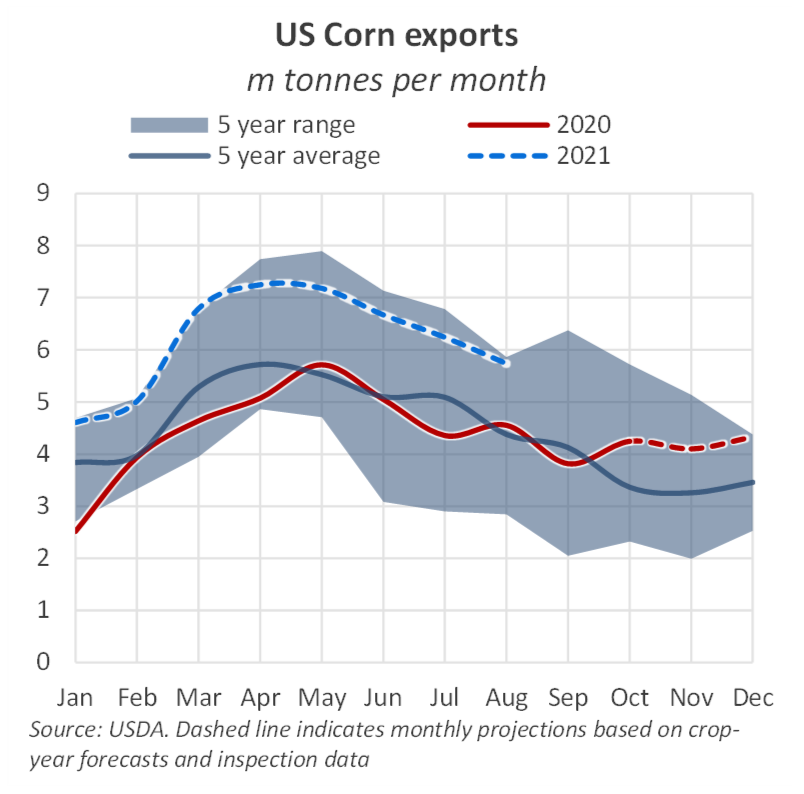

# The Big Picture: North American Grain Trade

**Date:** November 22, 2020  
**Publisher:** Breakwave Advisors | **Category:** Market Insights  
**Original URL:** [https://www.breakwaveadvisors.com/insights/2020/11/20/the-big-picture-north-american-grain-trade](https://www.breakwaveadvisors.com/insights/2020/11/20/the-big-picture-north-american-grain-trade)  

---

*By Nick Ristic*

### Total Grain Volumes

The last couple of months have seen a sharp rise in grain volumes from the US, both in the Pacific and Atlantic basins. In the Pacific Northwest, October saw grain liftings jump by 92% YoY, according to preliminary AIS cargo tracking data. The boost in volume has been felt primarily in the Panamax market, with a jump in the number of these ships loading in Washington. We recorded 3.8m tonnes of Panamax (inc. Kamsarmax and Post-Panamax) grain shipments from the US west coast in October, a volume nearly four times greater compared to last year. Over the first ten months of the 2020, Panamax shipments from this region were up by 11% versus the same period last year, helping to support the market in the Pacific.

> **Figure 1: Bmr 40**  
> [Local Asset](file:///C:/Users/Dell/Github/Shipping/corpus/03-breakwave/insights/2020/assets/2020-11-22_the-big-picture-north-american-grain-trade_img_bmr40_42b568e4dc0b.png)

On the other side of the North American continent, we’ve also seen a surge in cargoes being shipped from the US Gulf. October saw exports from this coastline hit 10.5m tonnes, 57% higher YoY and the highest monthly volume since November 2016. Here again the Panamaxes have seen the greatest increase in employment, with exports on these ships up by 61% YoY in October.

However we have not felt the same boost in Panamax demand in this basin as we have in the Pacific due to US grain. This is likely because other trade in the Atlantic, such as coal, has been extremely depressed so far this year. On the whole, this seems to have weighed on Atlantic rates, and with relatively few ships opening up in this basin, a large portion of the increased cargo volume has been serviced by the major grain shippers’ own tonnage.

### Back to Normal for Us Soybeans?

The recent jump in grain shipments from the US is largely down to strong soybean sales, primarily to China. This trade took a hit during the trade dispute between the two countries and following the Swine Flu outbreak in China which dented its total soybean demand. Since the end of last year, trade relations seem to have thawed, but more importantly, Chinese demand has sprung back to life. Unfortunately for US soybean farmers, this recovery came during the tail-end of the last North American exporting season, and it was instead Brazilian shipments that initially benefitted, surging by 43% YoY over the first half of the year.

But with Brazil’s crop now virtually depleted, US shipments have picked up to pre-trade war levels. Detailed cargo tracking data by grain type is still is still patchy for October, but USDA inspection figures indicate a 75% YoY jump in shipments, mostly heading to China.

> **Figure 2: Bmr 41**  
> [Local Asset](file:///C:/Users/Dell/Github/Shipping/corpus/03-breakwave/insights/2020/assets/2020-11-22_the-big-picture-north-american-grain-trade_img_bmr41_a9c8c5fb36ea.png)

The Chinese pig industry’s recovery from the Swine Flu outbreak has driven greater consolidation of farming activity. This industrialisation tends to drive greater use of processed grain for animal feed, and has helped to push demand for imported grains to new highs this year.

US export prices have rallied by 36% since April to a six-year high of $480/tonne, and downstream demand appears to be robust enough to absorb this surge in raw material prices. Soybean crush margins (the theoretical profit margin for crushers processing raw beans into meal and oil) for imported supply have sustained multi-year highs for the past couple of months.

> **Figure 3: Bmr 42**  
> [Local Asset](file:///C:/Users/Dell/Github/Shipping/corpus/03-breakwave/insights/2020/assets/2020-11-22_the-big-picture-north-american-grain-trade_img_bmr42_220aca7f0515.png)

These healthy conditions bode well for US exporters, and are likely to continue to support seaborne trade in the coming months. The USDA projects soybean shipments over the 2020/21 marketing year (which runs September-August) to reach almost 60m tonnes, a 31% increase on the previous year. We expect volumes over November-December to come in 25% higher YoY, while Q1 2021 is expected to be 38% stronger than Q1 of this year.

### Corn Too

US shipments of Corn (which seasonally peak in Q2) have also had a relatively strong year so far. Corn shipments reached nearly 40m tonnes over January-September this year, according to the USDA, marking a 16% YoY increase. But new patterns which are emerging are set to boost exports further.

China tends to import relatively small amounts of corn, but in the past few weeks we have seen a significant uptick in cargo arrivals. The heavy rains and flooding and flooding earlier in the year reportedly hit output from three of China’s top corn producing regions, leading to a draw down in stockpiles in the country. With food security and food inflation key concerns for Beijing, we have seen imports ramp up. Soaring soybean prices have also encouraged farmers to look to other sources of feed, such as corn and wheat.

According to AIS data, Chinese corn receipts on bulk carriers totalled 1.2m tonnes in October, the highest monthly volume since 2016 and the highest on record for this time of the year. But what is unusual about October’s imports is that they were sourced almost exclusively from the US. The ramp-up in purchases from the US over the past few months represents the first time this bilateral trade has amounted to more than just a handful of shipments per year.

> **Figure 4: Bmr 43**  
> [Local Asset](file:///C:/Users/Dell/Github/Shipping/corpus/03-breakwave/insights/2020/assets/2020-11-22_the-big-picture-north-american-grain-trade_img_bmr43_2f88fe4ffa83.png)

While Chinese demand for corn has been stronger than usual, not all suppliers have been able to capitalise. Brazilian shipments have gone to the typical buyers in the Mediterranean, Middle East and some countries in the Far East such as Japan and South Korea. Given that we are now approaching the end of Brazil’s export season, there is little room for increased volumes to China. Meanwhile Ukraine’s corn harvest, half of which tends to be shipped to China, has disappointed this year. Dryness over the summer has led to sharp declines in output and the USDA has slashed its forecasts for 2020/21 exports by 20% to 28.5m tonnes, with the US expected to pick up the slack.

> **Figure 5: Bmr44**  
> [Local Asset](file:///C:/Users/Dell/Github/Shipping/corpus/03-breakwave/insights/2020/assets/2020-11-22_the-big-picture-north-american-grain-trade_img_bmr44_dc7a1a9b1b6d.png)

Based on these projections we expect US corn shipments over Q4 this year to grow by around 70% YoY, with 1H 2021 exports increasing 40% YoY, with volumes heading to many of Ukraine’s usual customers. This boost in tonnes, and voyage durations, should help to bolster Panamax demand over the coming months.

---

**Tags:** Dry Bulk, Grains, Corn, Soybeans, Wheat  
