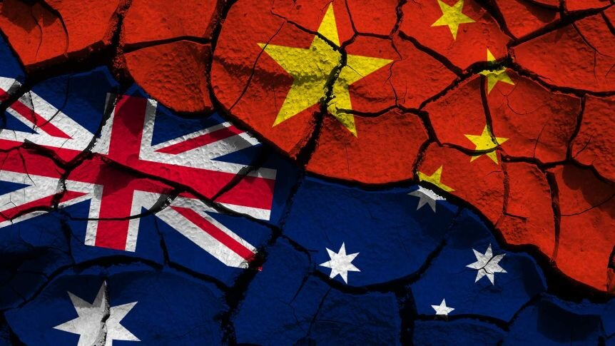
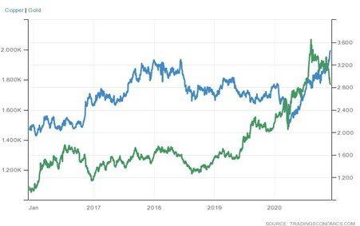

# Chinese Industrial Expansion Likely to Continue into the New Year

**Date:** December 01, 2020  
**Publisher:** Breakwave Advisors | **Category:** Market Insights  
**Original URL:** [https://www.breakwaveadvisors.com/insights/2020/12/1/chinese-industrial-expansion-likely-to-continue-into-the-new-year](https://www.breakwaveadvisors.com/insights/2020/12/1/chinese-industrial-expansion-likely-to-continue-into-the-new-year)  

---

*By Ulf Bergman*

> **Figure 1: Copper (Rhs) Vs**  
> *Copper (RHS) vs. Gold (LHS)*  
> [Local Asset](file:///C:/Users/Dell/Github/Shipping/corpus/03-breakwave/insights/2020/assets/2020-12-01_chinese-industrial-expansion-likely-to-continue-into-the-new-year_img_australiachina_ef1989f91ba4.jpg)

China is firmly positioning itself as the only major economy that will see the end of the year from a position of strength. The most recent purchasing managers’ index data released are pointing towards an accelerating economy, with most components increasing from the previous month’s levels. The manufacturing sector recorded its highest level for over three years and was also higher than the economists’ expectations. Trade indicators also expanded, as both exports and imports are continuing to show healthy gains.

The continued strength of the Chinese economy and the manufacturing sector looks like it will carry the momentum into the new year, giving the Chinese central bank an opportunity to start to phase-out the monetary easing currently in place. However, any changes to the monetary stance are likely to be gradual so that the ongoing expansion is not threatened. Hence, there is the possibility that the traditional weakness in the dry bulk shipping market during the first quarter of the year could fail to materialize in the next few months, as the Chinese industrial expansion looks set to continue for some time and supporting tonnage demand.

The continued strength of the Chinese economy keeps pushing market prices of industrial commodities higher, with iron ore, copper, and aluminum currently at multi-year highs. Copper, the third most used metal in the world, has gained more than sixty percent from recent lows, recorded at the end of the first quarter, and is now trading at levels last seen in 2013. Chinese industrial demand for the metal has picked up as the economy is recovering and at the same time output from the largest producer, Chile, has declined. The promising news surrounding the development of a COVID19-vaccine has also contributed with declining risk aversion among investors. In contrast, the rebounding appetite for risk has also reduced demand for traditional safe haven assets, with gold and the US dollars suffering. Gold has suffered its worst monthly performance in November since 2016, as investors are regaining their optimism.

> **Figure 2: Copper (Rhs) vs. Gold (Lhs)**  
> [Local Asset](file:///C:/Users/Dell/Github/Shipping/corpus/03-breakwave/insights/2020/assets/2020-12-01_chinese-industrial-expansion-likely-to-continue-into-the-new-year_img_image-asset_50d0dd4a73c9.jpeg)

It is clearly open for debate if Australian commodity exports can benefit from the continued industrial expansion in China, as relations between the two countries appear to get more strained by the day. Recent developments include new punitive tariffs on Australian wines, which are likely to cause serious damage to the producers, and Australia demanding an apology over photos published by the Chinese foreign ministry. Australia is, by a considerable margin, China’s largest provider of iron ore, which has so far not been included in the ongoing trade spat. However, it begs the question if rising tensions will see it remaining largely unaffected going forward. Any additional volumes required may well be sourced at more distant shores, with volumes already increasing from South Africa and Brazil.

---

**Tags:** Economics, Global Economy, Dry Bulk, China  
