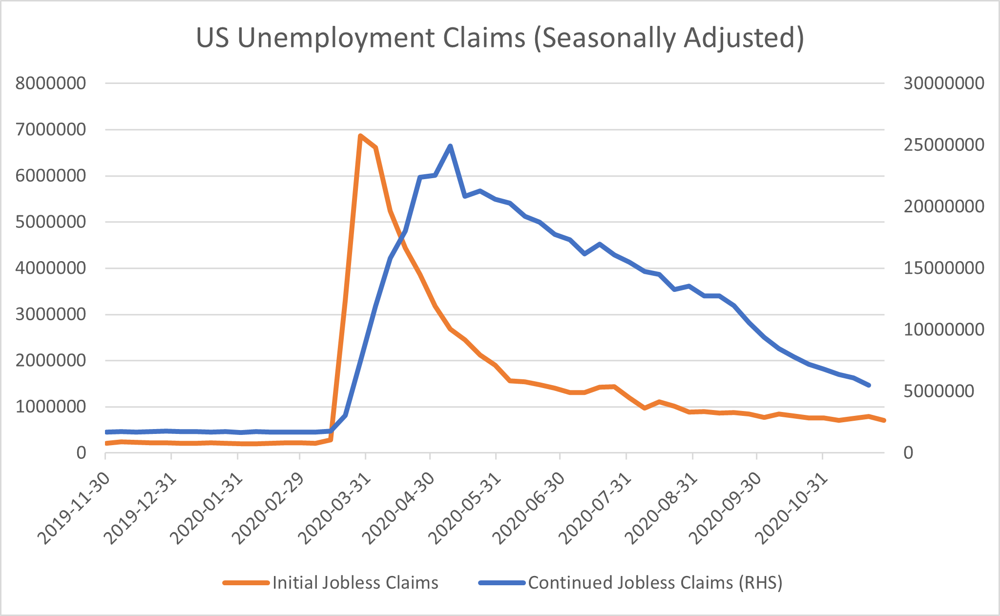

# The World Is Drifting Rather Than Marching Towards a Recovery

**Date:** December 03, 2020  
**Publisher:** Breakwave Advisors | **Category:** Market Insights  
**Original URL:** [https://www.breakwaveadvisors.com/insights/2020/12/3/the-world-is-drifting-rather-than-marching-towards-a-recovery](https://www.breakwaveadvisors.com/insights/2020/12/3/the-world-is-drifting-rather-than-marching-towards-a-recovery)  

---

*By Ulf Bergman*

With a bit of selective reading it is possible to become rather optimistic about the immediate future for the global economy, with Chinese industrial production expanding and business activities in the service industry at the highest levels in a decade. Likewise, the US labour market shows signs of improvements, with less Americans filing for unemployment benefits last week, despite rising COVID19 infection rates. The seasonally adjusted numbers were considerable better than expected by many economists and the first drop in three weeks. The continuing claims also show a gradually recovering labour market. However, comparing the unemployment data with the levels recorded before the start of the pandemic makes for sobering analysis. Despite the improvements, there still quite a distance to go for the US economy to regain its full strength.

> **Figure 1: Source: The Federal Reserve Bank of St Louis**  
> *Source: The Federal Reserve Bank of St Louis*  
> [Local Asset](file:///C:/Users/Dell/Github/Shipping/corpus/03-breakwave/insights/2020/assets/2020-12-03_the-world-is-drifting-rather-than-marching-towards-a-recovery_img_ulf82_38c25043c835.png)

Incoming Treasury Secretary, Janet Yellen, is also likely to have less tools at her disposal to stimulate the weak economy than many of her predecessors had, as many measures are still in place after the financial crisis a decade ago. However, there is an increasing likelihood that a stimulus plan can be agreed on in Congress, with a 908 billion dollars bipartisan proposal presented earlier in the week. Such a deal is likely to be good news for consumer spending and this is likely to continue to support shipping volumes into the US. The news of a possible deal also propelled the US equity market to all-time high levels.

In Europe, the picture is somewhat bleaker, with new restrictions and lockdowns curtailing the economies. High-frequency data have been showing plunging economic activities across many parts of the continent. In addition, Hungary and Poland are threatening to veto the planed EU stimulus proposal and there is a risk of the launch being delayed. However, as countries, such as France, are starting to ease social restrictions ahead of the Christmas holidays, a pick-up in activities can be expected.

On the bright side, container spot rates on the Asia to Europe trade have steadily improved during the last few months and are currently at levels not seen for over a decade. Restocking by European retailers have contributed to large imports from Asia and providing support to the surging Chinese industrial production. A drawn-out surge in infection rates in Europe and the US could potentially dent demand for Chinese products, as more sweeping restrictions may be required. However, the strong domestic economy in China is likely to offset much of any such losses in exports and with vaccinations likely to start shortly there, it can be expected that any new restrictions would be fairly short-lived. At this stage, there is no indication that the industrial expansion would lose its momentum and reduce the demand for commodities.

> **Figure 2: Vale 1**  
> [Local Asset](file:///C:/Users/Dell/Github/Shipping/corpus/03-breakwave/insights/2020/assets/2020-12-03_the-world-is-drifting-rather-than-marching-towards-a-recovery_img_vale1_144f0c3e42a5.jpg)

The Brazilian mining giant, Vale, also presented its own set of disappointing numbers this week, with this year’s iron ore production to fall below previously stated targets. Unlike elsewhere, the pandemic is only part of the problem and the production still suffering from the effects of the dam collapse in 2019. Next year’s production is targeted to increase by around five to ten percent, with total volumes still well below of those produced in the year before the Brumadinho dam collapse. The limited increase in output is likely to support iron ore prices in the coming year, but is also likely to disappoint the Chinese leadership as it makes it less likely that they can use iron ore as a leverage in the trade spat with Australia. Hence, it can be expected that Australian iron ore will remain excluded from the ongoing tensions, as any restrictions would carry to much of a cost for the Chinese economy.

---

**Tags:** Global Economy  
